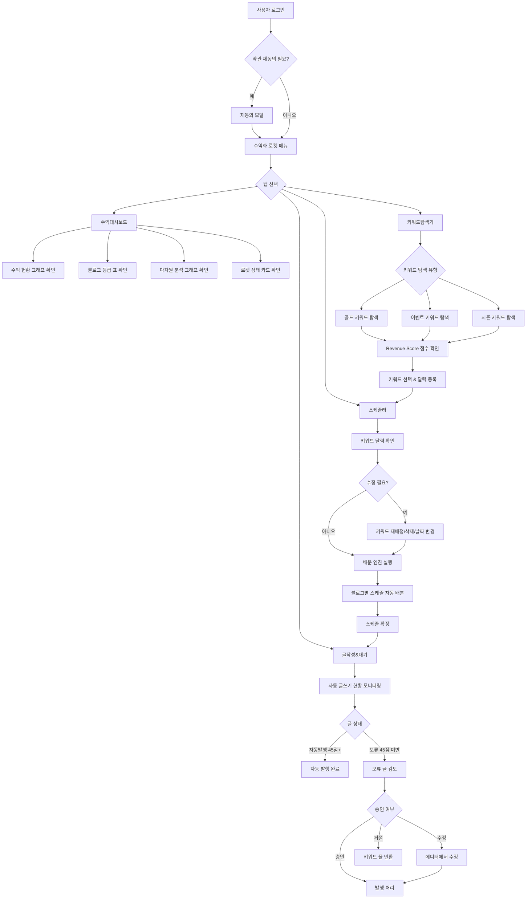
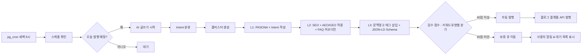

# 수익화 로켓 사용자 플로우

> 작성일: 2026-03-15 | 버전: 1.1.0 (동의서 플로우 추가)

---

## 0. 동의 수집 플로우 (Layered Consent)

> 상세: `docs/동의서/00-동의서-수집구조-가이드.md`

### 0-1. 회원가입 시 필수 동의

```
회원가입 페이지 (/signup)
    ↓
동의 체크박스 영역:
    ☑ [필수] 서비스 이용약관     [전문 보기 >]
    ☑ [필수] 개인정보 처리방침   [전문 보기 >]
    ☐ [선택] 마케팅 수신 동의    [전문 보기 >]
    [전체 동의] ← 편의용 토글
    ↓
필수 미체크 → "가입하기" 비활성화
    ↓
가입 완료 → user_consents에 tos + privacy 기록
```

### 0-2. 기능 최초 사용 시 동의 (Just-in-Time)

```
API 키 최초 등록 (/settings?tab=api-keys)
    └→ 인라인 패널: API 키 보관 동의 → [동의 후 저장]

수익화 로켓 최초 활성화 (/monetize)
    └→ 전체 화면 모달: 자동화 범위 안내 → [동의 — 로켓 활성화]

블로그 플랫폼 연동 (Tistory/WordPress)
    └→ OAuth 직전 모달: 발행 권한 안내 → [동의 후 연결]

AdSense 연동
    └→ OAuth 직전 모달: 수익 데이터 수집 안내 → [동의 후 연결]

SNS 플랫폼 연동 (Instagram/X/Threads)
    └→ OAuth 직전 모달: 자동 게시 권한 안내 → [동의 후 연결]

쿠팡파트너스/Amazon 설정
    └→ 인라인 패널: 제휴 링크 자동 삽입 안내 → [동의 후 활성화]
```

### 0-3. 약관 개정 시 재동의

```
로그인 → /api/consents/pending 호출
    ├─ 미동의 필수 항목 → 재동의 모달 (서비스 차단)
    └─ 없음 → 정상 진입
```

---

## 1. 메인 플로우 (전체 파이프라인)



---

## 2. 화면별 플로우

### 수익대시보드 (/monetize?tab=dashboard)

```
진입: 수익화 로켓 메뉴 클릭 (기본 탭)
행동:
  - 로켓 상태 카드 확인 (파이프라인 현황)
  - 수익 요약 카드 확인 (이번 달/지난 달/예상 수익)
  - 수익 그래프 확인 (현재까지 + 예상 수익 트렌드)
  - 블로그 등급 표 확인 (S/A/B/C/D 분류)
  - 다차원 분석 그래프 탐색 (블로그별/광고별/언어별/유형별)
이탈:
  - 키워드탐색기 탭 클릭 → 키워드탐색기
  - 스케줄러 탭 클릭 → 스케줄러
```

### 키워드탐색기 (/monetize?tab=keywords)

```
진입: 키워드탐색기 탭 클릭
행동:
  - 탐색 유형 선택 (골드 / 이벤트 / 시즌)
  - [골드 키워드] 검색어 입력 → Revenue Score 순 결과 확인
  - [이벤트 키워드] 날짜 범위 선택 → 외부 API 이벤트 목록 확인
  - [시즌 키워드] 계절/월 선택 → 연간 반복 키워드 확인
  - 키워드 상세: 검색량, CPC, 경쟁도, 트렌드 지수 확인
  - 키워드 선택 → 달력 등록 (날짜 지정 또는 자동 배분)
이탈:
  - 달력 등록 완료 → 스케줄러 탭으로 이동
  - 수익대시보드로 돌아가기
```

### 스케줄러 (/monetize?tab=scheduler)

```
진입: 스케줄러 탭 클릭 (또는 키워드 등록 후 자동 이동)
행동:
  - 키워드 달력 확인 (월간 캘린더 뷰)
  - 키워드 카드 클릭 → 상세 정보 확인 (등급, 배정 블로그, 예상 수익)
  - 키워드 재배정: 다른 블로그로 드래그 또는 드롭다운 선택
  - 날짜 변경: 달력에서 드래그 앤 드롭
  - 배분 엔진 실행: "자동 배분" 버튼 클릭
  - 배분 결과 확인: 블로그별 스케줄 프리뷰
  - 스케줄 확정: "확정" 버튼 → pg_cron 등록
이탈:
  - 글작성&대기 탭으로 이동 (확정 후)
  - 키워드탐색기로 돌아가기
```

### 글작성&대기 (/monetize?tab=writing)

```
진입: 글작성&대기 탭 클릭
행동:
  - 파이프라인 현황 확인 (작성 중 / 검수 중 / 대기 중 / 발행 완료)
  - [보류 글 목록] 45점 미만 글 확인
  - 보류 글 클릭 → 상세 검수 리포트 확인 (검수 A: 발견/설득/수익 또는 검수 B: 이벤트고유/공통기술)
  - 승인: "발행" 버튼 클릭 → 자동 발행 처리
  - 수정: "에디터에서 열기" → 기존 에디터로 이동
  - 거절: "키워드 풀 반환" → 해당 키워드 재탐색 큐로 이동
이탈:
  - 에디터로 이동 (/editor/[post-id])
  - 수익대시보드로 돌아가기
```

---

## 3. 자동화 파이프라인 플로우 (백그라운드)



---

## 4. 예외 플로우

### 외부 API 실패 시
```
네이버 광고 API 실패
  → 캐시 데이터 사용 (24시간 이내)
  → 캐시 없을 경우: 수동 입력 모드 전환 + 사용자 알림

이벤트 API 실패
  → 내부 연간 이벤트 캘린더 폴백
  → 사용자에게 "외부 데이터 미갱신" 배지 표시
```

### AI 글쓰기 실패 시
```
Claude API 타임아웃 (>60초)
  → 자동 재시도 1회
  → 재시도 실패 → 보류 큐로 이동 + 오류 코드 기록
  → 사용자 알림: "AI 작성 실패 - 수동 작성 필요"
```

### 배분 엔진 예외
```
블로그 쿼터 초과 (하루 최대 글 수 도달)
  → 다음 가용 날짜로 자동 밀기
  → 달력에서 "쿼터 초과" 배지로 표시

키워드 중복 배정
  → 동일 키워드 다른 블로그에 배정 시도
  → 같은 날짜 배정 방지 (날짜 분산 강제)
```

---

## 5. 화면 간 이동 경로 요약

```
로그인 화면
    ↓
수익화 로켓 메뉴 (수익대시보드 - 기본)
    ├─ 수익대시보드 탭
    │   └─ 상단 [수익화 가이드 ▼] 버튼 클릭 → 아코디언 슬라이드 다운 (기능 5)
    │       └─ [MD 다운로드] → 전략 파일 저장
    ├─ 키워드탐색기 탭 → [키워드 등록] → 스케줄러 탭
    ├─ 스케줄러 탭 → [스케줄 확정] → 글작성&대기 탭
    └─ 글작성&대기 탭 → [수정 선택] → 에디터 (/editor/[id])
                                       → [저장] → 글작성&대기 탭
```

---

## 6. Neurion 확장 플로우

### 6-1. 다국어 설정 플로우 (기능 4 — #15)

```
블로그 목록 (/blogs)
    ↓
블로그 카드 → [설정] 클릭
    ↓
블로그 설정 페이지 (/blogs/[id]/settings)
    ↓
[언어/지역] 탭 선택
    ├─ 작성 언어 선택: 한국어(ko) / 영어(en) / 일본어(ja)
    ├─ 언어 저장 → 블로그 settings에 반영
    └─ 효과:
        - 키워드 탐색 시 해당 언어 데이터소스 자동 사용
        - AI 글쓰기 시 해당 언어로 작성 (번역 아님)
        - 스케줄러에서 언어별 최적 발행 시간 자동 적용
```

### 6-2. SNS 자동배포 설정 플로우 (기능 6 — #10)

```
블로그 설정 페이지 (/blogs/[id]/settings)
    ↓
[SNS 자동화] 탭 선택
    ↓
플랫폼 선택 (Instagram / X / Threads) — 다중 선택 가능
    ↓
각 플랫폼별:
    ├─ API 키 / 액세스 토큰 입력
    ├─ 포맷 프롬프트 입력 (예: "인스타그램 감성 글로 작성, 해시태그 10개 포함")
    └─ [이미지 생성] 토글 ON/OFF
        → ON 선택 시: 이미지 생성 도구 선택 (DALL-E 3 / Ideogram / Flux)
        → 선택 후 고정 (수동 변경 전까지 유지)
    ↓
저장 → 이후 발행된 글은 자동으로 선택된 플랫폼에 배포
```

### 6-3. 수익화 가이드 패널 플로우 (기능 5 — #4)

```
수익대시보드 (/monetize?tab=dashboard)
    ↓
상단 [수익화 가이드 ▼] 버튼 클릭 (대시보드 최상단 고정)
    ↓ (아코디언 슬라이드 다운)
목표 월수익 입력 (예: 1,000,000원)
    ↓
[전략 계산] 버튼 클릭
    ↓
출력:
    ├─ 필요 블로그 수: N개
    ├─ 블로그 유형/페르소나 조합 추천
    ├─ 글 유형별 비중 (AD/REVIEW/INFO)
    ├─ 일일 자동 발행 수 목표
    └─ 예상 달성 기간
    ↓
[MD 파일로 다운로드] 버튼
    ↓ (닫기 클릭 시 패널 슬라이드 업)
```

### 6-4. 쿠팡파트너스 설정 플로우 (기능 7 — #13)

```
블로그 설정 페이지 (/blogs/[id]/settings)
    ↓
[수익화 연동] 탭 선택
    ↓
쿠팡파트너스 파트너 ID 입력
    ↓
[자동 삽입 활성화] 토글 ON
    ↓
저장 → 이후 AI 글쓰기 시 PASONA O(Offer) 섹션에 쿠팡 상품 링크 자동 삽입
```

---

## 7. 요금제(Plan Tier) 업셀 플로우 (구현 완료)

### 7-1. 플랜 선택 플로우

```
설정 (/settings?tab=plan)
    ↓
요금제 탭 클릭
    ↓
5개 플랜 카드 비교 (Lite/Basic/Pro/Growth/Scale)
    ├─ 월간/연간 토글 → 가격 실시간 변경
    ├─ 14개 기능 체크리스트 비교
    └─ 현재 플랜: 파란 테두리 + "현재 플랜" 배지
    ↓
"업그레이드" 또는 "다운그레이드" 버튼 클릭
    ↓
미수집 동의 체크 (PLAN_CONSENT_MAP 기반)
    ├─ 미수집 bundled 동의 있음 → PlanUpgradeConsentStep 표시
    │   ┌──────────────────────────────────────────┐
    │   │ Growth 업그레이드 — 추가 기능 동의        │
    │   │                                          │
    │   │ ☑ [전체 동의]                            │
    │   │ ☑ 자동화 처리 동의        [상세 보기 >]  │
    │   │ ☑ 제휴마케팅 자동 삽입    [상세 보기 >]  │
    │   │                                          │
    │   │ ※ SNS/AdSense/블로그 연동은              │
    │   │   실제 연결 시 별도 동의                  │
    │   │                                          │
    │   │              [동의 후 업그레이드]          │
    │   └──────────────────────────────────────────┘
    │   동의 완료 → user_consents 일괄 기록 (method: upgrade_flow)
    │       ↓
    └─ 미수집 동의 없음 → 바로 진행
        ↓
PATCH /api/user/plan → 즉시 적용 (결제 미구현)
    ↓
사이드바 + 페이지 잠금 상태 즉시 변경
```

### 7-2. 업셀 트리거 플로우

```
트리거 발생 시점:
  ├─ Lite: 블로그 3개 한도 도달 → "Basic으로 업그레이드하면 10개까지"
  ├─ Lite: 월 20건 글쓰기 한도 → "Basic으로 무제한"
  ├─ Basic: 수익화 로켓 메뉴 클릭 → "Pro부터 사용 가능"
  ├─ Pro: 자동 글쓰기 클릭 → "Growth부터 사용 가능"
  ├─ Pro: 블로그 10개 한도 → "Growth로 30개까지"
  └─ Growth: 블로그 27개+ → "Scale로 100개까지"
    ↓
UpgradeModal 표시 (현재 플랜 → 추천 플랜)
    ├─ "나중에" → 모달 닫기
    └─ "요금제 변경하기" → /settings?tab=plan 이동
```

### 7-3. 잠금 기능 접근 플로우

```
사이드바 잠긴 메뉴 클릭 (자물쇠 아이콘)
    ↓
UpgradeModal 표시 → "요금제 변경하기" → 설정 이동

페이지 FeatureGate 오버레이 클릭 (흐릿한 콘텐츠)
    ↓
UpgradeModal 표시 → "요금제 변경하기" → 설정 이동
```
