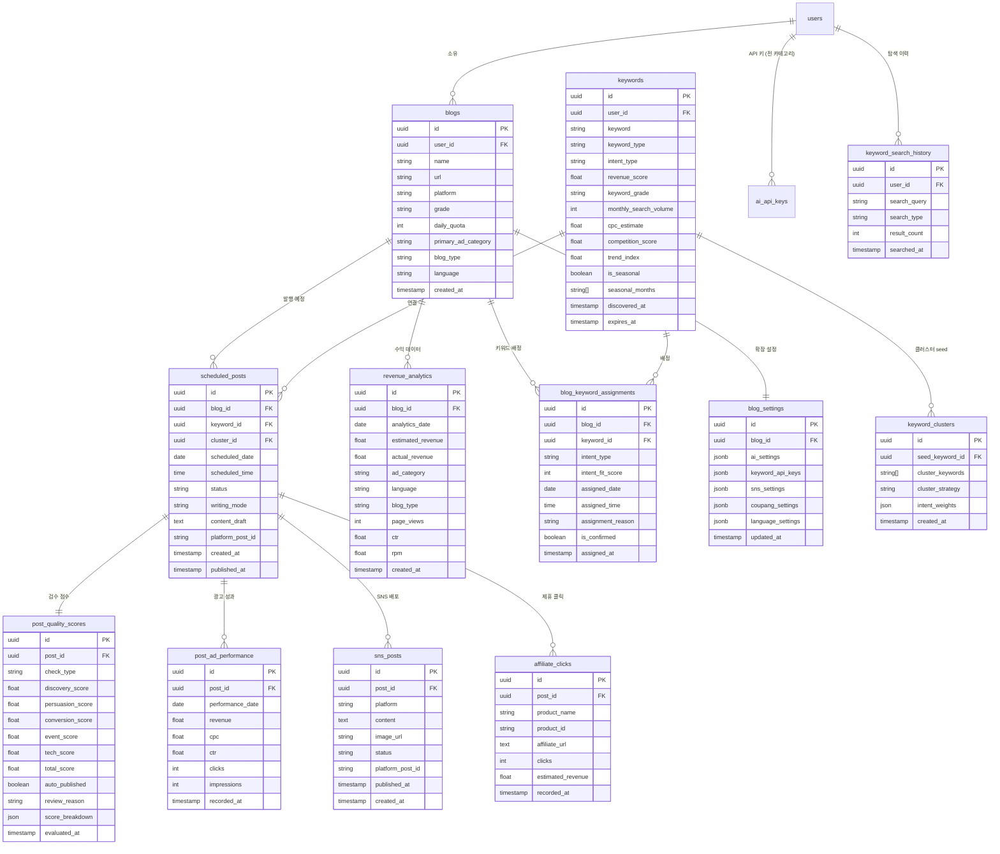

# 수익화 로켓 데이터베이스 설계

> 작성일: 2026-03-15 | 버전: 1.0.0

---

## 1. ERD



---

## 2. 테이블 상세 정의

### keywords (키워드 마스터)

| 컬럼 | 타입 | 제약 | 설명 |
|------|------|------|------|
| id | uuid | PK | 기본키 |
| user_id | uuid | FK, NOT NULL | 사용자 |
| keyword | varchar(200) | NOT NULL | 키워드 텍스트 |
| keyword_type | varchar(20) | NOT NULL | gold/event/seasonal |
| intent_type | varchar(20) | NOT NULL | AD/REVIEW/INFO/CRITIC/COMPARE/TREND |
| revenue_score | float | NOT NULL | Revenue Score (0~100) |
| keyword_grade | char(1) | NOT NULL | S/A/B/C/D |
| monthly_search_volume | int | | 월간 검색량 |
| cpc_estimate | float | | 예상 CPC (원) |
| competition_score | float | | 경쟁도 (0~1) |
| trend_index | float | | DataLab 트렌드 지수 (0~100) |
| is_seasonal | boolean | DEFAULT false | 시즌 키워드 여부 |
| seasonal_months | int[] | | 반복 월 배열 [3, 4] |
| discovered_at | timestamp | NOT NULL | 발견 시각 |
| expires_at | timestamp | | 유효 기간 만료 (이벤트 키워드) |

**Revenue Score 계산:**
```
revenue_score =
  (monthly_search_volume_normalized * 0.25) +  -- 트래픽 점수 25%
  (cpc_estimate_normalized * 0.40) +            -- 수익 점수 40%
  ((1 - competition_score) * 0.25) +            -- 난이도 점수 25%
  (trend_index_normalized * 0.10)               -- 트렌드 보너스 10%

등급 기준: S(90+) / A(75~89) / B(60~74) / C(45~59) / D(~44)
```

---

### scheduled_posts (발행 스케줄)

| 컬럼 | 타입 | 제약 | 설명 |
|------|------|------|------|
| id | uuid | PK | 기본키 |
| blog_id | uuid | FK, NOT NULL | 대상 블로그 |
| keyword_id | uuid | FK, NOT NULL | 대상 키워드 |
| cluster_id | uuid | FK | 클러스터 |
| scheduled_date | date | NOT NULL | 발행 예정 날짜 |
| scheduled_time | time | NOT NULL | 발행 예정 시간 |
| status | varchar(20) | NOT NULL | pending/writing/reviewing/auto_published/review_queue/published/failed |
| writing_mode | varchar(20) | | auto/manual |
| content_draft | text | | AI 생성 초안 |
| platform_post_id | varchar(200) | | 블로그 플랫폼 게시글 ID |
| published_at | timestamp | | 실제 발행 시각 |

**status 전환 흐름:**
```
pending → writing → reviewing → auto_published (45점+)
                              → review_queue (45점 미만)
review_queue → published (사용자 승인)
             → pending (수정 후 재검수)
             → failed (거절, 키워드 풀 반환)
```

---

### post_quality_scores (검수 점수)

> 키워드 유형에 따라 **검수 A**(골드/시즌) 또는 **검수 B**(이벤트) 채점표 적용.
> 두 체계 모두 50점 만점, 45점 이상 자동 발행.

| 컬럼 | 타입 | 제약 | 설명 |
|------|------|------|------|
| id | uuid | PK | 기본키 |
| post_id | uuid | FK, UNIQUE | scheduled_posts 1:1 |
| check_type | varchar(10) | NOT NULL | 'standard' (검수 A) / 'event' (검수 B) |
| discovery_score | float | | 발견 최적화 점수 (0~17) — 검수 A |
| persuasion_score | float | | 설득 품질 점수 (0~18) — 검수 A |
| conversion_score | float | | 수익 전환 점수 (0~15) — 검수 A |
| event_score | float | | 이벤트 고유 점수 (0~35) — 검수 B |
| tech_score | float | | 공통 기술 점수 (0~15) — 검수 B |
| total_score | float | GENERATED | check_type별 합산 |
| auto_published | boolean | DEFAULT false | 자동 발행 여부 |
| review_reason | text | | 보류 사유 |
| score_breakdown | jsonb | | 세부 점수 JSON |

**검수 A (골드/시즌 키워드, 50점):**
```
축1 발견 최적화 (0~17): SEO 기본(10) + AI 검색 최적화(7)
축2 설득 품질   (0~18): PASONA 구조(8) + Intent 정합성(5) + 가독성(5)
축3 수익 전환   (0~15): 광고 섹션(8) + 전환 유도(7)
```

**검수 B (이벤트 키워드, 50점):**
```
이벤트 고유 (0~35): Intent 목적(8) + PASONA 비중(7) + 필수 요소(7) + 금지 요소(7) + 페르소나 톤(6)
공통 기술   (0~15): SEO(5) + AI 검색 최적화(5) + 문맥광고(5)
```

---

### revenue_analytics (수익 분석)

| 컬럼 | 타입 | 제약 | 설명 |
|------|------|------|------|
| id | uuid | PK | 기본키 |
| blog_id | uuid | FK, NOT NULL | 블로그 |
| analytics_date | date | NOT NULL | 분석 날짜 |
| estimated_revenue | float | | 예상 수익 (원) |
| actual_revenue | float | | 실제 수익 (원) |
| ad_category | varchar(50) | | 광고 카테고리 |
| language | varchar(10) | | ko/en/ja |
| blog_type | varchar(50) | | 블로그 유형 |
| page_views | int | | 페이지뷰 |
| ctr | float | | 클릭률 |
| rpm | float | | RPM (원/1000뷰) |

---

## 3. 인덱스

```sql
-- 키워드 탐색 성능
CREATE INDEX idx_keywords_grade ON keywords(keyword_grade, revenue_score DESC);
CREATE INDEX idx_keywords_type ON keywords(keyword_type, user_id);
CREATE INDEX idx_keywords_seasonal ON keywords(is_seasonal, seasonal_months);

-- 스케줄러 성능
CREATE INDEX idx_scheduled_date ON scheduled_posts(scheduled_date, status);
CREATE INDEX idx_scheduled_blog ON scheduled_posts(blog_id, scheduled_date);

-- 수익 분석 성능
CREATE INDEX idx_revenue_date ON revenue_analytics(blog_id, analytics_date DESC);
CREATE INDEX idx_revenue_category ON revenue_analytics(ad_category, analytics_date);

-- pg_cron 자동 발행 쿼리 최적화
CREATE INDEX idx_pending_posts ON scheduled_posts(scheduled_date, scheduled_time, status)
WHERE status IN ('pending', 'writing');

-- [기능 4] 언어별 발행 쿼리 최적화
CREATE INDEX idx_scheduled_language ON scheduled_posts(scheduled_date, status)
  INCLUDE (blog_id)
  WHERE status IN ('pending', 'writing');
CREATE INDEX idx_blogs_language ON blogs(language, user_id);

-- [기능 6] SNS 배포 상태 조회
CREATE INDEX idx_sns_posts_status ON sns_posts(post_id, platform, status);
CREATE INDEX idx_sns_posts_pending ON sns_posts(status, created_at)
WHERE status = 'pending';

-- [기능 7] 제휴 클릭 집계
CREATE INDEX idx_affiliate_post ON affiliate_clicks(post_id, recorded_at DESC);
```

---

## 4. RLS 정책

```sql
-- keywords: 본인 데이터만 접근
ALTER TABLE keywords ENABLE ROW LEVEL SECURITY;
CREATE POLICY users_own_keywords ON keywords
  FOR ALL USING (user_id = auth.uid());

-- scheduled_posts: blogs 테이블을 통한 간접 접근 제어
ALTER TABLE scheduled_posts ENABLE ROW LEVEL SECURITY;
CREATE POLICY users_own_scheduled_posts ON scheduled_posts
  FOR ALL USING (
    blog_id IN (SELECT id FROM blogs WHERE user_id = auth.uid())
  );

-- revenue_analytics: 동일 패턴
ALTER TABLE revenue_analytics ENABLE ROW LEVEL SECURITY;
CREATE POLICY users_own_analytics ON revenue_analytics
  FOR ALL USING (
    blog_id IN (SELECT id FROM blogs WHERE user_id = auth.uid())
  );

-- [기능 4/6/7] blog_settings: blogs 통해 소유권 확인
ALTER TABLE blog_settings ENABLE ROW LEVEL SECURITY;
CREATE POLICY users_own_blog_settings ON blog_settings
  FOR ALL USING (
    blog_id IN (SELECT id FROM blogs WHERE user_id = auth.uid())
  );

-- [기능 6] sns_posts: scheduled_posts → blogs 간접 접근
ALTER TABLE sns_posts ENABLE ROW LEVEL SECURITY;
CREATE POLICY users_own_sns_posts ON sns_posts
  FOR ALL USING (
    post_id IN (
      SELECT sp.id FROM scheduled_posts sp
      JOIN blogs b ON sp.blog_id = b.id
      WHERE b.user_id = auth.uid()
    )
  );

-- [기능 7] affiliate_clicks: 동일 패턴
ALTER TABLE affiliate_clicks ENABLE ROW LEVEL SECURITY;
CREATE POLICY users_own_affiliate_clicks ON affiliate_clicks
  FOR ALL USING (
    post_id IN (
      SELECT sp.id FROM scheduled_posts sp
      JOIN blogs b ON sp.blog_id = b.id
      WHERE b.user_id = auth.uid()
    )
  );
```

---

## 5. blogs 테이블 ALTER (기존 테이블 확장)

```sql
ALTER TABLE blogs
  ADD COLUMN IF NOT EXISTS grade VARCHAR(1) DEFAULT 'C',
  ADD COLUMN IF NOT EXISTS daily_quota INT DEFAULT 3,
  ADD COLUMN IF NOT EXISTS primary_ad_category VARCHAR(50),
  ADD COLUMN IF NOT EXISTS blog_type VARCHAR(50),
  ADD COLUMN IF NOT EXISTS language VARCHAR(10) DEFAULT 'ko';

-- 등급 제약 조건
ALTER TABLE blogs ADD CONSTRAINT blogs_grade_check
  CHECK (grade IN ('S', 'A', 'B', 'C', 'D'));

-- 언어 제약 조건 (6개 언어)
ALTER TABLE blogs ADD CONSTRAINT blogs_language_check
  CHECK (language IN ('ko', 'en', 'ja', 'de', 'pt_br', 'es'));
```

---

## 5-1. 요금제(Plan Tier) 테이블 (구현 완료)

> `supabase/migrations/020_plans_and_pricing.sql`

### plans 테이블
- id(PK, varchar): lite/basic/pro/growth/scale
- display_name, monthly_price, annual_price, max_blogs, position, is_active, sort_order

### plan_features 테이블
- plan_id(FK) + feature_key + enabled(TEXT: true/false/readonly/unlimited/숫자)
- UNIQUE(plan_id, feature_key)
- Feature Keys 14개: general_writing, writing_limit_monthly, full_editor, revenue_dashboard, keyword_explorer, scheduler, auto_writing_pipeline, auto_publish, coupang_affiliate, sns_auto_deploy, multilingual, revenue_guide_panel, team_accounts, priority_support

### user_plans 테이블
- user_id(FK) + plan_id(FK) + billing_cycle(monthly/annual) + started_at + expires_at

### discount_policies 테이블
- discount_type(rate/amount), discount_value, target_plan(FK), target_billing, start_at, end_at, stackable, is_active

### users 테이블 확장
- plan_id(FK, DEFAULT 'lite') — 비정규화 빠른 조회

### RLS: plans/plan_features 인증 읽기, user_plans 본인만, discount_policies 활성 읽기

---

## 6. 마이그레이션 순서

```
-- Phase 0 (요금제 시스템 — 구현 완료)
0.  plans, plan_features, discount_policies, user_plans + 시드 데이터 + users.plan_id + handle_new_user() 트리거

-- Phase 1~2 (코어 파이프라인)
1.  ALTER TABLE blogs (grade, daily_quota, primary_ad_category, blog_type, language)
2.  CREATE TABLE keywords
3.  CREATE TABLE keyword_clusters
4.  CREATE TABLE scheduled_posts
5.  CREATE TABLE post_quality_scores
6.  CREATE TABLE revenue_analytics
7.  CREATE TABLE post_ad_performance
8.  CREATE TABLE blog_keyword_assignments
9.  CREATE TABLE keyword_search_history
10. CREATE INDEX (Phase 1~2 인덱스)
11. ENABLE ROW LEVEL SECURITY (Phase 1~2 테이블)
12. CREATE POLICY (Phase 1~2 RLS)
13. pg_cron 스케줄 등록 (auto-publish-rocket, trending-keyword-check)

-- Phase 3~4 (Neurion 확장)
14. CREATE TABLE blog_settings
15. CREATE TABLE sns_posts
16. CREATE TABLE affiliate_clicks
17. CREATE INDEX (Phase 3~4 인덱스: language, sns_posts, affiliate_clicks)
18. ENABLE ROW LEVEL SECURITY (Phase 3~4 테이블)
19. CREATE POLICY (Phase 3~4 RLS)
20. pg_cron 추가 등록 (auto-publish-en, auto-publish-ja, sns-auto-distribute)

-- Phase 5 (동의서 시스템)
21. CREATE TABLE user_consents
22. CREATE TABLE consent_versions
23. CREATE INDEX (동의서 인덱스)
24. ENABLE ROW LEVEL SECURITY (동의서 테이블)
25. CREATE POLICY (동의서 RLS)
26. INSERT consent_versions 초기 데이터 (tos v1.0, privacy v1.0 등)
```

---

## 9. 동의서 시스템 테이블

> 상세: `docs/동의서/00-동의서-수집구조-가이드.md`

### user_consents (동의 이력)

| 컬럼 | 타입 | 제약 | 설명 |
|------|------|------|------|
| id | uuid | PK | 기본키 |
| user_id | uuid | FK, NOT NULL | 사용자 |
| consent_type | varchar(50) | NOT NULL | tos, privacy, api_key_storage, automation, sns_oauth_instagram, sns_oauth_twitter, sns_oauth_threads, affiliate_marketing, adsense_oauth, blog_platform_tistory, blog_platform_wordpress, marketing |
| consent_version | varchar(10) | NOT NULL | 약관 버전 ('1.0', '1.1' 등) |
| agreed_at | timestamptz | NOT NULL, DEFAULT NOW() | 동의 시각 |
| ip_address | inet | | 동의 시점 IP |
| user_agent | text | | 브라우저 정보 |
| method | varchar(30) | NOT NULL | signup_checkbox, inline_panel, modal, upgrade_flow |
| revoked_at | timestamptz | | NULL=유효, 값 있으면 철회 |
| revoked_reason | text | | 철회 사유 |

**제약조건**: UNIQUE(user_id, consent_type, consent_version)

### consent_versions (약관 버전 관리)

| 컬럼 | 타입 | 제약 | 설명 |
|------|------|------|------|
| id | uuid | PK | 기본키 |
| consent_type | varchar(50) | NOT NULL | 동의서 유형 |
| version | varchar(10) | NOT NULL | 버전 |
| title | text | NOT NULL | 표시 제목 |
| summary | text | | 개정 요약 |
| content_url | text | | 전문 URL |
| effective_date | date | NOT NULL | 시행일 |

**제약조건**: UNIQUE(consent_type, version)

### RLS 정책

```sql
ALTER TABLE user_consents ENABLE ROW LEVEL SECURITY;
CREATE POLICY users_own_consents ON user_consents
  FOR ALL USING (user_id = auth.uid());

-- consent_versions는 모든 인증 사용자 읽기 가능
ALTER TABLE consent_versions ENABLE ROW LEVEL SECURITY;
CREATE POLICY read_consent_versions ON consent_versions
  FOR SELECT USING (auth.uid() IS NOT NULL);
```

### 인덱스

```sql
CREATE INDEX idx_user_consents_user ON user_consents(user_id, consent_type);
CREATE INDEX idx_user_consents_active ON user_consents(user_id, consent_type)
  WHERE revoked_at IS NULL;
```

---

## 7. ai_api_keys 테이블 (확장) — 블로거 API 키 통합 관리

> **모든 블로거 API 키를 user 레벨 한 곳에서 관리** (screen-09: `/settings?tab=api-keys`).
> blog_settings에는 API 키를 저장하지 않음 — 설정(ON/OFF, 스타일 등)만 저장.

```sql
-- 기존 ai_api_keys 테이블 확장
ALTER TABLE ai_api_keys DROP CONSTRAINT IF EXISTS ai_api_keys_provider_check;
ALTER TABLE ai_api_keys ADD CONSTRAINT ai_api_keys_provider_check
  CHECK (provider IN (
    'claude', 'openai', 'gemini',              -- AI 글쓰기
    'imagen',                                   -- 이미지 생성
    'naver_ad', 'naver_search', 'google_kwp',   -- 키워드 탐색
    'coupang', 'amazon'                         -- 수익화
  ));

-- Key+Secret 쌍 지원 (네이버 광고 API, 네이버 검색 API)
ALTER TABLE ai_api_keys ADD COLUMN IF NOT EXISTS encrypted_secret TEXT;
```

| provider | 카테고리 | encrypted_key | encrypted_secret | 비고 |
|----------|---------|---------------|------------------|------|
| `claude` | AI 글쓰기 | API Key | — | |
| `openai` | AI 글쓰기 | API Key | — | |
| `gemini` | AI 글쓰기 | API Key | — | |
| `imagen` | 이미지 생성 | API Key | — | Google AI Studio Key |
| `naver_ad` | 키워드 탐색 | API Key | API Secret | Key+Secret 쌍 |
| `naver_search` | 키워드 탐색 | Client ID | Client Secret | Key+Secret 쌍 |
| `google_kwp` | 키워드 탐색 | Developer Token | — | |
| `coupang` | 수익화 | Partner ID | — | |
| `amazon` | 수익화 | Associates Tag (Tracking ID) | — | 국가별 별도 가입 (US/JP 등) |

---

## 8. blog_settings JSONB 스키마 상세

> **API 키는 ai_api_keys 테이블에 저장** (user 레벨, 섹션 7 참조).
> blog_settings에는 블로그별 **설정/구성**만 저장.

```typescript
// blog_settings.sns_settings 구조
interface BlogSNSSettings {
  instagram: {
    enabled: boolean
    accessToken: string       // OAuth 토큰 (암호화 저장)
    formatPrompt: string      // 사용자 입력 포맷 프롬프트
  }
  twitter: {
    enabled: boolean
    accessToken: string       // OAuth 토큰 (암호화 저장)
    formatPrompt: string
  }
  threads: {
    enabled: boolean
    accessToken: string       // Instagram Graph API와 공유
    formatPrompt: string
  }
  imageGen: {
    enabled: boolean
    provider: 'imagen3'                 // Google Imagen 3 (고정)
    stylePreset: 'iphone16_warm_photo'  // 기본 프리셋 (고정)
    // ※ API 키는 ai_api_keys 테이블의 provider='imagen'에서 참조
    additionalStyleHint: string | null  // 추가 스타일 힌트 (선택)
  }
}

// blog_settings.ai_config 구조 (AI 사용 설정 — 키는 ai_api_keys에서 참조)
interface BlogAIConfig {
  preferredProvider: 'claude' | 'openai' | 'gemini'  // 이 블로그에서 사용할 AI 공급자
  model?: string                                       // 선호 모델 (미지정 시 기본값)
  // 기본 모델: claude → sonnet-4-6, openai → gpt-4o, gemini → gemini-2.0-flash
  // ※ API 키는 ai_api_keys 테이블의 해당 provider에서 참조
}

// blog_settings.affiliate_config 구조 (자동 삽입 설정 — 키/태그는 ai_api_keys에서 참조)
interface BlogAffiliateConfig {
  affiliateProvider: 'coupang' | 'amazon' | 'both'  // 제휴 플랫폼 선택 (ko→쿠팡 기본, en/ja→Amazon 기본)
  autoInsert: boolean         // PASONA O섹션 자동 삽입 여부
  maxProductsPerPost: number  // 글당 최대 상품 수 (기본값: 3)
  // ※ 쿠팡파트너스 ID → ai_api_keys provider='coupang'
  // ※ Amazon Associates Tag → ai_api_keys provider='amazon'
}

// blog_settings.language_settings 구조
type BlogLanguage = 'ko' | 'en' | 'ja' | 'de' | 'pt_br' | 'es'

interface BlogLanguageSettings {
  language: BlogLanguage
  writeStyle: string          // 언어별 글쓰기 스타일 힌트
}
```
