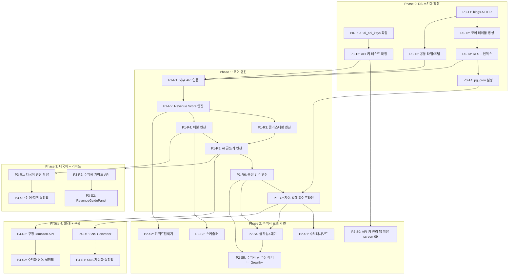

# 수익화 로켓 TASKS.md (추가개발)

> 생성 방식: Domain-Guarded (screen-spec v2.0 + strategy-engine-spec 기반)
> 버전: 1.1 | 날짜: 2026-03-19 (PC — 동의서 시스템 Phase 추가)
> Interface Contract Validation: ✅ PASSED
> 기존 planning/07-tasks.md 완료 후 추가 개발 범위

---

## 📊 전체 현황

| Phase | 설명 | 태스크 수 | 상태 |
|-------|------|----------|------|
| **PT** | **요금제(Plan Tier) 시스템** | **11** | **✅ 완료** |
| **PC** | **동의서 시스템 (Consent Management)** | **10** | **⬜** |
| P0 | DB 스키마 확장 + 공통 설정 + API 키 통합 | 7 | ⬜ |
| P1 | 코어 엔진 (Backend) | 15 | ⬜ |
| P2 | 수익화 로켓 4탭 화면 + API 키 관리 + 전용 에디터 (Frontend) | 19 | ⬜ |
| P3 | Neurion 다국어 + 수익화 가이드 | 6 | ⬜ |
| P4 | Neurion SNS + 쿠팡파트너스 + Amazon Associates | 10 | ⬜ |
| **합계** | | **78** | |

---

## Phase PT: 요금제(Plan Tier) 시스템 ✅ 완료

> 5단계 요금제 (Lite/Basic/Pro/Growth/Scale) 구현. 결제 미구현 — 설정에서 직접 플랜 선택.

### [x] PT-0: DB 마이그레이션
- `supabase/migrations/020_plans_and_pricing.sql`
- plans, plan_features, discount_policies, user_plans 테이블 + 시드 데이터
- users.plan_id 추가, handle_new_user() 트리거

### [x] PT-1: 타입 및 상수
- `types/plan.ts` — PlanId, FeatureKey, UserPlanContext 등
- `lib/plan/constants.ts` — PLAN_ORDER, FEATURE_LABELS, SIDEBAR_FEATURE_MAP, UPSELL_TRIGGERS

### [x] PT-2: 서버 유틸리티
- `lib/plan/server.ts` — getUserPlanContext, isFeatureEnabled, canCreateBlog, canCreatePost

### [x] PT-3: API 라우트
- `app/api/plans/route.ts` — GET: 전체 플랜 + 기능 + 할인
- `app/api/user/plan/route.ts` — GET: 내 플랜, PATCH: 플랜 변경

### [x] PT-4: 클라이언트 인프라
- `hooks/usePlan.ts`, `hooks/useUpsell.ts`, `components/plan/PlanContext.tsx`
- `app/(dashboard)/layout.tsx` — PlanProvider 래핑

### [x] PT-5: UI 컴포넌트
- `components/plan/UpgradeModal.tsx`, `FeatureGate.tsx`, `PlanSettingsTab.tsx`

### [x] PT-6: 설정 요금제 탭
- `app/(dashboard)/settings/page.tsx` — 5번째 탭 "요금제" 추가

### [x] PT-7: 사이드바 기능 잠금
- `components/layout/AppSidebar.tsx` — 잠긴 메뉴 opacity + 자물쇠 + UpgradeModal

### [x] PT-8: 페이지 수준 기능 잠금
- keywords, scheduler, monetize 페이지에 FeatureGate 래핑

### [x] PT-9: 백엔드 API 제한
- blogs POST (canCreateBlog), posts POST (canCreatePost)
- scheduler/jobs POST (isFeatureEnabled 'scheduler')
- keywords/search GET (isFeatureEnabled 'keyword_explorer')

### [x] PT-10: 업셀 트리거 + 문서 업데이트
- BlogCreateForm에 PLAN_LIMIT_BLOGS 감지 → UpgradeModal
- docs/add/ 1,3,4,6,7번 문서 업데이트

---

## Phase PC: 동의서 시스템 (Consent Management)

> 계층형 동의(Layered Consent) 구조: 회원가입 시 필수 2종 + 기능 사용 시 Just-in-Time 동의 8종
> 상세 문서: `docs/동의서/00-동의서-수집구조-가이드.md`
> **실행 시점**: P0와 병렬 가능 (DB 마이그레이션만 P0-T2 이후). 회원가입 동의는 가장 먼저 구현 필요.

### [ ] PC-T1: 동의서 DB 마이그레이션

- **담당**: database-specialist
- **의존**: 없음 (독립 마이그레이션)
- **작업 목록**:
  - [ ] `CREATE TABLE user_consents` (id, user_id FK, consent_type, consent_version, agreed_at, ip_address, user_agent, method, revoked_at, revoked_reason)
  - [ ] `UNIQUE(user_id, consent_type, consent_version)` 제약조건
  - [ ] `CHECK consent_type IN ('tos','privacy','marketing','api_key_storage','automation','sns_oauth_instagram','sns_oauth_twitter','sns_oauth_threads','affiliate_marketing','adsense_oauth','blog_platform_tistory','blog_platform_wordpress')`
  - [ ] `CREATE TABLE consent_versions` (id, consent_type, version, title, summary, content_url, effective_date)
  - [ ] `UNIQUE(consent_type, version)` 제약조건
  - [ ] RLS: user_consents → `user_id = auth.uid()`, consent_versions → 인증 사용자 읽기 전용
  - [ ] 인덱스: `idx_user_consents_user`, `idx_user_consents_active` (WHERE revoked_at IS NULL)
  - [ ] 시드 데이터: consent_versions 초기 데이터 (tos v1.0, privacy v1.0, marketing v1.0, api_key_storage v1.0, automation v1.0, sns_oauth v1.0, affiliate_marketing v1.0, adsense_oauth v1.0, blog_platform v1.0)
- **파일**:
  - `supabase/migrations/032_user_consents.sql`
  - `supabase/migrations/033_consent_versions.sql`
  - `supabase/seed/consent_versions_seed.sql`
- **완료 기준**: 마이그레이션 성공 + RLS 테스트 (다른 사용자 동의 이력 접근 차단)

### [ ] PC-T2: 동의서 공통 타입 + 유틸리티

- **담당**: backend-specialist
- **의존**: PC-T1
- **작업 목록**:
  - [ ] `types/consent.ts`: ConsentType (12종 유니온), ConsentVersion, UserConsent, ConsentCheckResult 타입 정의
  - [ ] `lib/consent/constants.ts`: CONSENT_TYPES 배열, REQUIRED_AT_SIGNUP (tos, privacy), CONSENT_UI_CONFIG (consent_type별 UI 방식: 'checkbox' | 'inline_panel' | 'modal' 매핑)
  - [ ] `lib/consent/server.ts`: 서버 유틸리티
    - `hasValidConsent(userId, consentType): Promise<boolean>` — 최신 버전 동의 유효 여부
    - `getPendingConsents(userId): Promise<ConsentType[]>` — 미동의/재동의 필요 목록
    - `recordConsent(userId, consentType, version, method, ip, userAgent): Promise<void>` — 동의 기록
    - `revokeConsent(userId, consentType, reason): Promise<void>` — 동의 철회 + 연쇄 처리 트리거
    - `getLatestConsentVersion(consentType): Promise<string>` — 최신 약관 버전 조회
- **파일**:
  - `types/consent.ts`
  - `lib/consent/constants.ts`
  - `lib/consent/server.ts`
- **TDD**: `tests/lib/consent/server.test.ts` → 구현

### [ ] PC-T3: 동의서 API 라우트

- **담당**: backend-specialist
- **의존**: PC-T2
- **엔드포인트**:
  - `GET /api/consents` → 회원의 전체 동의 현황 (consent_type별 동의 여부 + 버전 + 일시)
  - `POST /api/consents` → 동의 기록 생성 `{ consent_type, version, method }` (ip, user_agent 자동 수집)
  - `POST /api/consents/[type]/revoke` → 동의 철회 `{ reason }` + 연쇄 처리 실행
  - `GET /api/consents/check?type=automation` → 특정 동의 유효 여부 (boolean)
  - `GET /api/consents/pending` → 미동의/재동의 필요 목록 (로그인 시 호출)
  - `GET /api/consents/versions` → 전체 약관 버전 목록 (전문 URL 포함)
- **연쇄 처리 로직** (`revokeConsent` 내부):
  - `api_key_storage` 철회 → ai_api_keys 전체 DELETE
  - `automation` 철회 → 수익화 로켓 비활성화 (blogs.rocket_enabled = false)
  - `sns_oauth_{platform}` 철회 → blog_settings.sns_settings 해당 플랫폼 토큰 삭제
  - `affiliate_marketing` 철회 → blog_settings.affiliate_config.autoInsert = false
  - `adsense_oauth` 철회 → AdSense OAuth 토큰 삭제
  - `blog_platform_{platform}` 철회 → 해당 플랫폼 인증 정보 삭제
  - `tos` 또는 `privacy` 철회 → 서비스 이용 불가 안내 + 탈퇴 유도
- **파일**:
  - `app/api/consents/route.ts`
  - `app/api/consents/[type]/revoke/route.ts`
  - `app/api/consents/check/route.ts`
  - `app/api/consents/pending/route.ts`
  - `app/api/consents/versions/route.ts`
- **TDD**: `tests/api/consents.test.ts` → 구현

### [ ] PC-T4: 회원가입 동의 체크박스 (SignupForm 확장)

- **담당**: frontend-specialist
- **의존**: PC-T3
- **화면**: /signup (기존 P2-S2 확장)
- **작업 목록**:
  - [ ] `ConsentCheckboxGroup` 컴포넌트: 전체동의 토글 + 개별 체크박스(tos 필수, privacy 필수, marketing 선택) + "전문 보기" 모달 링크
  - [ ] 기존 `SignupForm` 수정: ConsentCheckboxGroup 삽입 + 필수 미체크 시 가입 버튼 비활성화
  - [ ] 가입 성공 시 `POST /api/consents` 호출 (tos + privacy + marketing(선택) 동시 기록)
  - [ ] "전문 보기" 클릭 → `ConsentFullTextModal` (consent_versions.content_url 로드)
- **파일**:
  - `components/consent/ConsentCheckboxGroup.tsx` (신규)
  - `components/consent/ConsentFullTextModal.tsx` (신규)
  - `components/auth/SignupForm.tsx` (수정)
- **TDD**: `tests/components/consent/ConsentCheckboxGroup.test.tsx` → 구현

### [ ] PC-T5: 약관 재동의 모달 (로그인 후)

- **담당**: frontend-specialist
- **의존**: PC-T3
- **작업 목록**:
  - [ ] `ConsentReAgreementModal` 컴포넌트: 변경 요약 + 전문 보기 링크 + 동의 버튼
  - [ ] `(dashboard)/layout.tsx` 수정: 마운트 시 `GET /api/consents/pending` 호출 → 미동의 필수 항목 있으면 모달 표시
  - [ ] 필수 동의(tos, privacy) 미동의 시 → 모달 닫기 불가 + 서비스 이용 차단
  - [ ] 선택 동의 미동의 시 → 모달 닫기 가능 + "다음에" 버튼 표시
- **파일**:
  - `components/consent/ConsentReAgreementModal.tsx` (신규)
  - `app/(dashboard)/layout.tsx` (수정)
  - `hooks/useConsentCheck.ts` (신규)
- **TDD**: `tests/components/consent/ConsentReAgreementModal.test.tsx` → 구현

### [ ] PC-T6: Just-in-Time 동의 — ConsentGate 래퍼 컴포넌트

- **담당**: frontend-specialist
- **의존**: PC-T3
- **설명**: 기능 사용 시점에 동의 여부를 확인하고, 미동의면 모달/패널을 표시하는 래퍼
- **작업 목록**:
  - [ ] `ConsentGate` 컴포넌트: `consentType` prop → `GET /api/consents/check` 호출 → 미동의 시 동의 UI 표시 → 동의 후 `onConsent` 콜백 실행
  - [ ] `ConsentInlinePanel` 컴포넌트: 인라인 동의 패널 (API 키 등록, 제휴마케팅용) — 요약 3~4줄 + 아코디언 전문 + "동의 후 저장" 버튼
  - [ ] `ConsentPreActionModal` 컴포넌트: 전체 화면 모달 (자동화, OAuth 직전용) — 동의 범위 상세 + "동의합니다" 버튼
- **사용 예**:
  ```tsx
  // API 키 등록 시
  <ConsentGate consentType="api_key_storage" ui="inline_panel" onConsent={() => saveApiKey()}>
    <ApiKeySaveButton />
  </ConsentGate>

  // 수익화 로켓 활성화 시
  <ConsentGate consentType="automation" ui="modal" onConsent={() => activateRocket()}>
    <RocketActivateButton />
  </ConsentGate>

  // SNS OAuth 연결 시
  <ConsentGate consentType="sns_oauth_instagram" ui="modal" onConsent={() => startOAuth('instagram')}>
    <InstagramConnectButton />
  </ConsentGate>
  ```
- **파일**:
  - `components/consent/ConsentGate.tsx` (신규)
  - `components/consent/ConsentInlinePanel.tsx` (신규)
  - `components/consent/ConsentPreActionModal.tsx` (신규)
- **TDD**: `tests/components/consent/ConsentGate.test.tsx` → 구현

### [ ] PC-T7: 기존 화면에 ConsentGate 적용

- **담당**: frontend-specialist
- **의존**: PC-T6
- **작업 목록**:
  - [ ] `/settings?tab=api-keys` (screen-09): API 키 등록 폼에 `ConsentGate(api_key_storage, inline_panel)` 래핑
  - [ ] `/monetize` (수익화 로켓): 로켓 활성화 버튼에 `ConsentGate(automation, modal)` 래핑
  - [ ] `/blogs/[id]/settings?tab=sns` (screen-06): SNS 연결 버튼에 `ConsentGate(sns_oauth_{platform}, modal)` 래핑
  - [ ] `/blogs/[id]/settings?tab=monetize` (screen-07): 제휴마케팅 활성화에 `ConsentGate(affiliate_marketing, inline_panel)` 래핑
  - [ ] AdSense 연결 버튼: `ConsentGate(adsense_oauth, modal)` 래핑
  - [ ] 블로그 플랫폼 연동: `ConsentGate(blog_platform_{platform}, modal)` 래핑
- **파일**:
  - 각 해당 화면 컴포넌트 수정 (ConsentGate import + 래핑)
- **TDD**: `tests/integration/consent-gates.test.tsx` → 구현

### [ ] PC-T8: 동의 관리 설정 페이지

- **담당**: frontend-specialist
- **의존**: PC-T3
- **화면**: /settings?tab=consent (설정 페이지 내 신규 탭)
- **작업 목록**:
  - [ ] `ConsentManagementSection` 컴포넌트: 전체 동의 현황 목록 (consent_type별 동의일시 + 버전 + 철회 버튼)
  - [ ] 철회 버튼 클릭 → 확인 모달 ("철회 시 [기능]이 중단됩니다. 계속하시겠습니까?")
  - [ ] 철회 확인 → `POST /api/consents/[type]/revoke` → 목록 갱신 + 토스트
  - [ ] 기존 설정 탭 네비게이션에 "동의 관리" 탭 추가 (계정 / API 키 관리 / 알림 / 스니펫 / 요금제 / **동의 관리**)
- **파일**:
  - `components/settings/ConsentManagementSection.tsx` (신규)
  - `app/(dashboard)/settings/page.tsx` (수정 — 탭 추가)
- **TDD**: `tests/pages/settings-consent.test.tsx` → 구현

### [ ] PC-T9: 요금제 변경 시 묶음 동의 플로우

- **담당**: frontend-specialist
- **의존**: PC-T6
- **설명**: 업그레이드 시 새로 열리는 기능들의 동의를 **한 화면에서 묶어서 수집**. OAuth가 필요한 동의(SNS, AdSense, 블로그 플랫폼)는 실제 연결 시점에 개별 수집하되, 나머지(자동화, 제휴마케팅 등)는 업그레이드 확인 화면에서 한 번에 처리.
- **묶음 동의 UI 구조**:
  ```
  ┌──────────────────────────────────────────────────┐
  │  Growth 업그레이드 — 추가 기능 동의               │
  ├──────────────────────────────────────────────────┤
  │                                                  │
  │  새로 사용 가능한 기능에 대한 동의가 필요합니다.   │
  │                                                  │
  │  ☑ [전체 동의]                                   │
  │  ☑ 자동화 처리 동의 (수익화 로켓)  [상세 보기 >]  │
  │  ☑ 제휴마케팅 자동 삽입 동의       [상세 보기 >]  │
  │                                                  │
  │  ※ 아래 기능은 실제 연결 시 별도 동의             │
  │    · SNS 자동 게시 (Instagram/X/Threads 연동 시)  │
  │    · AdSense 수익 연동 (AdSense 연결 시)          │
  │    · 블로그 플랫폼 발행 (Tistory/WP 연결 시)      │
  │                                                  │
  │                    [동의 후 업그레이드]            │
  └──────────────────────────────────────────────────┘
  ```
- **작업 목록**:
  - [ ] `PlanUpgradeConsentStep` 컴포넌트:
    - 업그레이드 대상 플랜에서 새로 열리는 기능 자동 계산
    - 해당 기능 중 미수집 동의만 필터링 (이미 동의한 건 미표시)
    - "전체 동의" 토글 + 개별 체크박스 + "상세 보기" 모달 링크
    - OAuth 필요 동의(sns_oauth_*, adsense_oauth, blog_platform_*)는 "실제 연결 시 별도 동의" 안내 문구로만 표시 (체크박스 아님)
    - 미수집 동의가 0건이면 이 스텝 자체를 스킵
  - [ ] `PLAN_CONSENT_MAP` 상수: 플랜별 필요 동의 매핑
    ```typescript
    const PLAN_CONSENT_MAP: Record<PlanId, { bundled: ConsentType[], deferred: ConsentType[] }> = {
      growth: {
        bundled: ['automation', 'affiliate_marketing'],  // 묶음 동의
        deferred: ['sns_oauth_instagram', 'sns_oauth_twitter', 'sns_oauth_threads', 'adsense_oauth', 'blog_platform_tistory', 'blog_platform_wordpress']  // 연결 시 개별 동의
      },
      scale: { bundled: ['automation', 'affiliate_marketing'], deferred: [...] },
    }
    ```
  - [ ] 기존 `PlanSettingsTab` 수정: "업그레이드" 버튼 클릭 → 미수집 bundled 동의 존재 시 `PlanUpgradeConsentStep` 삽입 → 모든 bundled 동의 체크 후 결제/변경 진행
  - [ ] 동의 기록: 체크된 항목만 `POST /api/consents` 일괄 호출 (method: `upgrade_flow`)
- **파일**:
  - `components/plan/PlanUpgradeConsentStep.tsx` (신규)
  - `components/plan/PlanSettingsTab.tsx` (수정)
  - `lib/consent/constants.ts` (수정 — PLAN_CONSENT_MAP 추가)
- **TDD**: `tests/components/plan/PlanUpgradeConsentStep.test.tsx` → 구현

### [ ] PC-V: 동의서 시스템 전체 검증

- **검증 항목**:
  - [ ] 회원가입: 필수 동의 미체크 → 가입 버튼 비활성화
  - [ ] 회원가입: 전체동의 토글 → 개별 체크박스 모두 체크/해제
  - [ ] 회원가입: 전문 보기 → 모달/새탭으로 전체 약관 표시
  - [ ] 회원가입 완료: user_consents에 tos + privacy 기록 (ip, user_agent 포함)
  - [ ] API 키 등록: 최초 등록 시 ConsentGate → 인라인 패널 동의 → 동의 후 저장
  - [ ] API 키 등록: 이미 동의한 경우 → ConsentGate 통과 (동의 UI 미표시)
  - [ ] 수익화 로켓: 최초 활성화 시 ConsentGate → 자동화 동의 모달 → 동의 후 활성화
  - [ ] SNS 연동: OAuth 직전 동의 모달 → 동의 후 OAuth 플로우 시작
  - [ ] 약관 개정: consent_versions에 새 버전 추가 → 다음 로그인 시 재동의 모달 표시
  - [ ] 동의 철회: api_key_storage 철회 → ai_api_keys 전체 삭제 확인
  - [ ] 동의 철회: automation 철회 → 수익화 로켓 비활성화 확인
  - [ ] 동의 철회: tos 철회 → 서비스 이용 불가 안내
  - [ ] 동의 관리 페이지: 전체 동의 현황 표시 + 개별 철회 동작
  - [ ] 요금제 변경: 업그레이드 시 미수집 동의 체크 → 동의 후 변경 진행
  - [ ] RLS: 다른 사용자의 동의 이력 접근 차단

---

## Interface Contract Validation

### 화면 → 리소스 매핑 검증

| 화면 | 필요 리소스 | DB 테이블 | 상태 |
|------|-----------|-----------|------|
| 수익대시보드 | pipeline_status, revenue_summary, blog_grades | scheduled_posts, revenue_analytics, blogs | ✅ |
| 키워드탐색기 | gold/event/seasonal_keywords, user_blogs | keywords, blogs | ✅ |
| 스케줄러 | schedule_entries, distribution_preview | scheduled_posts, blog_keyword_assignments | ✅ |
| 글작성&대기 | pipeline_counts, review_queue, quality_report | scheduled_posts, post_quality_scores | ✅ |
| 수익화 글 수정 에디터 | post, quality_report, keyword, blog + **plan_check(auto_writing_pipeline, growth)** | scheduled_posts, post_quality_scores, keywords, blogs, plan_features | ✅ |
| API 키 관리 (screen-09) | ai_keys (전 카테고리), api_guide_contents | ai_api_keys (확장) | ✅ |
| 블로그설정-언어 | language_config | blogs(language), blog_settings | ✅ |
| 블로그설정-SNS | platform_connections | blog_settings(sns_settings), sns_posts | ✅ |
| 블로그설정-수익화 | affiliate_config, affiliate_stats | blog_settings(affiliate_config), affiliate_clicks, ai_api_keys(coupang/amazon) | ✅ |
| **회원가입** | **consent_checkbox, consent_versions** | **user_consents, consent_versions** | **✅** |
| **동의 관리 (설정)** | **consent_list, consent_revoke** | **user_consents, consent_versions** | **✅** |
| **각 기능 최초 사용** | **consent_check, consent_record** | **user_consents** | **✅** |

### blogs 테이블 확장 필드 검증

| 신규 필드 | 사용 화면 | 상태 |
|-----------|----------|------|
| grade (S/A/B/C/D) | 대시보드, 키워드탐색기, 스케줄러 | ✅ |
| daily_quota | 스케줄러, 배분엔진 | ✅ |
| primary_ad_category | 대시보드, AI글쓰기 | ✅ |
| language (ko/en/ja/de/pt_br/es) | 블로그설정-언어, 배분엔진, **블로그 관리 카드** | ✅ |

---

## 의존성 다이어그램



---

## Phase 0: DB 스키마 확장 + 공통 설정

### [ ] P0-T1: blogs 테이블 ALTER + blog_settings 생성
- **담당**: database-specialist
- **설명**: 기존 blogs 테이블에 수익화 로켓 필드 추가 + blog_settings JSONB 테이블 생성
- **작업 목록**:
  - [ ] `ALTER TABLE blogs ADD COLUMN grade VARCHAR(1) DEFAULT 'C'`
  - [ ] `ALTER TABLE blogs ADD COLUMN daily_quota INT DEFAULT 3`
  - [ ] `ALTER TABLE blogs ADD COLUMN primary_ad_category VARCHAR(50)`
  - [ ] `ALTER TABLE blogs ADD COLUMN language VARCHAR(10) DEFAULT 'ko'`
  - [ ] `CHECK (grade IN ('S','A','B','C','D'))`
  - [ ] `CREATE TABLE blog_settings` (blog_id FK, sns_settings JSONB, coupang_settings JSONB, language_settings JSONB)
- **파일**:
  - `supabase/migrations/020_blogs_monetize_columns.sql`
  - `supabase/migrations/021_blog_settings.sql`
- **완료 기준**: 마이그레이션 성공, 기존 blogs 데이터 무결성 유지

### [ ] P0-T1-1: ai_api_keys 테이블 확장 (키워드·쿠팡 통합)
- **담당**: database-specialist
- **의존**: 없음 (기존 테이블 ALTER)
- **설명**: 기존 `ai_api_keys` 테이블의 provider CHECK 제약조건 확장 + encrypted_secret 컬럼 추가. 모든 블로거 API 키를 user 레벨 한 곳에서 관리 (screen-09).
- **작업 목록**:
  - [ ] `ALTER TABLE ai_api_keys DROP CONSTRAINT ai_api_keys_provider_check`
  - [ ] 새 CHECK: `provider IN ('claude','openai','gemini','imagen','naver_ad','naver_search','google_kwp','coupang','amazon')`
  - [ ] `ALTER TABLE ai_api_keys ADD COLUMN encrypted_secret TEXT` (Key+Secret 쌍 지원: 네이버 광고, 네이버 검색)
  - [ ] UNIQUE 제약 유지: `(user_id, provider)`
  - [ ] 기존 RLS 정책 그대로 유지 (user_id = auth.uid())
- **파일**:
  - `supabase/migrations/020_ai_api_keys_extend.sql`
- **완료 기준**: 기존 AI 키 데이터 무결성 유지 + 새 provider 타입 INSERT 가능

### [ ] P0-T2: 수익화 로켓 코어 테이블 생성
- **담당**: database-specialist
- **의존**: P0-T1
- **설명**: 키워드, 스케줄, 검수, 수익분석 등 8개 신규 테이블
- **작업 목록**:
  - [ ] `CREATE TABLE keywords` (keyword, keyword_type, intent_type, revenue_score, keyword_grade, monthly_search_volume, cpc_estimate, competition_score, trend_index, is_seasonal, seasonal_months, expires_at)
  - [ ] `CREATE TABLE keyword_clusters` (seed_keyword_id FK, cluster_keywords JSON, cluster_strategy, intent_weights)
  - [ ] `CREATE TABLE scheduled_posts` (blog_id FK, keyword_id FK, cluster_id FK, scheduled_date, scheduled_time, status, writing_mode, content_draft, platform_post_id, published_at)
  - [ ] `CREATE TABLE post_quality_scores` (post_id FK UNIQUE, check_type, discovery_score, persuasion_score, conversion_score, event_score, tech_score, total_score GENERATED, auto_published, review_reason, score_breakdown JSONB)
  - [ ] `CREATE TABLE revenue_analytics` (blog_id FK, analytics_date, estimated_revenue, actual_revenue, ad_category, language, blog_type, page_views, ctr, rpm)
  - [ ] `CREATE TABLE post_ad_performance` (post_id FK, performance_date, revenue, cpc, ctr, clicks, impressions)
  - [ ] `CREATE TABLE blog_keyword_assignments` (blog_id FK, keyword_id FK, assigned_date, assigned_time, assignment_reason, is_confirmed)
  - [ ] `CREATE TABLE keyword_search_history` (user_id FK, search_query, search_type, result_count)
- **파일**:
  - `supabase/migrations/022_keywords.sql`
  - `supabase/migrations/023_scheduled_posts.sql`
  - `supabase/migrations/024_quality_scores.sql`
  - `supabase/migrations/025_revenue_analytics.sql`
  - `supabase/migrations/026_supporting_tables.sql`
- **완료 기준**: 모든 FK 제약 조건 + 상태 체크 제약 조건 동작

### [ ] P0-T3: RLS 정책 + 인덱스 생성
- **담당**: database-specialist
- **의존**: P0-T2
- **작업 목록**:
  - [ ] keywords: `user_id = auth.uid()` RLS
  - [ ] scheduled_posts: `blog_id IN (SELECT id FROM blogs WHERE user_id = auth.uid())` RLS
  - [ ] revenue_analytics: 동일 패턴 RLS
  - [ ] post_quality_scores: scheduled_posts 경유 RLS
  - [ ] `idx_keywords_grade`, `idx_keywords_type`, `idx_keywords_seasonal`
  - [ ] `idx_scheduled_date`, `idx_scheduled_blog`, `idx_pending_posts`
  - [ ] `idx_revenue_date`, `idx_revenue_category`
- **파일**:
  - `supabase/migrations/027_rls_policies.sql`
  - `supabase/migrations/028_indexes.sql`
- **완료 기준**: RLS 테스트 (다른 사용자 데이터 접근 차단)

### [ ] P0-T4: pg_cron 스케줄 등록
- **담당**: database-specialist
- **의존**: P0-T3
- **작업 목록**:
  - [ ] `auto-publish-rocket`: UTC 21:00 (KST 06:00) 자동 발행
  - [ ] `trending-keyword-check`: 매시간 급상승 키워드 체크
  - [ ] `trigger_auto_publish()` 함수 스텁 생성
  - [ ] `check_trending_keywords()` 함수 스텁 생성
- **파일**:
  - `supabase/migrations/029_pg_cron.sql`
- **완료 기준**: pg_cron 등록 확인, 함수 호출 정상 동작 (로그 기록)

### [ ] P0-T5: 공통 타입 + 유틸리티
- **담당**: backend-specialist
- **의존**: P0-T1
- **작업 목록**:
  - [ ] `types/monetize.ts`: Grade, IntentType, KeywordType, PipelineStatus, RevenueScore 등 타입 정의
  - [ ] `types/database.ts` 확장: 신규 테이블 타입 추가
  - [ ] `lib/monetize/constants.ts`: Revenue Score 가중치, 자동발행 임계값(45점), PASONA 가중치 매트릭스, ANNUAL_EVENTS 캘린더
  - [ ] `lib/monetize/utils.ts`: normalizeSearchVolume, normalizeCPC, normalizeTrend, assignGrade 공통 함수
- **파일**:
  - `types/monetize.ts`
  - `lib/monetize/constants.ts`
  - `lib/monetize/utils.ts`
- **TDD**: `tests/lib/monetize-utils.test.ts` → 구현

### [ ] P0-T6: API 키 관리 확장 — 백엔드 (키워드·쿠팡·Amazon 테스트 로직)
- **담당**: backend-specialist
- **의존**: P0-T1-1
- **설명**: 기존 `/api/ai-keys` 라우트를 확장하여 키워드 API, 쿠팡 파트너 ID, Amazon Associates Tag 등록/테스트 지원. 모든 블로거 API 키를 한 곳에서 CRUD.
- **작업 목록**:
  - [ ] `app/api/ai-keys/route.ts` 수정: POST에 새 provider 타입 지원 + encrypted_secret 저장
  - [ ] `app/api/ai-keys/[id]/route.ts` 수정: 테스트 로직 확장
    - `naver_ad`: 네이버 광고 API `/keywordstool` 테스트 호출
    - `naver_search`: 네이버 검색 API `/v1/search/blog` 테스트 호출
    - `google_kwp`: Google Ads API 연결 테스트
    - `coupang`: 쿠팡파트너스 API 연결 테스트
    - `amazon`: Amazon Product Advertising API 연결 테스트 (Associates Tag 유효성 검증)
  - [ ] `lib/utils/api-key-helpers.ts`: provider별 테스트 함수 추출 (기존 inline → 분리)
- **파일**:
  - `app/api/ai-keys/route.ts` (수정)
  - `app/api/ai-keys/[id]/route.ts` (수정)
  - `lib/utils/api-key-helpers.ts` (신규)
- **TDD**: `tests/api/ai-keys-extended.test.ts` → 구현

---

## Phase 1: 코어 엔진 (Backend Resources)

### P1-R1: 외부 API 연동 모듈

#### [ ] P1-R1-T1: 네이버 광고 API 연동
- **담당**: backend-specialist
- **의존**: P0-T5
- **설명**: 키워드 검색량(PC+모바일) + 경쟁도(compIdx) 수집 — Revenue Score 1순위 데이터소스
- **API**: `https://api.naver.com/keywordstool` (X-API-KEY 헤더)
- **작업 목록**:
  - [ ] `lib/monetize/apis/naver-ad-api.ts`: NaverAdAPI 클래스
  - [ ] 연관 키워드 + 월간 검색량(PC+모바일) + 경쟁도 수집
  - [ ] 일 1,000건 Rate Limit 관리 + 24시간 캐싱
  - [ ] `app/api/monetize/external/naver-keywords/route.ts`
- **TDD**: `tests/lib/monetize/naver-ad-api.test.ts` → 구현

#### [ ] P1-R1-T2: Google Keyword Planner 연동
- **담당**: backend-specialist
- **의존**: P0-T5
- **설명**: CPC 단가 수집 (애드센스 수익 핵심 지표) — Revenue Score 2순위 데이터소스
- **API**: Google Ads API (Keyword Planner `high_top_of_page_bid_micros`)
- **작업 목록**:
  - [ ] `lib/monetize/apis/google-kwp-api.ts`: GoogleKWPAPI 클래스
  - [ ] CPC 단가 (micros → 원화 환산) + 글로벌 검색량
  - [ ] 일 1회 배치 갱신 + 캐싱
  - [ ] `app/api/monetize/external/google-keywords/route.ts`
- **TDD**: `tests/lib/monetize/google-kwp-api.test.ts` → 구현

#### [ ] P1-R1-T3: 네이버 DataLab API + 이벤트 API 연동
- **담당**: backend-specialist
- **의존**: P0-T5
- **설명**: 트렌드 지수(계절성) + 이벤트/공연 키워드 수집
- **작업 목록**:
  - [ ] `lib/monetize/apis/naver-datalab-api.ts`: DataLab 2년치 트렌드 + YoY 성장률
  - [ ] `lib/monetize/apis/event-api.ts`: 인터파크/멜론티켓 RSS + 네이버뉴스 API + Google Trends
  - [ ] 논란 인물 블랙리스트 필터 ("논란", "사건", "불매" 감지)
  - [ ] 이벤트 D-Day 타이밍 자동 계산 (D-90~D+7)
- **TDD**: `tests/lib/monetize/datalab-api.test.ts` → 구현

### P1-R2: Revenue Score 엔진

#### [ ] P1-R2-T1: Revenue Score 계산 + 등급 부여
- **담당**: backend-specialist
- **의존**: P1-R1-T1, P1-R1-T2, P1-R1-T3
- **설명**: 4차원 수익 점수 체계 (Traffic 25% + Revenue 40% + Difficulty 25% + Trend 10%)
- **공식**:
  ```
  revenue_score = traffic(25%) + revenue(40%) + difficulty(25%) + trend(10%)
  등급: S(90+) / A(75~89) / B(60~74) / C(45~59) / D(~44)
  ```
- **작업 목록**:
  - [ ] `lib/monetize/engines/keyword-scorer.ts`: calculateRevenueScore(), assignGrade()
  - [ ] 3개 API 데이터 통합 파이프라인 (우선순위: 네이버 → Google KWP → DataLab)
  - [ ] keywords 테이블 저장 + 중복 검사
- **파일**:
  - `lib/monetize/engines/keyword-scorer.ts`
- **TDD**: `tests/lib/monetize/keyword-scorer.test.ts` → 구현

#### [ ] P1-R2-T2: 키워드 탐색 API (골드/이벤트/시즌)
- **담당**: backend-specialist
- **의존**: P1-R2-T1
- **엔드포인트**:
  - `GET /api/monetize/keywords/gold?q=...&minScore=60` → 골드 키워드 검색
  - `GET /api/monetize/keywords/events?startDate=...&endDate=...` → 이벤트 키워드
  - `GET /api/monetize/keywords/seasonal?month=3` → 시즌 키워드
  - `POST /api/monetize/keywords/register` → 키워드 달력 등록
- **파일**:
  - `app/api/monetize/keywords/gold/route.ts`
  - `app/api/monetize/keywords/events/route.ts`
  - `app/api/monetize/keywords/seasonal/route.ts`
  - `app/api/monetize/keywords/register/route.ts`
- **TDD**: `tests/api/monetize/keywords.test.ts` → 구현

### P1-R3: 클러스터링 엔진

#### [ ] P1-R3-T1: 키워드 클러스터링 × Intent 분류
- **담당**: backend-specialist
- **의존**: P1-R2-T1
- **설명**: Seed 키워드 → 6가지 Intent(AD/REVIEW/INFO/CRITIC/COMPARE/TREND)별 2개씩 → 8~12개 클러스터
- **작업 목록**:
  - [ ] `lib/monetize/engines/cluster-engine.ts`: Intent 자동 분류 + Claude API 연관 키워드 생성
  - [ ] keyword_clusters 테이블 저장 (seed_keyword_id, cluster_keywords, intent_weights)
  - [ ] 이벤트 키워드 D-Day 기준 클러스터 자동 생성 (D-90~D+7 타이밍)
- **파일**:
  - `lib/monetize/engines/cluster-engine.ts`
- **TDD**: `tests/lib/monetize/cluster-engine.test.ts` → 구현

### P1-R4: 배분 엔진

#### [ ] P1-R4-T1: Distribution Engine 구현 (Intent 적합도 포함)
- **담당**: backend-specialist
- **의존**: P1-R2-T1, P0-T2
- **설명**: 키워드를 블로그별 날짜+시간으로 자동 배분. **KeywordGrade × BlogGrade 매트릭스(1차) + Intent × BlogGrade 적합도(2차)** 2단계 필터 적용.
- **상세**: `08-strategy-engine-spec.md` 엔진 1 참조
- **배분 규칙**:
  - **STEP 0 — Intent 반영 정렬**: 배분 우선순위 = KeywordGrade × IPS(AD=1.0, COMPARE=0.9, REVIEW=0.7, CRITIC=0.5, INFO=0.4, TREND=0.2)
  - **STEP 1~4**: 카테고리 필터 → 경고 제외 → 등급 매트릭스(1차) → 쿼터 확인
  - **STEP 5 — Intent 적합도(2차)**: INTENT_BLOG_FIT 매트릭스 기준 부적합(0) 제거 + 적합도 내림차순 정렬
    - AD/COMPARE → S급 최적, NEW 부적합
    - REVIEW → A급 최적, NEW 부적합
    - CRITIC → A급 최적, NEW 부적합
    - INFO → B급 최적, S~NEW 모두 가능
    - TREND → B급 최적, S급 부적합 (저CPC 카테고리 훼손 방지)
  - **STEP 6~9**: 내부 경쟁 방지 → 일일 한도 → 최종 선택(적합도→blog_score) → 배정 기록(intent_type, intent_fit_score 포함)
- **작업 목록**:
  - [ ] `lib/monetize/engines/distribution-engine.ts`: runDistributionEngine()
  - [ ] `lib/monetize/constants.ts` 추가: INTENT_PRIORITY, INTENT_BLOG_FIT 상수
  - [ ] Intent 적합도 기반 2차 필터 + 정렬 로직
  - [ ] 프리뷰 모드 (확정 전 검토) — 프리뷰에 Intent 적합도 점수 표시
  - [ ] blog_keyword_assignments + scheduled_posts 레코드 생성 (intent_type, intent_fit_score 컬럼 포함)
- **엔드포인트**:
  - `POST /api/monetize/scheduler/distribute` → 배분 프리뷰
  - `POST /api/monetize/scheduler/apply-preview` → 프리뷰 적용
  - `POST /api/monetize/scheduler/confirm` → 스케줄 확정
- **파일**:
  - `lib/monetize/engines/distribution-engine.ts`
  - `app/api/monetize/scheduler/distribute/route.ts`
  - `app/api/monetize/scheduler/confirm/route.ts`
- **TDD**: `tests/lib/monetize/distribution-engine.test.ts` → 구현

#### [ ] P1-R4-T2: 스케줄러 CRUD API
- **담당**: backend-specialist
- **의존**: P1-R4-T1
- **엔드포인트**:
  - `GET /api/monetize/scheduler/calendar?year=2026&month=3` → 월간 달력 조회
  - `PUT /api/monetize/scheduler/reassign` → 드래그앤드롭 재배정
  - `DELETE /api/monetize/scheduler/entry/[id]` → 스케줄 삭제
- **파일**:
  - `app/api/monetize/scheduler/calendar/route.ts`
  - `app/api/monetize/scheduler/reassign/route.ts`
  - `app/api/monetize/scheduler/entry/[id]/route.ts`
- **TDD**: `tests/api/monetize/scheduler.test.ts` → 구현

### P1-R5: AI 글쓰기 엔진

#### [ ] P1-R5-T1: 4-Layer 전략 기반 AI 글쓰기 엔진
- **담당**: backend-specialist
- **의존**: P1-R3-T1
- **설명**: 4-Layer 전략 모델 적용. L1: PASONA×Intent 골격 → L2: SEO+AEO/GEO 발견 최적화 → L3: 문맥광고 후처리
- **파이프라인**:
  1. [L1] 아웃라인 생성 (claude-sonnet-4-6)
  2. [L1] PASONA × Intent별 가중치 본문 생성 (S등급: claude-opus-4-6)
     - A 단계: AD/CRITIC → Agitation, INFO/REVIEW/COMPARE/TREND → Affinity
     - Intent × BlogGrade 프롬프트 매트릭스 적용 (PRD.md 4-5 참조, 24가지 전략)
  3. [L2] AEO: 글 하단 FAQ 아코디언 자동 생성 (<details>, 답변 80~120자)
  4. [L3] 후처리: 키워드 밀도 조정 + google_ad_section 태그(So~N) + 이미지 alt
  5. JSON-LD Schema 자동 생성 (FAQPage + Article)
- **작업 목록**:
  - [ ] `lib/monetize/engines/ai-writer.ts`: PASONA 가중치 매트릭스 + A 단계 Intent별 분기
  - [ ] `lib/monetize/engines/prompt-builder.ts`: 4-Layer 통합 프롬프트 (PASONA body + FAQ 아코디언)
  - [ ] `lib/monetize/engines/post-processor.ts`: L3 문맥광고 태그, JSON-LD Schema, 키워드 밀도
  - [ ] `lib/monetize/apis/claude-api.ts`: Claude API 래퍼 (기존 lib/ai/claude.ts 확장)
- **파일**:
  - `lib/monetize/engines/ai-writer.ts`
  - `lib/monetize/engines/prompt-builder.ts`
  - `lib/monetize/engines/post-processor.ts`
- **TDD**: `tests/lib/monetize/ai-writer.test.ts` → 구현

#### [ ] P1-R5-T2: AI 글쓰기 API Route
- **담당**: backend-specialist
- **의존**: P1-R5-T1
- **엔드포인트**:
  - `POST /api/monetize/writing/generate` → 수동 글 생성 트리거
  - `GET /api/monetize/writing/pipeline` → 파이프라인 현황 카운트
- **파일**:
  - `app/api/monetize/writing/generate/route.ts`
  - `app/api/monetize/writing/pipeline/route.ts`
- **TDD**: `tests/api/monetize/writing.test.ts` → 구현

### P1-R6: 품질 검수 엔진

> **키워드 유형별 검수 체계 분리**
> - 골드/시즌 키워드 → **검수 A** (SEO + 품질 + 수익화)
> - 이벤트 키워드 → **검수 B** (Intent 검수) — 글쓰기 로직 자체가 다르므로 채점표도 다름
> - 공통: 50점 만점, 45점 이상 자동 발행

#### [ ] P1-R6-T1: 검수 A — 골드/시즌 키워드 품질 검수 엔진
- **담당**: backend-specialist
- **의존**: P1-R5-T1
- **적용 대상**: `keyword_type = 'gold' | 'seasonal'`
- **설명**: 3축 균형 검수, 총 50점 만점, 45점 이상 자동 발행
- **검수 항목 (검수 A — 3축 균형)**:
  ```
  [축1] 발견 최적화 (0~17점)
    SEO 기본 (10점):
      메타태그 완성도:     3점  제목 35자+키워드(2), 메타설명(1)
      키워드 밀도:         3점  1~2% 범위(3), 이탈(0)
      구조 최적화:         2점  H2 2개+(1), H3 포함(1)
      링크/이미지:         2점  내부링크 2개+(1), 이미지 alt(1)
    AI 검색 최적화 (7점):
      FAQ 아코디언:        3점  <details> FAQ 3개+(2), 답변 80~120자(1)
      JSON-LD Schema:     2점  FAQPage(1) + Article(1) Schema
      숫자/통계 인용:      2점  구체적 수치 2개 이상

  [축2] 설득 품질 (0~18점)
    PASONA 구조 (8점):
      6요소 모두 포함:     5점  1개 누락시 -1점
      Intent별 가중치 준수: 3점  AD: O 30%+, INFO: So 35%+ 등
    Intent 정합성 (5점):
      선택 Intent 목적 달성: 5점
    가독성 (5점):
      평균 문장 길이:      2점  40자 이내
      단락 당 줄 수:       2점  5줄 이내
      리스트/불릿 포함:    1점

  [축3] 수익 전환 (0~15점)
    광고 섹션 (8점):
      ad_section 태그:     4점  So~N 영역 정확 배치
      고CPC 키워드 밀집:   2점  광고 카테고리 키워드 집중
      광고 비율 적정:      2점  < 30% (네이버 저품질 방지)
    전환 유도 (7점):
      CTA 포함:           3점  Action 섹션에 명확한 행동 유도
      내부 링크 동선:      2점  관련 글/서비스 연결
      독창성:             2점  중복률 0~20%(2), 20~40%(1), 40%+(0)

  합계: 17 + 18 + 15 = 50점 → 45점 이상 자동 발행
  ```
- **작업 목록**:
  - [ ] `lib/monetize/engines/quality-checker.ts`: QualityChecker 클래스 (Strategy 패턴 — 키워드 유형별 분기)
  - [ ] `lib/monetize/engines/checkers/standard-checker.ts`: checkSEO(), checkContentQuality(), checkAEO(), checkAdCode()
  - [ ] post_quality_scores 자동 저장 + review_reason 생성
  - [ ] 자동 발행 / 보류 결정 로직
- **파일**:
  - `lib/monetize/engines/quality-checker.ts`
  - `lib/monetize/engines/checkers/standard-checker.ts`
- **TDD**: `tests/lib/monetize/standard-checker.test.ts` → 구현

#### [ ] P1-R6-T2: 검수 B — 이벤트 키워드 Intent 검수 엔진
- **담당**: backend-specialist
- **의존**: P1-R5-T1
- **적용 대상**: `keyword_type = 'event'`
- **설명**: 이벤트 키워드는 D-Day 기반 글쓰기 로직이 다르므로 별도 채점표. 총 50점, 45점 이상 자동 발행
- **검수 항목 (검수 B — 이벤트 고유 + 공통 기술)**:
  ```
  [이벤트 고유 항목] (0~35점)
    Intent 목적 달성:      8점  해당 Intent(AD/REVIEW/INFO 등) 목적을 콘텐츠가 충족하는가
    PASONA 비중 준수:      7점  Intent별 가중치(AD: O 30%, A 20% 등)가 실제 반영되었는가
    필수 포함 요소 완비:    7점  D-Day 시점별 필수 요소 (D-45: 예매 링크, D+1: 후기 등)
    금지 요소 미포함:       7점  논란 인물, 허위 정보, 과대 광고 등 블랙리스트
    페르소나 톤앤매너:      6점  블로그 AI 캐릭터 설정과 어조 일치 여부

  [공통 기술 항목] (0~15점)
    SEO 준수:              5점  메타태그+키워드(2), 키워드밀도 1~2%(2), H2/H3 구조(1)
    AI 검색 최적화:        5점  FAQ 아코디언(2), 핵심답변 80~120자(2), Schema 마크업(1)
    문맥광고 코드 준수:     5점  ad_section 태그 정확 배치(2), 고CPC 밀집(2), 광고비율 < 30%(1)

  합계: 35 + 15 = 50점 → 45점 이상 자동 발행
  ```
- **작업 목록**:
  - [ ] `lib/monetize/engines/checkers/event-checker.ts`: checkIntentAchievement(), checkPasonaWeight(), checkRequiredElements(), checkForbiddenElements(), checkToneMatch(), checkSEO(), checkAEO(), checkAdCode()
  - [ ] D-Day 시점별 필수 요소 매핑 테이블 (D-90 루머→TREND, D-45 티켓→AD, D+1 후기→REVIEW 등)
  - [ ] AI 기반 톤앤매너 일치도 평가 (Claude API로 페르소나 vs 실제 글 비교)
  - [ ] post_quality_scores에 event 전용 score_breakdown 저장
- **파일**:
  - `lib/monetize/engines/checkers/event-checker.ts`
- **TDD**: `tests/lib/monetize/event-checker.test.ts` → 구현

#### [ ] P1-R6-T3: 검수 대기열 + 재검수 API
- **담당**: backend-specialist
- **의존**: P1-R6-T1, P1-R6-T2
- **엔드포인트**:
  - `GET /api/monetize/writing/review-queue` → 보류 글 목록
  - `GET /api/monetize/writing/report/[postId]` → 품질 검수 리포트
  - `PATCH /api/monetize/writing/draft/[postId]` → 수정 초안 저장 (전용 에디터에서 호출)
  - `POST /api/monetize/writing/re-score/[postId]` → 수정 후 재검수 (품질 점수 재계산)
  - `POST /api/monetize/writing/approve/[postId]` → 승인 (자동 발행)
  - `POST /api/monetize/writing/reject/[postId]` → 거절 (키워드 풀 반환)
- **파일**:
  - `app/api/monetize/writing/review-queue/route.ts`
  - `app/api/monetize/writing/report/[postId]/route.ts`
  - `app/api/monetize/writing/draft/[postId]/route.ts`
  - `app/api/monetize/writing/re-score/[postId]/route.ts`
  - `app/api/monetize/writing/approve/[postId]/route.ts`
  - `app/api/monetize/writing/reject/[postId]/route.ts`
- **TDD**: `tests/api/monetize/review.test.ts` → 구현

### P1-R7: 자동 발행 파이프라인

#### [ ] P1-R7-T1: pg_cron 자동 발행 파이프라인 구현
- **담당**: backend-specialist
- **의존**: P1-R6-T1, P1-R6-T2, P0-T4
- **설명**: 새벽 6시(KST) pg_cron 트리거. 4-Layer 전략 적용 AI 글쓰기 → keyword_type별 검수 A/B 자동 분기 → 발행/보류
- **파이프라인**:
  ```
  scheduled_date = today & status = 'pending'
  → status = 'writing' → AI 글쓰기 엔진 호출 (L1: PASONA → L2: SEO+AEO → L3: 문맥광고)
  → status = 'reviewing' → 품질 검수 엔진 호출 (keyword_type별 검수 A/B 자동 분기)
  → 45점+ → status = 'auto_published' (블로그 플랫폼 발행)
  → 45점- → status = 'review_queue' (사용자 검토 대기)
  ```
- **작업 목록**:
  - [ ] `lib/monetize/pipeline/auto-publish.ts`: 전체 파이프라인 오케스트레이션
  - [ ] `app/api/cron/monetize-publish/route.ts`: Vercel Cron / pg_cron 엔드포인트
  - [ ] `vercel.json` cron 설정 추가
  - [ ] scheduled_posts 상태 전환 + 로그 기록
- **파일**:
  - `lib/monetize/pipeline/auto-publish.ts`
  - `app/api/cron/monetize-publish/route.ts`
- **TDD**: `tests/lib/monetize/auto-publish.test.ts` → 구현

#### [ ] P1-R7-T2: 수익 분석 데이터 API
- **담당**: backend-specialist
- **의존**: P0-T2
- **엔드포인트**:
  - `GET /api/monetize/dashboard` → 대시보드 통합 데이터 (파이프라인 현황 + 수익 요약 + 블로그 등급)
  - `GET /api/monetize/analytics?dimension=blog&startDate=...&endDate=...` → 다차원 수익 분석
- **파일**:
  - `app/api/monetize/dashboard/route.ts`
  - `app/api/monetize/analytics/route.ts`
- **TDD**: `tests/api/monetize/dashboard.test.ts` → 구현

---

## Phase 2: 수익화 로켓 4탭 화면 + API 키 관리 (Frontend)

### P2-S0: API 키 관리 탭 확장 (screen-09)

> 기존 `/settings?tab=ai-keys` (AI 키 4종)를 확장하여 키워드·쿠팡까지 통합.
> 각 카테고리별 접히는 발급 가이드(ApiGuideAccordion) 포함.

#### [ ] P2-S0-T1: API 키 관리 탭 UI 확장
- **담당**: frontend-specialist
- **의존**: P0-T1-1, P0-T6
- **화면**: /settings?tab=api-keys (screen-09, 기존 ai-keys 탭 확장)
- **설명**: 기존 AI 키 관리 UI를 4개 카테고리 섹션으로 재구성 + 접히는 발급 가이드 추가
- **작업 목록**:
  - [ ] 탭 이름 변경: "AI API 키" → "API 키 관리"
  - [ ] 4개 카테고리 섹션 구성: AI 글쓰기 / 이미지 생성 / 키워드 탐색 / 수익화 연동
  - [ ] `ApiKeySection` 컴포넌트: 카테고리 헤더 + 키 목록 + 가이드 아코디언
  - [ ] `ApiKeyRow` 컴포넌트: 마스킹 표시 + 활성/비활성 토글 + 테스트 + 삭제 (기존 UI 리팩토링)
  - [ ] `ApiKeyRegisterForm` 컴포넌트: provider 선택 + 키 입력 + Secret 입력(네이버) + 저장
  - [ ] `ApiKeyTestButton` 컴포넌트: 연결 테스트 → 성공/실패 표시 (기존 로직 확장)
  - [ ] 새 provider 타입 지원: `naver_ad`, `naver_search`, `google_kwp`, `coupang`, `amazon`
- **파일**:
  - `app/(dashboard)/settings/page.tsx` (기존 수정 — ai-keys 섹션 교체)
  - `components/settings/ApiKeySection.tsx` (신규)
  - `components/settings/ApiKeyRow.tsx` (신규)
  - `components/settings/ApiKeyRegisterForm.tsx` (신규)
- **TDD**: `tests/pages/settings-api-keys.test.tsx` → 구현

#### [ ] P2-S0-T2: 접히는 API 발급 가이드 (ApiGuideAccordion)
- **담당**: frontend-specialist
- **의존**: P2-S0-T1
- **설명**: 각 카테고리 하단에 접히는 발급 가이드 아코디언. 발급처 링크 + 단계별 설명 + 비용 + 주의사항.
- **작업 목록**:
  - [ ] `ApiGuideAccordion` 컴포넌트: Collapsible/Accordion 패턴 (기본 접힘)
  - [ ] `API_GUIDE_CONTENTS` 상수: 9개 provider별 가이드 데이터 (title, steps[], signupUrl, cost, warnings[])
  - [ ] 가이드 내용 (docs/planning/11-api-setup-guide.md Part B 내용 기반):
    - AI: Claude / OpenAI / Gemini 각각 발급처 + 비용 + 글 1편당 예상 비용
    - Imagen: Google Cloud Console 발급 절차 + 무료 크레딧 안내
    - 키워드: 네이버 광고(무료, 즉시) / 네이버 검색(무료, 즉시) / Google KWP(무료, 승인 2~4주)
    - 쿠팡: partners.coupang.com 가입 절차 + 수수료 구조
    - Amazon: affiliate-program.amazon.com 가입 + 180일 3건 판매 조건 + 국가별 별도 가입 + 카테고리별 수수료율
  - [ ] 외부 링크는 `target="_blank"` + 아이콘 표시
- **파일**:
  - `components/settings/ApiGuideAccordion.tsx` (신규)
  - `lib/constants/api-guide-contents.ts` (신규 — 가이드 데이터 상수)
- **TDD**: `tests/components/settings/ApiGuideAccordion.test.tsx` → 구현

#### [ ] P2-S0-T3: ApiKeyStatusBadge — 블로그 설정 연동
- **담당**: frontend-specialist
- **의존**: P2-S0-T1
- **설명**: 블로그 설정 화면(screen-06, screen-07)에서 API 키 등록 상태를 표시하는 공통 뱃지 컴포넌트. 미등록 시 "설정 > API 키 관리에서 등록" 링크 표시.
- **작업 목록**:
  - [ ] `ApiKeyStatusBadge` 컴포넌트: provider 받아서 등록 여부 확인 → ✅등록 / ❌미등록 + 이동 링크
  - [ ] screen-06 (SNS 설정): ImageGenToggle에 Imagen 키 상태 뱃지 추가
  - [ ] screen-07 (수익화 설정): CoupangPartnerInput → ApiKeyStatusBadge (쿠팡+Amazon 2개) 교체 (키 입력은 screen-09에서)
- **파일**:
  - `components/common/ApiKeyStatusBadge.tsx` (신규)
- **TDD**: `tests/components/common/ApiKeyStatusBadge.test.tsx` → 구현

#### [ ] P2-S0-V: API 키 관리 탭 검증
- **검증 항목**:
  - [ ] AI 키 등록/테스트/삭제 (기존 기능 유지)
  - [ ] 키워드 API 키 등록 (네이버 광고: Key+Secret 쌍 입력)
  - [ ] 키워드 API 테스트 (실제 API 호출 → 성공/실패)
  - [ ] 쿠팡 파트너 ID 등록 + 테스트
  - [ ] Amazon Associates Tag 등록 + 테스트
  - [ ] 접히는 가이드: 기본 접힘 → 클릭 시 펼침 → 발급처 외부 링크 정상 동작
  - [ ] screen-06: Imagen 키 미등록 시 ApiKeyStatusBadge → "API 키 관리에서 등록" 링크 클릭 → /settings?tab=api-keys 이동
  - [ ] screen-07: 쿠팡/Amazon 미등록 시 동일 동작

---

### P2-S1: 수익대시보드

#### [ ] P2-S1-T1: 수익대시보드 레이아웃 + MonetizeTabNav
- **담당**: frontend-specialist
- **의존**: P1-R7-T2
- **화면**: /monetize?tab=dashboard (screen-15)
- **컴포넌트**:
  - `MonetizeTabNav`: 4탭 네비게이션 (대시보드/키워드/스케줄러/글작성) — 공통
  - `monetize/layout.tsx`: 탭 라우팅 레이아웃
- **파일**:
  - `app/(dashboard)/monetize/layout.tsx`
  - `components/monetize/MonetizeTabNav.tsx`
- **TDD**: `tests/components/monetize/MonetizeTabNav.test.tsx` → 구현

#### [ ] P2-S1-T2: 수익대시보드 위젯 구현
- **담당**: frontend-specialist
- **의존**: P2-S1-T1
- **컴포넌트**:
  - `RocketStatusCard`: 파이프라인 현황 4분할 (대기/작성중/검수중/발행완료)
  - `RevenueSummaryCard`: 이번달/지난달/예상 수익 (전월 대비 변화율)
  - `RevenueLineChart`: 실제+예상 수익 트렌드 그래프 (Recharts, 골드 컬러)
  - `BlogGradeTable`: 블로그 등급 + 월수익 + 글수 + RPM 테이블
  - `MultiDimensionChart`: 블로그별/광고별/언어별/유형별 탭 전환 분석
- **파일**:
  - `app/(dashboard)/monetize/page.tsx` (기존 플레이스홀더 교체)
  - `components/monetize/dashboard/RocketStatusCard.tsx`
  - `components/monetize/dashboard/RevenueSummaryCard.tsx`
  - `components/monetize/dashboard/RevenueLineChart.tsx`
  - `components/monetize/dashboard/BlogGradeTable.tsx`
  - `components/monetize/dashboard/MultiDimensionChart.tsx`
- **TDD**: `tests/pages/monetize-dashboard.test.tsx` → 구현

#### [ ] P2-S1-V: 수익대시보드 검증
- **검증 항목**:
  - [ ] 파이프라인 카드 클릭 → /monetize?tab=writing 이동
  - [ ] 수익 차트 기간 필터링 동작
  - [ ] 블로그 등급 S/A/B/C/D 배지 정상 표시
  - [ ] 다차원 분석 탭 전환 → 데이터 갱신

### P2-S2: 키워드탐색기

#### [ ] P2-S2-T1: 키워드탐색기 3탭 구현
- **담당**: frontend-specialist
- **의존**: P1-R2-T2
- **화면**: /monetize?tab=keywords (screen-16)
- **컴포넌트**:
  - `KeywordTypeSelector`: 골드/이벤트/시즌 탭
  - `GoldKeywordPanel`: 검색 입력 + Revenue Score 필터 + 결과 카드 목록
  - `EventKeywordPanel`: 날짜 범위 + 이벤트 목록 + D-Day 표시
  - `SeasonKeywordPanel`: 월 선택 + ANNUAL_EVENTS 기반 시즌 키워드
  - `KeywordResultCard`: Revenue Score 바 + 등급 배지 + Intent 태그
  - `KeywordDetailModal`: 상세 정보 + 달력 등록 버튼
  - `GradeBadge`: S/A/B/C/D 등급 배지 (공통)
  - `RevenueScoreBar`: Revenue Score 프로그레스 바 (공통)
- **파일**:
  - `components/monetize/keywords/KeywordTypeSelector.tsx`
  - `components/monetize/keywords/GoldKeywordPanel.tsx`
  - `components/monetize/keywords/EventKeywordPanel.tsx`
  - `components/monetize/keywords/SeasonKeywordPanel.tsx`
  - `components/monetize/keywords/KeywordResultCard.tsx`
  - `components/monetize/keywords/KeywordDetailModal.tsx`
  - `components/monetize/shared/GradeBadge.tsx`
  - `components/monetize/shared/RevenueScoreBar.tsx`
  - `store/monetizeStore.ts`
- **TDD**: `tests/pages/monetize-keywords.test.tsx` → 구현

#### [ ] P2-S2-V: 키워드탐색기 검증
- **검증 항목**:
  - [ ] 골드 탭: 검색 → API 호출 → Revenue Score 내림차순 결과
  - [ ] 이벤트 탭: 날짜 범위 변경 → 이벤트 키워드 목록 갱신
  - [ ] 시즌 탭: 월 선택 → 해당 월 시즌 키워드 표시
  - [ ] 키워드 상세 모달 → 달력 등록 → /monetize?tab=scheduler 이동

### P2-S3: 스케줄러

#### [ ] P2-S3-T1: 키워드 달력 + 배분 엔진 UI 구현
- **담당**: frontend-specialist
- **의존**: P1-R4-T2
- **화면**: /monetize?tab=scheduler (screen-17)
- **컴포넌트**:
  - `SchedulerCalendar`: 월간 키워드 달력 (좌측 2/3), 셀별 키워드 카드
  - `KeywordScheduleCard`: 키워드명 + 등급 + 블로그 + 시간 + 상태 (드래그 가능)
  - `DistributionEnginePanel`: 자동 배분 설정 (우측 1/3) — 블로그 선택, 규칙, 실행
  - `BlogDistributionPreview`: 배분 프리뷰 테이블 (하단)
  - `ScheduleConfirmModal`: 확정 전 검토 모달
- **이벤트**:
  - 카드 드래그앤드롭 → PUT /api/monetize/scheduler/reassign
  - 빈 셀 클릭 → 키워드 검색 모달
  - 자동 배분 실행 → POST distribute → 프리뷰 표시 → 적용 확정
- **파일**:
  - `components/monetize/scheduler/SchedulerCalendar.tsx`
  - `components/monetize/scheduler/KeywordScheduleCard.tsx`
  - `components/monetize/scheduler/DistributionEnginePanel.tsx`
  - `components/monetize/scheduler/BlogDistributionPreview.tsx`
  - `components/monetize/scheduler/ScheduleConfirmModal.tsx`
- **TDD**: `tests/pages/monetize-scheduler.test.tsx` → 구현

#### [ ] P2-S3-V: 스케줄러 검증
- **검증 항목**:
  - [ ] 월 네비게이션 → 달력 데이터 갱신
  - [ ] 카드 드래그앤드롭 → 날짜/블로그 재배정
  - [ ] 배분 엔진 실행 → 프리뷰 → 적용 → 달력 반영
  - [ ] 스케줄 확정 → /monetize?tab=writing 이동

### P2-S4: 글작성&대기

#### [ ] P2-S4-T1: 파이프라인 현황 + 검수 대기열 UI 구현
- **담당**: frontend-specialist
- **의존**: P1-R6-T3
- **화면**: /monetize?tab=writing (screen-18)
- **컴포넌트**:
  - `PipelineStatusBoard`: Kanban 보드 (대기→작성중→검수중→발행완료/보류)
  - `WritingProgressCard`: 현재 AI 작성 중인 글 진행률 (10초 폴링)
  - `ReviewQueueList`: 보류 글 목록 (키워드, 등급, 블로그, 점수, 미달 사유)
  - `QualityScoreReport`: 선택 글 검수 리포트 (검수 A: 발견/설득/수익 또는 검수 B: 이벤트/공통기술)
  - `PostActionButtons`: 승인(자동발행) / 수정(에디터) / 거절(키워드풀 반환) 버튼
- **이벤트**:
  - 승인 → POST approve → 목록 갱신 + 토스트
  - 수정 → `/editor/[post-id]?from=review` 이동 (수익화 글 수정 에디터, screen-04-1)
  - 거절 → POST reject → 키워드 풀 반환 + 토스트
  - 10초 자동 폴링 (writing_count > 0일 때만)
- **파일**:
  - `components/monetize/writing/PipelineStatusBoard.tsx`
  - `components/monetize/writing/WritingProgressCard.tsx`
  - `components/monetize/writing/ReviewQueueList.tsx`
  - `components/monetize/writing/QualityScoreReport.tsx`
  - `components/monetize/writing/PostActionButtons.tsx`
- **TDD**: `tests/pages/monetize-writing.test.tsx` → 구현

#### [ ] P2-S4-V: 글작성&대기 검증
- **검증 항목**:
  - [ ] 파이프라인 카운트 정상 표시 (각 상태별)
  - [ ] 보류 글 선택 → 검수 리포트 상세 점수 표시
  - [ ] 승인 → 자동 발행 + 목록에서 제거 + 카운트 업데이트
  - [ ] 거절 → 키워드 풀 반환 확인

### P2-S5: 수익화 글 수정 에디터 (screen-04-1)

> **기존 에디터(`/editor/[id]`)에 수익화 사이드패널 추가** — `?from=review` 쿼리로 분기.
> PASONA 구조 + 품질 검수 + 재검수 워크플로우는 사이드패널에서 처리.
>
> ⚠️ **Growth 이상 전용 화면** — `auto_writing_pipeline` 기능키로 접근 제어.
> 프론트엔드: `FeatureGate` 래퍼로 사이드패널 잠금.
> 백엔드: API 라우트에서 `isFeatureEnabled(ctx, 'auto_writing_pipeline')` 체크 → 미달 시 403.

#### [ ] P2-S5-T1: 기존 에디터 확장 — 수익화 사이드패널 레이아웃
- **담당**: frontend-specialist
- **의존**: P1-R6-T3
- **화면**: `/editor/[post-id]?from=review` (기존 에디터 라우트 공유, screen-04-1)
- **설명**: 기존 에디터 페이지에 `?from=review` 감지 → 수익화 사이드패널 표시. 사이드패널 전체를 `FeatureGate(auto_writing_pipeline, growth)` 로 감싼다.
- **플랜 권한 게이팅**:
  - Growth/Scale → 전체 기능 표시 (검수 사이드패널 + PASONA 마커 + 재검수 버튼)
  - Lite/Basic/Pro → 범용 에디터만 표시, 사이드패널 `FeatureGate(mode='replace')` → UpgradeModal
  - API 3개 모두 서버 사이드 `isFeatureEnabled` 체크 필수 (프론트 우회 방지)
- **레이아웃 구조**:
  ```
  ┌──────────────────────────────────────────────────────────┐
  │ ← 검수 대기로 돌아가기          [임시저장] [재검수 요청]   │
  ├───────────────────────┬──────────────────────────────────┤
  │  (A) 메인 에디터 (2/3) │  (B) FeatureGate 래핑 (1/3)     │
  │                       │  ┌─ QualityScoreSidebar ───────┐│
  │  MonetizeEditorHeader │  │ 총점/보류사유/축별 breakdown  ││
  │  키워드+블로그 컨텍스트 │  └─────────────────────────────┘│
  │                       │  ┌─ AIImproveSuggestion ───────┐│
  │  PostEditor (기존)     │  │ [PASONA 보강] [SEO] [CTA]   ││
  │  + PasonaSectionMarker│  └─────────────────────────────┘│
  │                       │  ┌─ SEOChecklist ──────────────┐│
  │  SEOMetaForm (기존)    │  │ 실시간 SEO/AEO 항목 체크     ││
  │                       │  └─────────────────────────────┘│
  ├───────────────────────┴──────────────────────────────────┤
  │  [재검수 실행]    [수정 저장]    [승인 발행]    [거절]     │
  └──────────────────────────────────────────────────────────┘
  ```
- **컴포넌트**:
  - `MonetizeEditorHeader`: 키워드 등급 배지 + Intent 태그 + 블로그 정보 + 뒤로가기
  - `MonetizeEditorSidebar`: 사이드패널 래퍼 (`FeatureGate` 포함)
- **파일**:
  - `app/(dashboard)/editor/[id]/page.tsx` (기존 파일 확장 — `?from=review` 분기 추가)
  - `components/monetize/editor/MonetizeEditorHeader.tsx`
  - `components/monetize/editor/MonetizeEditorSidebar.tsx`
- **TDD**: `tests/pages/monetize-editor.test.tsx` → 구현

#### [ ] P2-S5-T2: PASONA 섹션 마커 + 에디터 보강 (좌측 메인 영역)
- **담당**: frontend-specialist
- **의존**: P2-S5-T1
- **설명**: 기존 PostEditor(TipTap)에 PASONA 섹션 구분 배지 + 광고존 하이라이트 오버레이 추가. 에디터 자체를 새로 만들지 않고, 기존 PostEditor 위에 마커를 얹는 구조.
- **컴포넌트**:
  - `PasonaSectionMarker`: H2 태그 패턴 매칭(`## [P]`, `## [A]` 등)으로 P-A-S-O-N-A 구분 배지 표시
  - `AdSectionHighlight`: `<!-- google_ad_section_start/end -->` 태그 영역 시각적 강조
  - `KeywordDensityIndicator`: 에디터 하단 실시간 키워드 밀도 표시 바
  - `InternalLinkSuggestion`: 내부 링크 추천 팝오버 (관련 이전 글 자동 검색)
- **파일**:
  - `components/monetize/editor/PasonaSectionMarker.tsx`
  - `components/monetize/editor/AdSectionHighlight.tsx`
  - `components/monetize/editor/KeywordDensityIndicator.tsx`
  - `components/monetize/editor/InternalLinkSuggestion.tsx`
- **TDD**: `tests/components/monetize/PasonaSectionMarker.test.tsx` → 구현

#### [ ] P2-S5-T3: 품질 검수 사이드패널 (우측) + AI 개선 제안
- **담당**: frontend-specialist
- **의존**: P2-S5-T1
- **설명**: 사이드패널 내부 컴포넌트. 키워드 유형별 채점표 + 미달 항목 안내 + AI 부분 개선 + SEO 체크리스트. 전체가 `FeatureGate(auto_writing_pipeline, growth)` 로 감싸짐.
- **컴포넌트**:
  - `QualityScoreSidebar`: 검수 점수 breakdown + 보류 사유 + 축별 시각 바
    - 검수 A (골드/시즌): 발견(17) + 설득(18) + 수익(15) 3축 게이지
    - 검수 B (이벤트): 이벤트 고유(35) + 공통 기술(15) 게이지
  - `AIImproveSuggestion`: 부족 항목별 AI 부분 개선 버튼 → POST `/api/writing/ai-improve/[post-id]`
    - [PASONA 구조 보강하기] / [SEO 최적화하기] / [CTA 문구 강화하기]
  - `SEOChecklist`: SEO/AEO 항목 실시간 체크리스트 (메타타이틀, H2 키워드, FAQ 아코디언, JSON-LD 등)
  - `ReviewReasonAlert`: 보류 사유 표시 (어떤 항목이 부족한지 구체적 안내)
- **파일**:
  - `components/monetize/editor/QualityScoreSidebar.tsx`
  - `components/monetize/editor/AIImproveSuggestion.tsx`
  - `components/monetize/editor/SEOChecklist.tsx`
  - `components/monetize/editor/ReviewReasonAlert.tsx`
- **TDD**: `tests/components/monetize/QualityScoreSidebar.test.tsx` → 구현

#### [ ] P2-S5-T4: 에디터 헤더 액션 + API 연동 + 플랜 권한 백엔드 체크
- **담당**: frontend-specialist + backend-specialist
- **의존**: P2-S5-T2, P2-S5-T3
- **설명**: 저장/재검수/승인/거절 워크플로우. 모든 API에 `isFeatureEnabled(ctx, 'auto_writing_pipeline')` 서버 체크 추가.
- **컴포넌트**:
  - `ReReviewButton`: "재검수 요청" → status를 pending으로 변경 + 수정 내용 저장
  - `MonetizeEditorActions`: 하단 고정 액션 바
    - [임시저장]: 현재 내용 저장 (scheduled_posts.content_draft 업데이트)
    - [재검수 요청]: 수정 내용 반영 + 파이프라인 재진입 (pending → writing → reviewing → ...)
    - [승인 발행]: 45점 이상일 때만 활성화 → POST approve → /monetize?tab=writing 이동
    - [거절]: 키워드 풀 반환 → /monetize?tab=writing 이동
- **API 연동** (전부 `auto_writing_pipeline` 권한 체크 포함):
  - `GET /api/writing/edit-context/[post-id]` → 포스트+검수+키워드+블로그 통합 로드
  - `POST /api/writing/re-review/[post-id]` → 수정 내용 저장 + 재검수 트리거
  - `POST /api/writing/ai-improve/[post-id]` → AI 부분 개선
  - `POST /api/monetize/writing/approve/[postId]` → 승인 발행 (기존)
  - `POST /api/monetize/writing/reject/[postId]` → 거절 (기존)
  - 미달 플랜 호출 시 `403 { error: 'plan_required', minPlan: 'growth' }` 반환
- **파일**:
  - `components/monetize/editor/MonetizeEditorActions.tsx`
  - `hooks/useMonetizeEditor.ts` (에디터 상태 관리 + API 호출)
  - `app/api/writing/edit-context/[postId]/route.ts` (신규)
  - `app/api/writing/re-review/[postId]/route.ts` (신규)
  - `app/api/writing/ai-improve/[postId]/route.ts` (신규)
- **TDD**: `tests/components/monetize/MonetizeEditorActions.test.tsx` → 구현

#### [ ] P2-S5-V: 수익화 글 수정 에디터 검증
- **검증 항목**:
  - [ ] **플랜 권한**: Lite/Basic/Pro에서 `/editor/[id]?from=review` 접근 → 사이드패널 FeatureGate 잠금 + UpgradeModal
  - [ ] **플랜 권한**: Growth/Scale에서 접근 → 전체 기능 정상 표시
  - [ ] **플랜 권한**: 미달 플랜에서 재검수/AI개선 API 호출 → 403 반환
  - [ ] /monetize?tab=writing에서 수정 버튼 → `/editor/[post-id]?from=review` 이동
  - [ ] 기존 글 데이터 + 검수 리포트 + 키워드/블로그 컨텍스트 로드
  - [ ] PASONA 섹션 마커 자동 표시 (H2 패턴 매칭)
  - [ ] 품질 점수 breakdown 사이드패널 정상 렌더링 (검수 A/B 자동 전환)
  - [ ] SEO 체크리스트 실시간 반영
  - [ ] AI 개선 제안 버튼 클릭 → 해당 섹션 재생성
  - [ ] 임시저장 → 내용 유지 + 저장 토스트
  - [ ] 재검수 요청 → status pending 전환 + /monetize?tab=writing 이동
  - [ ] 45점 이상 시 승인 버튼 활성화 → 발행 → /monetize?tab=writing 이동
  - [ ] 거절 → 키워드 풀 반환 + 목록 복귀

---

## Phase 3: Neurion 확장 — 다국어 + 수익화 가이드

### P3-R1: 다국어 발행 엔진 확장

#### [ ] P3-R1-T1: 언어별 데이터소스 + 글쓰기 엔진 확장
- **담당**: backend-specialist
- **의존**: P1-R5-T1
- **설명**: 블로그 언어 설정(6개 언어) → AI 원어 작성 + 키워드 탐색 소스 자동 전환 + FeatureGate(Growth+)
- **지원 언어**: `BlogLanguage = 'ko' | 'en' | 'ja' | 'de' | 'pt_br' | 'es'`
- **작업 목록**:
  - [ ] `lib/monetize/engines/keyword-scorer.ts` 수정: 언어별 데이터소스 자동 선택 (`getDataSourceConfig()` 활용 — ko→네이버+Google, en/ja/de/pt_br/es→Google KWP)
  - [ ] `lib/monetize/engines/ai-writer.ts` 수정: 언어별 프롬프트 분기 (LANGUAGE_WRITING_CONFIG — 6개 언어 원어 지시문)
  - [ ] `lib/monetize/engines/distribution-engine.ts` 수정: 언어별 타임존 스케줄링 (Asia/Seoul, America/Los_Angeles, Asia/Tokyo, Europe/Berlin, America/Sao_Paulo, Europe/Madrid)
  - [ ] pg_cron 추가: `auto-publish-en` (UTC 17:00 → LA 09:00), `auto-publish-ja` (UTC 22:00 → Tokyo 07:00), `auto-publish-de` (UTC 06:00 → Berlin 07:00), `auto-publish-pt_br` (UTC 11:00 → SP 08:00), `auto-publish-es` (UTC 07:00 → Madrid 08:00)
  - [ ] `isFeatureEnabled(ctx, 'multilingual')` 권한 체크: PUT에서 language !== 'ko' 시 Growth+ 이상 필수 → 미달 시 403 `{ error: 'plan_required', minPlan: 'growth' }`
- **엔드포인트**:
  - `GET /api/blogs/[id]/settings/language`
  - `PUT /api/blogs/[id]/settings/language` → { language, writeStyle } — **권한**: language !== 'ko' 시 `isFeatureEnabled(ctx, 'multilingual')` 필수
- **파일**:
  - `app/api/blogs/[id]/settings/language/route.ts`
- **TDD**: `tests/lib/monetize/multilingual.test.ts` → 구현
  - [ ] ko 이외 언어 변경 시 Growth+ 미만이면 403 반환
  - [ ] 6개 언어 각각 올바른 데이터소스/타임존 매핑 확인
  - [ ] ko→ko 변경은 Free 플랜에서도 허용

### P3-S1: 블로그 설정 — 언어/지역 탭

#### [ ] P3-S1-T1: 언어/지역 설정 UI 구현
- **담당**: frontend-specialist
- **의존**: P3-R1-T1
- **화면**: /blogs/[id]/settings?tab=language (screen-05 in docs/add)
- **FeatureGate**: `multilingual` (Growth+) — ko 이외 언어 옵션에 잠금 아이콘 표시, 클릭 시 업그레이드 유도
- **컴포넌트**:
  - `LanguageSelector`: 6개 언어 선택 (ko/en/ja/de/pt_br/es) + Growth+ 미만 시 ko 외 잠금 표시 + `FeatureGate` 래퍼
  - `DataSourcePreview`: 선택 언어의 데이터소스 미리보기 (읽기 전용, 런타임 계산 — DB 미저장)
  - `WriteStyleInput`: 글쓰기 스타일 힌트 입력
  - `AffiliateDefaultNotice`: 언어 변경 시 기본 제휴 플랫폼 안내 (ko→쿠팡, en/ja/de/pt_br/es→Amazon)
  - 기존 `BlogSettingsTabNav` 확장: 언어/지역 탭 추가
- **블로그 관리 카드 언어 표기** (기존 `/blogs` 페이지 수정):
  - [ ] `Blog` 타입에 `language` 필드 추가 (`BlogLanguage` 타입)
  - [ ] `GET /api/blogs` 응답에 `language` 필드 포함 확인
  - [ ] 블로그 카드 상단 배지 영역에 언어 배지 추가 (blog_type 배지 옆, 예: `🇰🇷 한국어`, `🇺🇸 English`, `🇯🇵 日本語`, `🇩🇪 Deutsch`, `🇧🇷 Português`, `🇪🇸 Español`)
  - [ ] 기본값 `ko`인 경우 배지 숨김 처리 (한국어만 운영 시 불필요한 노이즈 방지) 또는 항상 표시 — 다국어 블로그가 1개라도 있으면 전체 표시
  - [ ] 블로그 글 관리 테이블에도 언어 컬럼 추가 (블로그명 옆 또는 별도 컬럼)
- **파일**:
  - `components/blogs/settings/language/LanguageSelector.tsx`
  - `components/blogs/settings/language/DataSourcePreview.tsx`
  - `components/blogs/settings/language/WriteStyleInput.tsx`
  - `components/blogs/settings/language/AffiliateDefaultNotice.tsx` (신규)
  - `app/(dashboard)/blogs/page.tsx` (기존 수정 — Blog 타입 + 카드 + 테이블)
- **TDD**: `tests/pages/blog-settings-language.test.tsx` → 구현
  - [ ] Growth+ 미만 플랜에서 en/ja/de/pt_br/es 선택 시 잠금 UI 표시
  - [ ] 언어 변경 시 DataSourcePreview가 올바른 소스 표시
  - [ ] 언어 변경 시 AffiliateDefaultNotice가 올바른 기본 제휴 표시
  - [ ] 블로그 카드에 language 배지가 올바르게 렌더링

### P3-R2: 수익화 가이드 API

#### [ ] P3-R2-T1: Revenue Calculator 역산 로직 구현
- **담당**: backend-specialist
- **의존**: P1-R7-T2
- **설명**: 목표 월수익 → 필요 블로그 수/페르소나/일일 발행 수 역산
- **작업 목록**:
  - [ ] `lib/monetize/engines/revenue-calculator.ts`: 카테고리별 CPC 조회 + 편당 수익 계산 + 블로그 등급 구성 추천
  - [ ] 역산 공식: 목표 수익 / (월 방문자 × CTR 3% × CPC × 68%)
  - [ ] 블로그 구성: S급(60%) + A급(30%) + B급(10%)
- **엔드포인트**:
  - `POST /api/monetize/revenue-guide` → { targetAmount } → RevenueGuideResult
- **파일**:
  - `lib/monetize/engines/revenue-calculator.ts`
  - `app/api/monetize/revenue-guide/route.ts`
- **TDD**: `tests/lib/monetize/revenue-calculator.test.ts` → 구현

### P3-S2: RevenueGuidePanel

#### [ ] P3-S2-T1: 수익화 가이드 아코디언 패널 구현
- **담당**: frontend-specialist
- **의존**: P3-R2-T1
- **화면**: /monetize?tab=dashboard 하단 (아코디언)
- **컴포넌트**:
  - `RevenueGuidePanel`: 아코디언 (기본 접힘) + 목표 입력 + 결과 표시
  - 입력: 월 목표 수익 + 현재 블로그 수 + 주력 카테고리
  - 출력: 블로그 구성 추천 + 일일 발행 계획 + 페르소나 가이드 + 수익 시뮬레이션 + 액션 플랜
  - MD 다운로드 버튼: `revenue-guide-{amount}-{date}.md`
- **파일**:
  - `components/monetize/dashboard/RevenueGuidePanel.tsx`
- **TDD**: `tests/components/monetize/RevenueGuidePanel.test.tsx` → 구현

---

## Phase 4: Neurion 확장 — SNS + 쿠팡파트너스 + Amazon Associates

### P4-R1: SNS Converter 엔진

#### [ ] P4-R1-T1: SNS 변환 + 발행 엔진 구현
- **담당**: backend-specialist
- **의존**: P1-R7-T1
- **설명**: 발행 글 → PASONA 기반 인스타/X/쓰레드 변환 (P→A→S 티저 + CTA) + Google Imagen 3 이미지 + 예약 발행
- **DB**: sns_posts 테이블 + blog_settings(sns_settings)
- **작업 목록**:
  - [ ] `supabase/migrations/030_sns_posts.sql` (sns_posts 테이블 + RLS + 인덱스)
  - [ ] `lib/monetize/engines/sns-converter.ts`: PASONA 기반 플랫폼별 변환 (Claude API + PASONA 시스템 프롬프트 — "답을 주지 마라, 궁금증을 팔아라")
  - [ ] `lib/monetize/apis/instagram-api.ts`: Instagram Graph API 래퍼
  - [ ] `lib/monetize/apis/twitter-api.ts`: Twitter API v2 스레드 발행
  - [ ] `lib/monetize/apis/threads-api.ts`: Meta Graph API 래퍼
  - [ ] `lib/monetize/apis/imagen-api.ts`: Google Imagen 3 (iPhone 16 Warm Real Photo 프리셋, 비율 자동 설정)
  - [ ] pg_cron: `sns-auto-distribute` (매시간 30분 실행)
- **엔드포인트**:
  - `POST /api/monetize/sns/convert` → 변환 프리뷰
  - `POST /api/monetize/sns/publish` → 발행 실행
- **파일**:
  - `lib/monetize/engines/sns-converter.ts`
  - `lib/monetize/apis/instagram-api.ts`
  - `lib/monetize/apis/twitter-api.ts`
  - `lib/monetize/apis/threads-api.ts`
  - `app/api/monetize/sns/convert/route.ts`
  - `app/api/monetize/sns/publish/route.ts`
- **TDD**: `tests/lib/monetize/sns-converter.test.ts` → 구현

#### [ ] P4-R1-T2: SNS 설정 API
- **담당**: backend-specialist
- **의존**: P4-R1-T1
- **엔드포인트**:
  - `GET /api/blogs/[id]/settings/sns` → SNS 설정 조회
  - `PUT /api/blogs/[id]/settings/sns` → SNS 설정 저장
  - `POST /api/blogs/[id]/settings/sns/test/[platform]` → 연결 테스트
- **파일**:
  - `app/api/blogs/[id]/settings/sns/route.ts`
  - `app/api/blogs/[id]/settings/sns/test/[platform]/route.ts`
- **TDD**: `tests/api/blog-settings-sns.test.ts` → 구현

### P4-R2: 쿠팡파트너스 + Amazon Associates API 연동

#### [ ] P4-R2-T1: 쿠팡 + Amazon 상품 검색 API 연동
- **담당**: backend-specialist
- **의존**: P1-R5-T1, P0-T1-1 (ai_api_keys에 coupang/amazon provider 등록)
- **설명**: 쿠팡파트너스/Amazon 상품 검색 + 제휴 링크 생성 API 래퍼. 블로그 언어별 자동 분기.
- **DB**: affiliate_clicks 테이블 + blog_settings(affiliate_config)
- **선행 조건**: `hasValidConsent(userId, 'affiliate_marketing')` — 동의 미완료 시 기능 비활성화
- **작업 목록**:
  - [ ] `supabase/migrations/031_affiliate_clicks.sql` (affiliate_clicks 테이블 + RLS + 인덱스)
  - [ ] `lib/monetize/apis/coupang-api.ts`:
    - 쿠팡파트너스 API 래퍼
    - 상품 검색 조건: **리뷰 100건 이상 + 평점 4.0 이상 + 로켓배송** 필터
    - 상위 5개 후보 반환
    - 제휴 링크 생성: `https://coupa.ng/{product_id}?affiliate={affiliateId}&subid={subId}`
  - [ ] `lib/monetize/apis/amazon-api.ts`:
    - Amazon Product Advertising API 래퍼
    - 국가별 엔드포인트 분기: US/JP/DE/BR/ES
    - 상품 검색 + Associates 링크 생성 (Tracking ID 자동 삽입)
  - [ ] 언어별 제휴 플랫폼 자동 선택:
    - ko → 쿠팡파트너스 기본 / en → Amazon US / ja → Amazon JP / de → Amazon DE / pt_br → Amazon BR / es → Amazon ES
    - affiliateProvider = 'both' → 두 플랫폼 모두 호출 후 AI가 최적 선택
- **파일**:
  - `lib/monetize/apis/coupang-api.ts`
  - `lib/monetize/apis/amazon-api.ts` (신규)
- **TDD**: `tests/lib/monetize/coupang-api.test.ts`, `tests/lib/monetize/amazon-api.test.ts` → 구현

#### [ ] P4-R2-T2: AI 상품 추천 + 자동 삽입 후처리 로직
- **담당**: backend-specialist
- **의존**: P4-R2-T1, P1-R5-T1
- **설명**: AI가 글 내용을 분석하여 최적 상품을 선택하고, PASONA O 섹션에 자동 삽입하는 후처리 로직
- **자동 삽입 전제 조건 (4가지 모두 충족 시 실행)**:
  ```
  ① ai_api_keys에 coupang 또는 amazon provider 등록됨
  ② blog_settings.affiliate_config.autoInsert = true
  ③ 해당 글의 Intent가 삽입 허용 Intent에 포함됨
  ④ hasValidConsent(userId, 'affiliate_marketing') = true
  → 하나라도 미충족 시 삽입 스킵 (에러 아님, 정상 동작)
  ```
- **Intent별 삽입 동작 상세**:
  ```
  | Intent  | 기본값 | 동작                                              |
  |---------|--------|--------------------------------------------------|
  | AD      | ON     | 항상 삽입 — 구매 유도 글이므로 상품 링크 자연스러움       |
  | REVIEW  | ON     | 항상 삽입 — 리뷰 대상 상품 또는 관련 상품 링크          |
  | COMPARE | ON     | 항상 삽입 — 비교 대상 상품 직접 링크                   |
  | INFO    | OFF    | AI 판단 — Claude에게 자연스러움 질의 → true일 때만 삽입 |
  | CRITIC  | OFF    | 삽입 안 함 — 비판 글에 상품 링크는 신뢰도 훼손           |
  | TREND   | OFF    | AI 판단 — INFO와 동일 로직 (자연스러울 때만)           |
  ```
  ※ 사용자가 `/blogs/[id]/settings?tab=monetize`에서 Intent별 ON/OFF 변경 가능
- **AI 상품 선택 프롬프트** (Claude API):
  ```
  [입력]
  글 제목, 키워드, Intent, 광고 카테고리
  상품 후보 5개 (name, price, rating, reviewCount, url)

  [지시]
  1. 글 주제와의 관련성 (핵심 기준)
  2. 독자가 실제로 구매할 가능성
  3. 글 흐름을 해치지 않는 자연스러운 삽입 가능성

  [INFO/TREND Intent 추가 지시]
  먼저 "이 글에 상품 링크를 넣는 것이 자연스러운가?" 판단
  → 부자연스럽다면 빈 배열 [] 반환

  [출력] JSON [{productIndex, insertReason}]
  ```
- **삽입 위치**: PASONA O(Offer) 섹션 시작 직전 (S 섹션과 O 섹션 사이, `google_ad_section` 내부)
- **삽입 HTML 형태**:
  ```html
  <!-- affiliate-auto-insert start -->
  <div class="affiliate-products">
    <p><strong>관련 상품</strong></p>
    <div class="affiliate-item">
      <a href="{affiliateUrl}" rel="nofollow sponsored" target="_blank">{상품명}</a>
      <span class="price">{가격}원</span>
      <span class="rating">⭐ {평점}</span>
      <span class="delivery">🚀 로켓배송</span>
    </div>
  </div>
  <!-- affiliate-auto-insert end -->
  ```
- **최대 삽입 수**: blog_settings.affiliate_config.maxProductsPerPost (1/2/3, 기본값 2)
- **작업 목록**:
  - [ ] `lib/monetize/engines/affiliate-selector.ts` (신규): AI 상품 선택 로직
    - Claude API 프롬프트 빌더 (글 정보 + 후보 상품 + Intent별 지시)
    - INFO/TREND → 자연스러움 판단 분기
    - 빈 배열 반환 시 삽입 스킵
  - [ ] `lib/monetize/engines/post-processor.ts` 수정: 자동 삽입 후처리 파이프라인 추가
    - 전제 조건 4가지 체크
    - Intent별 분기: always → 바로 삽입 / ai_judge → Claude 질의 / never → 스킵
    - affiliateProvider 분기: coupang / amazon / both
    - HTML 삽입 위치: PASONA O 파트 직전
  - [ ] `lib/monetize/constants.ts` 추가: AFFILIATE_INTENT_DEFAULTS
    ```typescript
    const AFFILIATE_INTENT_DEFAULTS: Record<IntentType, 'always' | 'ai_judge' | 'never'> = {
      AD: 'always', REVIEW: 'always', COMPARE: 'always',
      INFO: 'ai_judge', CRITIC: 'never', TREND: 'ai_judge',
    }
    ```
  - [ ] affiliate_clicks 로그 기록: 삽입 시점에 product_id, affiliate_url, post_id 기록
- **파일**:
  - `lib/monetize/engines/affiliate-selector.ts` (신규)
  - `lib/monetize/engines/post-processor.ts` (수정)
  - `lib/monetize/constants.ts` (수정)
- **TDD**: `tests/lib/monetize/affiliate-selector.test.ts` → 구현
  - [ ] AD Intent → 항상 삽입 확인
  - [ ] CRITIC Intent → 삽입 안 함 확인
  - [ ] INFO Intent + AI "부자연스럽다" → 미삽입 확인
  - [ ] INFO Intent + AI "자연스럽다" → 삽입 확인
  - [ ] 전제 조건 미충족 (동의 미완료) → 삽입 스킵 확인
  - [ ] maxProductsPerPost = 2 → 최대 2개만 삽입 확인
  - [ ] ko 블로그 → 쿠팡 호출 / en 블로그 → Amazon US 호출 확인
  - [ ] affiliateProvider = 'both' → 두 플랫폼 모두 호출 확인

#### [ ] P4-R2-T3: 수익화 연동 설정 API
- **담당**: backend-specialist
- **의존**: P4-R2-T1
- **엔드포인트**:
  - `GET /api/blogs/[id]/settings/monetize` → 수익화 연동 설정 조회
  - `PUT /api/blogs/[id]/settings/monetize` → 설정 저장
    ```typescript
    {
      affiliateProvider: 'coupang' | 'amazon' | 'both',
      autoInsert: boolean,
      maxProductsPerPost: 1 | 2 | 3,
      intentFilter: {
        AD: boolean,       // 기본 true
        REVIEW: boolean,   // 기본 true
        COMPARE: boolean,  // 기본 true
        INFO: boolean,     // 기본 false
        CRITIC: boolean,   // 기본 false
        TREND: boolean,    // 기본 false
      }
    }
    ```
  - `GET /api/blogs/[id]/affiliate-stats` → 클릭/수익 통계 (provider별 분리)
- **권한 체크**: `hasValidConsent(userId, 'affiliate_marketing')` — 미동의 시 403
- **파일**:
  - `app/api/blogs/[id]/settings/monetize/route.ts`
  - `app/api/blogs/[id]/affiliate-stats/route.ts`
- **TDD**: `tests/api/blog-settings-monetize.test.ts` → 구현

### P4-S1: 블로그 설정 — SNS 자동화 탭

#### [ ] P4-S1-T1: SNS 자동화 설정 UI 구현
- **담당**: frontend-specialist
- **의존**: P4-R1-T2
- **화면**: /blogs/[id]/settings?tab=sns (screen-06 in docs/add)
- **컴포넌트**:
  - `PlatformToggleGroup`: 인스타/X/쓰레드 ON/OFF + 토큰 입력 + 연결 테스트
  - `SNSFormatPromptInput`: PASONA 기반 플랫폼별 시스템 프롬프트 (기본 PASONA/직접편집 토글)
  - `ImageGenToggle`: 이미지 생성 ON/OFF + 스타일 설정 (API 키는 screen-09에서 등록, `ApiKeyStatusBadge` 표시)
  - `SNSPublishTrigger`: 발행 트리거 설정 (즉시/지연/수동)
  - `IntentFilterConfig`: Intent별 SNS 배포 조건 체크박스
  - 기존 `BlogSettingsTabNav` 확장: SNS 자동화 탭 추가
- **파일**:
  - `components/blogs/settings/sns/PlatformToggleGroup.tsx`
  - `components/blogs/settings/sns/SNSFormatPromptInput.tsx`
  - `components/blogs/settings/sns/ImageGenToggle.tsx`
- **TDD**: `tests/pages/blog-settings-sns.test.tsx` → 구현

### P4-S2: 블로그 설정 — 수익화 연동 탭

#### [ ] P4-S2-T1: 쿠팡파트너스 + Amazon Associates 설정 UI 구현
- **담당**: frontend-specialist
- **의존**: P4-R2-T1
- **화면**: /blogs/[id]/settings?tab=monetize (screen-07 in docs/add)
- **컴포넌트**:
  - `ApiKeyStatusBadge` (×2): 쿠팡파트너스 + Amazon Associates 연결 상태 표시 (API 키는 screen-09에서 등록)
  - `AffiliateProviderSelector`: 제휴 플랫폼 선택 (쿠팡/Amazon/둘 다) — 블로그 언어 기반 기본값 자동 설정 (ko→쿠팡, en/ja→Amazon)
  - `AffiliateAutoInsertToggle`: PASONA O섹션 자동 삽입 ON/OFF + 최대 삽입 수 (1/2/3) — 해당 provider 등록 시에만 활성화
  - `IntentInsertConfig`: Intent별 삽입 조건 (AD ON/REVIEW ON/COMPARE ON 등)
  - `AffiliateStatsCard`: 총 클릭수 + 예상 수익 + 인기 상품 목록 (provider별 분리 표시)
  - 기존 `BlogSettingsTabNav` 확장: 수익화 연동 탭 추가
- **파일**:
  - `components/blogs/settings/monetize/AffiliateProviderSelector.tsx` (신규)
  - `components/blogs/settings/monetize/AffiliateAutoInsertToggle.tsx`
  - `components/blogs/settings/monetize/AffiliateStatsCard.tsx`
- **TDD**: `tests/pages/blog-settings-monetize.test.tsx` → 구현

---

## 병렬 실행 가이드

### 병렬 가능 그룹

```
PC-T1 || P0-T1 || P0-T1-1 || P0-T5      # 동의서 DB, blogs ALTER, API키 확장, 타입 정의 동시 가능
PC-T4 || PC-T5 || PC-T6 || PC-T8       # 동의서 프론트엔드 컴포넌트 동시 가능 (PC-T3 완료 후)
P0-T1 || P0-T1-1 || P0-T5               # blogs ALTER, API키 확장, 타입 정의 동시 가능
P1-R1-T1 || P1-R1-T2 || P1-R1-T3        # 외부 API 3개 동시 연동
P2-S0 || P2-S1 || P2-S2 || P2-S3 || P2-S4 || P2-S5  # API 키 관리 + 4탭 화면 + 에디터 동시
P3-R1-T1 || P3-R2-T1                     # 다국어 엔진 / 수익화 가이드 동시
P4-R1-T1 || P4-R2-T1                     # SNS / 쿠팡+Amazon 동시
P4-S1-T1 || P4-S2-T1                     # SNS 설정 / 수익화 설정 동시
```

### 순차 필수 그룹

```
P0-T1 → P0-T2 → P0-T3 → P0-T4          # DB 스키마 순차
P0-T1-1 → P0-T6 → P2-S0                 # API 키 테이블 확장 → 백엔드 → 프론트
P1-R1 → P1-R2 → P1-R3                    # 외부 API → Revenue Score → 클러스터링
P1-R2 → P1-R4                            # Revenue Score → 배분 엔진
P1-R3 + P1-R4 → P1-R5                    # 클러스터링 + 배분 → AI 글쓰기
P1-R5 → P1-R6 → P1-R7                    # 글쓰기 → 검수 → 자동 발행
P1-R7 → P2-S1 (대시보드)                  # 발행 파이프라인 → 대시보드 화면
P1-R6 → P2-S4 (글작성&대기)               # 검수 엔진 → 검수 대기열 화면
P1-R6 → P2-S5 (수익화 글 수정 에디터)       # 검수 엔진 → 수익화 글 수정 에디터 (Growth+ 전용, 재검수 기능)
P1-R5 → P4-R2 (쿠팡+Amazon)                # AI 글쓰기 → 제휴 상품 후처리 삽입
PC-T1 → PC-T2 → PC-T3                     # 동의서 DB → 유틸 → API
PC-T3 → PC-T4 (회원가입 동의)               # API → 회원가입 폼 확장
PC-T3 → PC-T5 (재동의 모달)                 # API → 레이아웃 재동의
PC-T3 → PC-T6 (ConsentGate)                # API → Just-in-Time 래퍼
PC-T6 → PC-T7 (기존 화면 적용)              # ConsentGate → 각 화면 래핑
```

---

## 기술 스택 참조 (추가분)

| 영역 | 기술 |
|------|------|
| Charts | Recharts 2.13 (수익 그래프, 키워드 분포) |
| Animation | Framer Motion (아코디언, 카드 전환) |
| Cron | Supabase pg_cron + Vercel Cron |
| AI (글쓰기) | Claude / GPT-4o / Gemini (사용자 선택, 사용자 API 키) |
| 외부 API (키워드) | 네이버 광고 API, Google KWP, 네이버 DataLab |
| 외부 API (이벤트) | 인터파크 RSS, Google Trends, 스포츠연맹 |
| 외부 API (Neurion) | Instagram Graph, Twitter v2, Threads (Meta), 쿠팡파트너스, Amazon Product Advertising API |
| 이미지 생성 (SNS) | Google Imagen 3 (iPhone 16 Warm Real Photo 프리셋) |

---

## 완료 기준 (Definition of Done)

- [ ] TypeScript strict 에러 없음
- [ ] ESLint 경고 없음
- [ ] 각 태스크의 테스트 통과 (TDD: RED → GREEN → REFACTOR)
- [ ] Supabase RLS 정책 적용 (다른 사용자 데이터 접근 차단)
- [ ] Revenue Score 계산 정확도 (3개 API 교차 검증)
- [ ] 자동 발행 파이프라인 E2E 테스트 (pg_cron → 글쓰기 → 검수 → 발행)
- [ ] 45점 기준 자동 발행/보류 분기 정상 동작
- [ ] 반응형 레이아웃 (수익화 로켓 4탭)
- [ ] 에러 상태 및 로딩 상태 처리 (LoadingRocket 스피너)

---

## 즉시 적용 가능: 이미지 최적화

### [ ] IMG-1: WebP quality 85→75 + 리사이즈 적용
- **담당**: backend-specialist
- **의존**: 없음 (독립 태스크)
- **설명**: AI 생성 이미지의 WebP 변환 품질을 85→75로 낮추고, 블로그용 적정 해상도로 리사이즈. 육안 차이 거의 없으며, 이미지 당 용량 ~40~50% 절감
- **작업 목록**:
  - [ ] `lib/image.ts` (또는 이미지 처리 관련 파일): sharp WebP quality 85 → 75 변경
  - [ ] sharp resize 추가: 최대 너비 800px (비율 유지)
  - [ ] 기존 이미지에는 영향 없음 (신규 생성분부터 적용)
- **효과**:
  - 이미지 평균 크기: ~100KB → ~50KB
  - 월간 Storage 증가량: 28.35GB → ~14GB (50% 절감)
  - Supabase Bandwidth 절감: 비례 감소
- **참고**: `docs/planning/12-cost-revenue-analysis.md` 10장 장기 비용 최적화 전략
