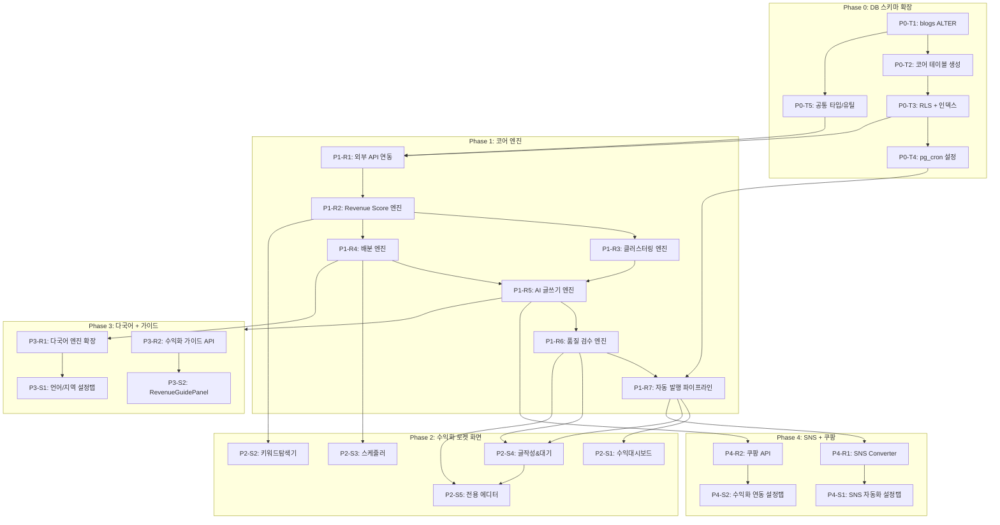

# 수익화 로켓 TASKS.md (추가개발)

> 생성 방식: Domain-Guarded (screen-spec v2.0 + strategy-engine-spec 기반)
> 버전: 1.0 | 날짜: 2026-03-18
> Interface Contract Validation: ✅ PASSED
> 기존 planning/07-tasks.md 완료 후 추가 개발 범위

---

## 📊 전체 현황

| Phase | 설명 | 태스크 수 | 상태 |
|-------|------|----------|------|
| **PT** | **요금제(Plan Tier) 시스템** | **11** | **✅ 완료** |
| P0 | DB 스키마 확장 + 공통 설정 | 5 | ⬜ |
| P1 | 코어 엔진 (Backend) | 15 | ⬜ |
| P2 | 수익화 로켓 4탭 화면 + 전용 에디터 (Frontend) | 15 | ⬜ |
| P3 | Neurion 다국어 + 수익화 가이드 | 6 | ⬜ |
| P4 | Neurion SNS + 쿠팡파트너스 | 8 | ⬜ |
| **합계** | | **60** | |

---

## Phase PT: 요금제(Plan Tier) 시스템 ✅ 완료

> 5단계 요금제 (Lite/Basic/Pro/Growth/Scale) 구현. 결제 미구현 — 설정에서 직접 플랜 선택.

### [x] PT-0: DB 마이그레이션
- `supabase/migrations/020_plans_and_pricing.sql`
- plans, plan_features, discount_policies, user_plans 테이블 + 시드 데이터
- users.plan_id 추가, handle_new_user() 트리거

### [x] PT-1: 타입 및 상수
- `types/plan.ts` — PlanId, FeatureKey, UserPlanContext 등
- `lib/plan/constants.ts` — PLAN_ORDER, FEATURE_LABELS, SIDEBAR_FEATURE_MAP, UPSELL_TRIGGERS

### [x] PT-2: 서버 유틸리티
- `lib/plan/server.ts` — getUserPlanContext, isFeatureEnabled, canCreateBlog, canCreatePost

### [x] PT-3: API 라우트
- `app/api/plans/route.ts` — GET: 전체 플랜 + 기능 + 할인
- `app/api/user/plan/route.ts` — GET: 내 플랜, PATCH: 플랜 변경

### [x] PT-4: 클라이언트 인프라
- `hooks/usePlan.ts`, `hooks/useUpsell.ts`, `components/plan/PlanContext.tsx`
- `app/(dashboard)/layout.tsx` — PlanProvider 래핑

### [x] PT-5: UI 컴포넌트
- `components/plan/UpgradeModal.tsx`, `FeatureGate.tsx`, `PlanSettingsTab.tsx`

### [x] PT-6: 설정 요금제 탭
- `app/(dashboard)/settings/page.tsx` — 5번째 탭 "요금제" 추가

### [x] PT-7: 사이드바 기능 잠금
- `components/layout/AppSidebar.tsx` — 잠긴 메뉴 opacity + 자물쇠 + UpgradeModal

### [x] PT-8: 페이지 수준 기능 잠금
- keywords, scheduler, monetize 페이지에 FeatureGate 래핑

### [x] PT-9: 백엔드 API 제한
- blogs POST (canCreateBlog), posts POST (canCreatePost)
- scheduler/jobs POST (isFeatureEnabled 'scheduler')
- keywords/search GET (isFeatureEnabled 'keyword_explorer')

### [x] PT-10: 업셀 트리거 + 문서 업데이트
- BlogCreateForm에 PLAN_LIMIT_BLOGS 감지 → UpgradeModal
- docs/add/ 1,3,4,6,7번 문서 업데이트

---

## Interface Contract Validation

### 화면 → 리소스 매핑 검증

| 화면 | 필요 리소스 | DB 테이블 | 상태 |
|------|-----------|-----------|------|
| 수익대시보드 | pipeline_status, revenue_summary, blog_grades | scheduled_posts, revenue_analytics, blogs | ✅ |
| 키워드탐색기 | gold/event/seasonal_keywords, user_blogs | keywords, blogs | ✅ |
| 스케줄러 | schedule_entries, distribution_preview | scheduled_posts, blog_keyword_assignments | ✅ |
| 글작성&대기 | pipeline_counts, review_queue, quality_report | scheduled_posts, post_quality_scores | ✅ |
| 블로그설정-언어 | language_config | blogs(language), blog_settings | ✅ |
| 블로그설정-SNS | platform_connections | blog_settings(sns_settings), sns_posts | ✅ |
| 블로그설정-수익화 | coupang_settings, affiliate_stats | blog_settings(coupang_settings), affiliate_clicks | ✅ |

### blogs 테이블 확장 필드 검증

| 신규 필드 | 사용 화면 | 상태 |
|-----------|----------|------|
| grade (S/A/B/C/D) | 대시보드, 키워드탐색기, 스케줄러 | ✅ |
| daily_quota | 스케줄러, 배분엔진 | ✅ |
| primary_ad_category | 대시보드, AI글쓰기 | ✅ |
| language (ko/en/ja) | 블로그설정-언어, 배분엔진 | ✅ |

---

## 의존성 다이어그램



---

## Phase 0: DB 스키마 확장 + 공통 설정

### [ ] P0-T1: blogs 테이블 ALTER + blog_settings 생성
- **담당**: database-specialist
- **설명**: 기존 blogs 테이블에 수익화 로켓 필드 추가 + blog_settings JSONB 테이블 생성
- **작업 목록**:
  - [ ] `ALTER TABLE blogs ADD COLUMN grade VARCHAR(1) DEFAULT 'C'`
  - [ ] `ALTER TABLE blogs ADD COLUMN daily_quota INT DEFAULT 3`
  - [ ] `ALTER TABLE blogs ADD COLUMN primary_ad_category VARCHAR(50)`
  - [ ] `ALTER TABLE blogs ADD COLUMN language VARCHAR(10) DEFAULT 'ko'`
  - [ ] `CHECK (grade IN ('S','A','B','C','D'))`
  - [ ] `CREATE TABLE blog_settings` (blog_id FK, sns_settings JSONB, coupang_settings JSONB, language_settings JSONB)
- **파일**:
  - `supabase/migrations/020_blogs_monetize_columns.sql`
  - `supabase/migrations/021_blog_settings.sql`
- **완료 기준**: 마이그레이션 성공, 기존 blogs 데이터 무결성 유지

### [ ] P0-T2: 수익화 로켓 코어 테이블 생성
- **담당**: database-specialist
- **의존**: P0-T1
- **설명**: 키워드, 스케줄, 검수, 수익분석 등 8개 신규 테이블
- **작업 목록**:
  - [ ] `CREATE TABLE keywords` (keyword, keyword_type, intent_type, revenue_score, keyword_grade, monthly_search_volume, cpc_estimate, competition_score, trend_index, is_seasonal, seasonal_months, expires_at)
  - [ ] `CREATE TABLE keyword_clusters` (seed_keyword_id FK, cluster_keywords JSON, cluster_strategy, intent_weights)
  - [ ] `CREATE TABLE scheduled_posts` (blog_id FK, keyword_id FK, cluster_id FK, scheduled_date, scheduled_time, status, writing_mode, content_draft, platform_post_id, published_at)
  - [ ] `CREATE TABLE post_quality_scores` (post_id FK UNIQUE, seo_score, quality_score, revenue_score, total_score GENERATED, auto_published, review_reason, score_breakdown JSONB)
  - [ ] `CREATE TABLE revenue_analytics` (blog_id FK, analytics_date, estimated_revenue, actual_revenue, ad_category, language, blog_type, page_views, ctr, rpm)
  - [ ] `CREATE TABLE post_ad_performance` (post_id FK, performance_date, revenue, cpc, ctr, clicks, impressions)
  - [ ] `CREATE TABLE blog_keyword_assignments` (blog_id FK, keyword_id FK, assigned_date, assigned_time, assignment_reason, is_confirmed)
  - [ ] `CREATE TABLE keyword_search_history` (user_id FK, search_query, search_type, result_count)
- **파일**:
  - `supabase/migrations/022_keywords.sql`
  - `supabase/migrations/023_scheduled_posts.sql`
  - `supabase/migrations/024_quality_scores.sql`
  - `supabase/migrations/025_revenue_analytics.sql`
  - `supabase/migrations/026_supporting_tables.sql`
- **완료 기준**: 모든 FK 제약 조건 + 상태 체크 제약 조건 동작

### [ ] P0-T3: RLS 정책 + 인덱스 생성
- **담당**: database-specialist
- **의존**: P0-T2
- **작업 목록**:
  - [ ] keywords: `user_id = auth.uid()` RLS
  - [ ] scheduled_posts: `blog_id IN (SELECT id FROM blogs WHERE user_id = auth.uid())` RLS
  - [ ] revenue_analytics: 동일 패턴 RLS
  - [ ] post_quality_scores: scheduled_posts 경유 RLS
  - [ ] `idx_keywords_grade`, `idx_keywords_type`, `idx_keywords_seasonal`
  - [ ] `idx_scheduled_date`, `idx_scheduled_blog`, `idx_pending_posts`
  - [ ] `idx_revenue_date`, `idx_revenue_category`
- **파일**:
  - `supabase/migrations/027_rls_policies.sql`
  - `supabase/migrations/028_indexes.sql`
- **완료 기준**: RLS 테스트 (다른 사용자 데이터 접근 차단)

### [ ] P0-T4: pg_cron 스케줄 등록
- **담당**: database-specialist
- **의존**: P0-T3
- **작업 목록**:
  - [ ] `auto-publish-rocket`: UTC 21:00 (KST 06:00) 자동 발행
  - [ ] `trending-keyword-check`: 매시간 급상승 키워드 체크
  - [ ] `trigger_auto_publish()` 함수 스텁 생성
  - [ ] `check_trending_keywords()` 함수 스텁 생성
- **파일**:
  - `supabase/migrations/029_pg_cron.sql`
- **완료 기준**: pg_cron 등록 확인, 함수 호출 정상 동작 (로그 기록)

### [ ] P0-T5: 공통 타입 + 유틸리티
- **담당**: backend-specialist
- **의존**: P0-T1
- **작업 목록**:
  - [ ] `types/monetize.ts`: Grade, IntentType, KeywordType, PipelineStatus, RevenueScore 등 타입 정의
  - [ ] `types/database.ts` 확장: 신규 테이블 타입 추가
  - [ ] `lib/monetize/constants.ts`: Revenue Score 가중치, 자동발행 임계값(45점), PASONA 가중치 매트릭스, ANNUAL_EVENTS 캘린더
  - [ ] `lib/monetize/utils.ts`: normalizeSearchVolume, normalizeCPC, normalizeTrend, assignGrade 공통 함수
- **파일**:
  - `types/monetize.ts`
  - `lib/monetize/constants.ts`
  - `lib/monetize/utils.ts`
- **TDD**: `tests/lib/monetize-utils.test.ts` → 구현

---

## Phase 1: 코어 엔진 (Backend Resources)

### P1-R1: 외부 API 연동 모듈

#### [ ] P1-R1-T1: 네이버 광고 API 연동
- **담당**: backend-specialist
- **의존**: P0-T5
- **설명**: 키워드 검색량(PC+모바일) + 경쟁도(compIdx) 수집 — Revenue Score 1순위 데이터소스
- **API**: `https://api.naver.com/keywordstool` (X-API-KEY 헤더)
- **작업 목록**:
  - [ ] `lib/monetize/apis/naver-ad-api.ts`: NaverAdAPI 클래스
  - [ ] 연관 키워드 + 월간 검색량(PC+모바일) + 경쟁도 수집
  - [ ] 일 1,000건 Rate Limit 관리 + 24시간 캐싱
  - [ ] `app/api/monetize/external/naver-keywords/route.ts`
- **TDD**: `tests/lib/monetize/naver-ad-api.test.ts` → 구현

#### [ ] P1-R1-T2: Google Keyword Planner 연동
- **담당**: backend-specialist
- **의존**: P0-T5
- **설명**: CPC 단가 수집 (애드센스 수익 핵심 지표) — Revenue Score 2순위 데이터소스
- **API**: Google Ads API (Keyword Planner `high_top_of_page_bid_micros`)
- **작업 목록**:
  - [ ] `lib/monetize/apis/google-kwp-api.ts`: GoogleKWPAPI 클래스
  - [ ] CPC 단가 (micros → 원화 환산) + 글로벌 검색량
  - [ ] 일 1회 배치 갱신 + 캐싱
  - [ ] `app/api/monetize/external/google-keywords/route.ts`
- **TDD**: `tests/lib/monetize/google-kwp-api.test.ts` → 구현

#### [ ] P1-R1-T3: 네이버 DataLab API + 이벤트 API 연동
- **담당**: backend-specialist
- **의존**: P0-T5
- **설명**: 트렌드 지수(계절성) + 이벤트/공연 키워드 수집
- **작업 목록**:
  - [ ] `lib/monetize/apis/naver-datalab-api.ts`: DataLab 2년치 트렌드 + YoY 성장률
  - [ ] `lib/monetize/apis/event-api.ts`: 인터파크/멜론티켓 RSS + 네이버뉴스 API + Google Trends
  - [ ] 논란 인물 블랙리스트 필터 ("논란", "사건", "불매" 감지)
  - [ ] 이벤트 D-Day 타이밍 자동 계산 (D-90~D+7)
- **TDD**: `tests/lib/monetize/datalab-api.test.ts` → 구현

### P1-R2: Revenue Score 엔진

#### [ ] P1-R2-T1: Revenue Score 계산 + 등급 부여
- **담당**: backend-specialist
- **의존**: P1-R1-T1, P1-R1-T2, P1-R1-T3
- **설명**: 4차원 수익 점수 체계 (Traffic 25% + Revenue 40% + Difficulty 25% + Trend 10%)
- **공식**:
  ```
  revenue_score = traffic(25%) + revenue(40%) + difficulty(25%) + trend(10%)
  등급: S(90+) / A(75~89) / B(60~74) / C(45~59) / D(~44)
  ```
- **작업 목록**:
  - [ ] `lib/monetize/engines/keyword-scorer.ts`: calculateRevenueScore(), assignGrade()
  - [ ] 3개 API 데이터 통합 파이프라인 (우선순위: 네이버 → Google KWP → DataLab)
  - [ ] keywords 테이블 저장 + 중복 검사
- **파일**:
  - `lib/monetize/engines/keyword-scorer.ts`
- **TDD**: `tests/lib/monetize/keyword-scorer.test.ts` → 구현

#### [ ] P1-R2-T2: 키워드 탐색 API (골드/이벤트/시즌)
- **담당**: backend-specialist
- **의존**: P1-R2-T1
- **엔드포인트**:
  - `GET /api/monetize/keywords/gold?q=...&minScore=60` → 골드 키워드 검색
  - `GET /api/monetize/keywords/events?startDate=...&endDate=...` → 이벤트 키워드
  - `GET /api/monetize/keywords/seasonal?month=3` → 시즌 키워드
  - `POST /api/monetize/keywords/register` → 키워드 달력 등록
- **파일**:
  - `app/api/monetize/keywords/gold/route.ts`
  - `app/api/monetize/keywords/events/route.ts`
  - `app/api/monetize/keywords/seasonal/route.ts`
  - `app/api/monetize/keywords/register/route.ts`
- **TDD**: `tests/api/monetize/keywords.test.ts` → 구현

### P1-R3: 클러스터링 엔진

#### [ ] P1-R3-T1: 키워드 클러스터링 × Intent 분류
- **담당**: backend-specialist
- **의존**: P1-R2-T1
- **설명**: Seed 키워드 → 6가지 Intent(AD/REVIEW/INFO/CRITIC/COMPARE/TREND)별 2개씩 → 8~12개 클러스터
- **작업 목록**:
  - [ ] `lib/monetize/engines/cluster-engine.ts`: Intent 자동 분류 + Claude API 연관 키워드 생성
  - [ ] keyword_clusters 테이블 저장 (seed_keyword_id, cluster_keywords, intent_weights)
  - [ ] 이벤트 키워드 D-Day 기준 클러스터 자동 생성 (D-90~D+7 타이밍)
- **파일**:
  - `lib/monetize/engines/cluster-engine.ts`
- **TDD**: `tests/lib/monetize/cluster-engine.test.ts` → 구현

### P1-R4: 배분 엔진

#### [ ] P1-R4-T1: Distribution Engine 구현
- **담당**: backend-specialist
- **의존**: P1-R2-T1, P0-T2
- **설명**: 키워드를 블로그별 날짜+시간으로 자동 배분 (등급 매칭 + 쿼터 + 시간 분산)
- **배분 규칙**:
  - Grade Matching: S키워드 → S/A블로그, A → A/B, B → B/C, C → C/D
  - 하루 쿼터(daily_quota) 초과 불가
  - 동일 키워드: 블로그별 최소 3일 간격
  - 시간 분산: 60~120분 랜덤 간격 (패턴 감지 방지)
- **작업 목록**:
  - [ ] `lib/monetize/engines/distribution-engine.ts`: runDistributionEngine()
  - [ ] 프리뷰 모드 (확정 전 검토)
  - [ ] blog_keyword_assignments + scheduled_posts 레코드 생성
- **엔드포인트**:
  - `POST /api/monetize/scheduler/distribute` → 배분 프리뷰
  - `POST /api/monetize/scheduler/apply-preview` → 프리뷰 적용
  - `POST /api/monetize/scheduler/confirm` → 스케줄 확정
- **파일**:
  - `lib/monetize/engines/distribution-engine.ts`
  - `app/api/monetize/scheduler/distribute/route.ts`
  - `app/api/monetize/scheduler/confirm/route.ts`
- **TDD**: `tests/lib/monetize/distribution-engine.test.ts` → 구현

#### [ ] P1-R4-T2: 스케줄러 CRUD API
- **담당**: backend-specialist
- **의존**: P1-R4-T1
- **엔드포인트**:
  - `GET /api/monetize/scheduler/calendar?year=2026&month=3` → 월간 달력 조회
  - `PUT /api/monetize/scheduler/reassign` → 드래그앤드롭 재배정
  - `DELETE /api/monetize/scheduler/entry/[id]` → 스케줄 삭제
- **파일**:
  - `app/api/monetize/scheduler/calendar/route.ts`
  - `app/api/monetize/scheduler/reassign/route.ts`
  - `app/api/monetize/scheduler/entry/[id]/route.ts`
- **TDD**: `tests/api/monetize/scheduler.test.ts` → 구현

### P1-R5: AI 글쓰기 엔진

#### [ ] P1-R5-T1: PASONA × SEO/AEO/GEO 통합 프롬프트 엔진
- **담당**: backend-specialist
- **의존**: P1-R3-T1
- **설명**: Intent별 PASONA 가중치 + SEO/AEO/GEO 요구사항 통합 프롬프트 생성 + 글 작성
- **파이프라인**:
  1. 아웃라인 생성 (claude-sonnet-4-6)
  2. 본문 생성 (S등급: claude-opus-4-6, 나머지: claude-sonnet-4-6)
  3. 후처리: 키워드 밀도 조정 + google_ad_section 태그 + Schema.org JSON-LD + 이미지 alt
- **작업 목록**:
  - [ ] `lib/monetize/engines/ai-writer.ts`: PASONA 가중치 매트릭스 (AD/REVIEW/INFO/CRITIC/COMPARE별)
  - [ ] `lib/monetize/engines/prompt-builder.ts`: Intent Directive + PASONA + SEO/AEO/GEO 통합 프롬프트
  - [ ] `lib/monetize/engines/post-processor.ts`: 키워드 밀도, 광고 섹션 태그, Schema 자동 생성
  - [ ] `lib/monetize/apis/claude-api.ts`: Claude API 래퍼 (기존 lib/ai/claude.ts 확장)
- **파일**:
  - `lib/monetize/engines/ai-writer.ts`
  - `lib/monetize/engines/prompt-builder.ts`
  - `lib/monetize/engines/post-processor.ts`
- **TDD**: `tests/lib/monetize/ai-writer.test.ts` → 구현

#### [ ] P1-R5-T2: AI 글쓰기 API Route
- **담당**: backend-specialist
- **의존**: P1-R5-T1
- **엔드포인트**:
  - `POST /api/monetize/writing/generate` → 수동 글 생성 트리거
  - `GET /api/monetize/writing/pipeline` → 파이프라인 현황 카운트
- **파일**:
  - `app/api/monetize/writing/generate/route.ts`
  - `app/api/monetize/writing/pipeline/route.ts`
- **TDD**: `tests/api/monetize/writing.test.ts` → 구현

### P1-R6: 품질 검수 엔진

> **키워드 유형별 검수 체계 분리**
> - 골드/시즌 키워드 → **검수 A** (SEO + 품질 + 수익화)
> - 이벤트 키워드 → **검수 B** (Intent 검수) — 글쓰기 로직 자체가 다르므로 채점표도 다름
> - 공통: 50점 만점, 45점 이상 자동 발행

#### [ ] P1-R6-T1: 검수 A — 골드/시즌 키워드 품질 검수 엔진
- **담당**: backend-specialist
- **의존**: P1-R5-T1
- **적용 대상**: `keyword_type = 'gold' | 'seasonal'`
- **설명**: 4개 영역 검수, 총 50점 만점, 45점 이상 자동 발행
- **검수 항목**:
  ```
  [1] SEO 준수 (0~15점)
    메타태그 완성도:     4점  제목 35자+키워드(2), 메타설명 120~160자(2)
    키워드 밀도:         4점  1~2% 범위(4), 이탈(0)
    구조 최적화:         4점  H2 2개+(2), H3 포함(1), 1500자+(1)
    링크/이미지:         3점  내부링크 2개+(2), 이미지 alt(1)

  [2] 콘텐츠 품질 (0~12점)
    PASONA 구조:        5점  6요소 모두 포함(5), 1개 누락(-1)
    가독성:             4점  문장 40자 이내(2), 단락 5줄 이내(1), 리스트(1)
    독창성:             3점  중복 0~20%(3), 20~40%(1), 40%+(0)

  [3] AEO 준수 (0~10점)
    FAQ 구조화 데이터:   3점  FAQPage Schema.org JSON-LD 포함
    핵심답변 블록:       3점  40~60자 이내 명확한 1문장 답변
    Schema.org 마크업:   2점  Article/HowTo/Product Schema 적용
    숫자/통계 인용:      2점  구체적 수치/연구 결과 2개 이상 포함

  [4] 문맥광고 코드 준수 (0~13점)
    ad_section 태그:     4점  google_ad_section_start/end 정확 배치
    고CPC 키워드 밀집:   3점  ad_section 내부에 광고 카테고리 키워드 집중
    Intent 정합성:       4점  선택 Intent와 글 내용 일치
    광고 비율 적정:      2점  광고 섹션 비율 < 30% (네이버 저품질 방지)

  합계: 15 + 12 + 10 + 13 = 50점 → 45점 이상 자동 발행
  ```
- **작업 목록**:
  - [ ] `lib/monetize/engines/quality-checker.ts`: QualityChecker 클래스 (Strategy 패턴 — 키워드 유형별 분기)
  - [ ] `lib/monetize/engines/checkers/standard-checker.ts`: checkSEO(), checkContentQuality(), checkAEO(), checkAdCode()
  - [ ] post_quality_scores 자동 저장 + review_reason 생성
  - [ ] 자동 발행 / 보류 결정 로직
- **파일**:
  - `lib/monetize/engines/quality-checker.ts`
  - `lib/monetize/engines/checkers/standard-checker.ts`
- **TDD**: `tests/lib/monetize/standard-checker.test.ts` → 구현

#### [ ] P1-R6-T2: 검수 B — 이벤트 키워드 Intent 검수 엔진
- **담당**: backend-specialist
- **의존**: P1-R5-T1
- **적용 대상**: `keyword_type = 'event'`
- **설명**: 이벤트 키워드는 D-Day 기반 글쓰기 로직이 다르므로 별도 채점표. 8개 항목, 총 50점, 45점 이상 자동 발행
- **검수 항목**:
  ```
  [이벤트 고유 항목]
    Intent 목적 달성:      8점  해당 Intent(AD/REVIEW/INFO 등) 목적을 콘텐츠가 충족하는가
    PASONA 비중 준수:      8점  Intent별 가중치(AD: O 30%, A 20% 등)가 실제 반영되었는가
    필수 포함 요소 완비:    7점  D-Day 시점별 필수 요소 (D-45: 예매 링크, D+1: 후기 등)
    금지 요소 미포함:       7점  논란 인물, 허위 정보, 과대 광고 등 블랙리스트
    페르소나 톤앤매너:      5점  블로그 AI 캐릭터 설정과 어조 일치 여부

  [공통 준수 항목]
    SEO 준수:              5점  메타태그+키워드 포함(2), 키워드밀도 1~2%(2), H2/H3 구조(1)
    AEO 준수:              5점  FAQ 구조화 데이터(2), 핵심답변 40~60자(2), Schema 마크업(1)
    문맥광고 코드 준수:     5점  ad_section 태그 정확 배치(2), 고CPC 밀집(2), 광고비율 < 30%(1)

  합계: 8+8+7+7+5+5+5+5 = 50점 → 45점 이상 자동 발행
  ```
- **작업 목록**:
  - [ ] `lib/monetize/engines/checkers/event-checker.ts`: checkIntentAchievement(), checkPasonaWeight(), checkRequiredElements(), checkForbiddenElements(), checkToneMatch(), checkSEO(), checkAEO(), checkAdCode()
  - [ ] D-Day 시점별 필수 요소 매핑 테이블 (D-90 루머→TREND, D-45 티켓→AD, D+1 후기→REVIEW 등)
  - [ ] AI 기반 톤앤매너 일치도 평가 (Claude API로 페르소나 vs 실제 글 비교)
  - [ ] post_quality_scores에 event 전용 score_breakdown 저장
- **파일**:
  - `lib/monetize/engines/checkers/event-checker.ts`
- **TDD**: `tests/lib/monetize/event-checker.test.ts` → 구현

#### [ ] P1-R6-T3: 검수 대기열 + 재검수 API
- **담당**: backend-specialist
- **의존**: P1-R6-T1, P1-R6-T2
- **엔드포인트**:
  - `GET /api/monetize/writing/review-queue` → 보류 글 목록
  - `GET /api/monetize/writing/report/[postId]` → 품질 검수 리포트
  - `PATCH /api/monetize/writing/draft/[postId]` → 수정 초안 저장 (전용 에디터에서 호출)
  - `POST /api/monetize/writing/re-score/[postId]` → 수정 후 재검수 (품질 점수 재계산)
  - `POST /api/monetize/writing/approve/[postId]` → 승인 (자동 발행)
  - `POST /api/monetize/writing/reject/[postId]` → 거절 (키워드 풀 반환)
- **파일**:
  - `app/api/monetize/writing/review-queue/route.ts`
  - `app/api/monetize/writing/report/[postId]/route.ts`
  - `app/api/monetize/writing/draft/[postId]/route.ts`
  - `app/api/monetize/writing/re-score/[postId]/route.ts`
  - `app/api/monetize/writing/approve/[postId]/route.ts`
  - `app/api/monetize/writing/reject/[postId]/route.ts`
- **TDD**: `tests/api/monetize/review.test.ts` → 구현

### P1-R7: 자동 발행 파이프라인

#### [ ] P1-R7-T1: pg_cron 자동 발행 파이프라인 구현
- **담당**: backend-specialist
- **의존**: P1-R6-T1, P1-R6-T2, P0-T4
- **설명**: 새벽 6시(KST) pg_cron 트리거. keyword_type에 따라 검수 A 또는 검수 B 자동 분기 → 오늘 scheduled_posts 가져오기 → AI 글쓰기 → 검수 → 발행/보류
- **파이프라인**:
  ```
  scheduled_date = today & status = 'pending'
  → status = 'writing' → AI 글쓰기 엔진 호출
  → status = 'reviewing' → 품질 검수 엔진 호출
  → 45점+ → status = 'auto_published' (블로그 플랫폼 발행)
  → 45점- → status = 'review_queue' (사용자 검토 대기)
  ```
- **작업 목록**:
  - [ ] `lib/monetize/pipeline/auto-publish.ts`: 전체 파이프라인 오케스트레이션
  - [ ] `app/api/cron/monetize-publish/route.ts`: Vercel Cron / pg_cron 엔드포인트
  - [ ] `vercel.json` cron 설정 추가
  - [ ] scheduled_posts 상태 전환 + 로그 기록
- **파일**:
  - `lib/monetize/pipeline/auto-publish.ts`
  - `app/api/cron/monetize-publish/route.ts`
- **TDD**: `tests/lib/monetize/auto-publish.test.ts` → 구현

#### [ ] P1-R7-T2: 수익 분석 데이터 API
- **담당**: backend-specialist
- **의존**: P0-T2
- **엔드포인트**:
  - `GET /api/monetize/dashboard` → 대시보드 통합 데이터 (파이프라인 현황 + 수익 요약 + 블로그 등급)
  - `GET /api/monetize/analytics?dimension=blog&startDate=...&endDate=...` → 다차원 수익 분석
- **파일**:
  - `app/api/monetize/dashboard/route.ts`
  - `app/api/monetize/analytics/route.ts`
- **TDD**: `tests/api/monetize/dashboard.test.ts` → 구현

---

## Phase 2: 수익화 로켓 4탭 화면 (Frontend)

### P2-S1: 수익대시보드

#### [ ] P2-S1-T1: 수익대시보드 레이아웃 + MonetizeTabNav
- **담당**: frontend-specialist
- **의존**: P1-R7-T2
- **화면**: /monetize?tab=dashboard (screen-15)
- **컴포넌트**:
  - `MonetizeTabNav`: 4탭 네비게이션 (대시보드/키워드/스케줄러/글작성) — 공통
  - `monetize/layout.tsx`: 탭 라우팅 레이아웃
- **파일**:
  - `app/(dashboard)/monetize/layout.tsx`
  - `components/monetize/MonetizeTabNav.tsx`
- **TDD**: `tests/components/monetize/MonetizeTabNav.test.tsx` → 구현

#### [ ] P2-S1-T2: 수익대시보드 위젯 구현
- **담당**: frontend-specialist
- **의존**: P2-S1-T1
- **컴포넌트**:
  - `RocketStatusCard`: 파이프라인 현황 4분할 (대기/작성중/검수중/발행완료)
  - `RevenueSummaryCard`: 이번달/지난달/예상 수익 (전월 대비 변화율)
  - `RevenueLineChart`: 실제+예상 수익 트렌드 그래프 (Recharts, 골드 컬러)
  - `BlogGradeTable`: 블로그 등급 + 월수익 + 글수 + RPM 테이블
  - `MultiDimensionChart`: 블로그별/광고별/언어별/유형별 탭 전환 분석
- **파일**:
  - `app/(dashboard)/monetize/page.tsx` (기존 플레이스홀더 교체)
  - `components/monetize/dashboard/RocketStatusCard.tsx`
  - `components/monetize/dashboard/RevenueSummaryCard.tsx`
  - `components/monetize/dashboard/RevenueLineChart.tsx`
  - `components/monetize/dashboard/BlogGradeTable.tsx`
  - `components/monetize/dashboard/MultiDimensionChart.tsx`
- **TDD**: `tests/pages/monetize-dashboard.test.tsx` → 구현

#### [ ] P2-S1-V: 수익대시보드 검증
- **검증 항목**:
  - [ ] 파이프라인 카드 클릭 → /monetize?tab=writing 이동
  - [ ] 수익 차트 기간 필터링 동작
  - [ ] 블로그 등급 S/A/B/C/D 배지 정상 표시
  - [ ] 다차원 분석 탭 전환 → 데이터 갱신

### P2-S2: 키워드탐색기

#### [ ] P2-S2-T1: 키워드탐색기 3탭 구현
- **담당**: frontend-specialist
- **의존**: P1-R2-T2
- **화면**: /monetize?tab=keywords (screen-16)
- **컴포넌트**:
  - `KeywordTypeSelector`: 골드/이벤트/시즌 탭
  - `GoldKeywordPanel`: 검색 입력 + Revenue Score 필터 + 결과 카드 목록
  - `EventKeywordPanel`: 날짜 범위 + 이벤트 목록 + D-Day 표시
  - `SeasonKeywordPanel`: 월 선택 + ANNUAL_EVENTS 기반 시즌 키워드
  - `KeywordResultCard`: Revenue Score 바 + 등급 배지 + Intent 태그
  - `KeywordDetailModal`: 상세 정보 + 달력 등록 버튼
  - `GradeBadge`: S/A/B/C/D 등급 배지 (공통)
  - `RevenueScoreBar`: Revenue Score 프로그레스 바 (공통)
- **파일**:
  - `components/monetize/keywords/KeywordTypeSelector.tsx`
  - `components/monetize/keywords/GoldKeywordPanel.tsx`
  - `components/monetize/keywords/EventKeywordPanel.tsx`
  - `components/monetize/keywords/SeasonKeywordPanel.tsx`
  - `components/monetize/keywords/KeywordResultCard.tsx`
  - `components/monetize/keywords/KeywordDetailModal.tsx`
  - `components/monetize/shared/GradeBadge.tsx`
  - `components/monetize/shared/RevenueScoreBar.tsx`
  - `store/monetizeStore.ts`
- **TDD**: `tests/pages/monetize-keywords.test.tsx` → 구현

#### [ ] P2-S2-V: 키워드탐색기 검증
- **검증 항목**:
  - [ ] 골드 탭: 검색 → API 호출 → Revenue Score 내림차순 결과
  - [ ] 이벤트 탭: 날짜 범위 변경 → 이벤트 키워드 목록 갱신
  - [ ] 시즌 탭: 월 선택 → 해당 월 시즌 키워드 표시
  - [ ] 키워드 상세 모달 → 달력 등록 → /monetize?tab=scheduler 이동

### P2-S3: 스케줄러

#### [ ] P2-S3-T1: 키워드 달력 + 배분 엔진 UI 구현
- **담당**: frontend-specialist
- **의존**: P1-R4-T2
- **화면**: /monetize?tab=scheduler (screen-17)
- **컴포넌트**:
  - `SchedulerCalendar`: 월간 키워드 달력 (좌측 2/3), 셀별 키워드 카드
  - `KeywordScheduleCard`: 키워드명 + 등급 + 블로그 + 시간 + 상태 (드래그 가능)
  - `DistributionEnginePanel`: 자동 배분 설정 (우측 1/3) — 블로그 선택, 규칙, 실행
  - `BlogDistributionPreview`: 배분 프리뷰 테이블 (하단)
  - `ScheduleConfirmModal`: 확정 전 검토 모달
- **이벤트**:
  - 카드 드래그앤드롭 → PUT /api/monetize/scheduler/reassign
  - 빈 셀 클릭 → 키워드 검색 모달
  - 자동 배분 실행 → POST distribute → 프리뷰 표시 → 적용 확정
- **파일**:
  - `components/monetize/scheduler/SchedulerCalendar.tsx`
  - `components/monetize/scheduler/KeywordScheduleCard.tsx`
  - `components/monetize/scheduler/DistributionEnginePanel.tsx`
  - `components/monetize/scheduler/BlogDistributionPreview.tsx`
  - `components/monetize/scheduler/ScheduleConfirmModal.tsx`
- **TDD**: `tests/pages/monetize-scheduler.test.tsx` → 구현

#### [ ] P2-S3-V: 스케줄러 검증
- **검증 항목**:
  - [ ] 월 네비게이션 → 달력 데이터 갱신
  - [ ] 카드 드래그앤드롭 → 날짜/블로그 재배정
  - [ ] 배분 엔진 실행 → 프리뷰 → 적용 → 달력 반영
  - [ ] 스케줄 확정 → /monetize?tab=writing 이동

### P2-S4: 글작성&대기

#### [ ] P2-S4-T1: 파이프라인 현황 + 검수 대기열 UI 구현
- **담당**: frontend-specialist
- **의존**: P1-R6-T3
- **화면**: /monetize?tab=writing (screen-18)
- **컴포넌트**:
  - `PipelineStatusBoard`: Kanban 보드 (대기→작성중→검수중→발행완료/보류)
  - `WritingProgressCard`: 현재 AI 작성 중인 글 진행률 (10초 폴링)
  - `ReviewQueueList`: 보류 글 목록 (키워드, 등급, 블로그, 점수, 미달 사유)
  - `QualityScoreReport`: 선택 글 3단계 검수 리포트 (SEO/품질/수익화 세부 점수)
  - `PostActionButtons`: 승인(자동발행) / 수정(에디터) / 거절(키워드풀 반환) 버튼
- **이벤트**:
  - 승인 → POST approve → 목록 갱신 + 토스트
  - 수정 → /monetize/editor/[postId] 이동 (수익화 전용 에디터)
  - 거절 → POST reject → 키워드 풀 반환 + 토스트
  - 10초 자동 폴링 (writing_count > 0일 때만)
- **파일**:
  - `components/monetize/writing/PipelineStatusBoard.tsx`
  - `components/monetize/writing/WritingProgressCard.tsx`
  - `components/monetize/writing/ReviewQueueList.tsx`
  - `components/monetize/writing/QualityScoreReport.tsx`
  - `components/monetize/writing/PostActionButtons.tsx`
- **TDD**: `tests/pages/monetize-writing.test.tsx` → 구현

#### [ ] P2-S4-V: 글작성&대기 검증
- **검증 항목**:
  - [ ] 파이프라인 카운트 정상 표시 (각 상태별)
  - [ ] 보류 글 선택 → 검수 리포트 상세 점수 표시
  - [ ] 승인 → 자동 발행 + 목록에서 제거 + 카운트 업데이트
  - [ ] 거절 → 키워드 풀 반환 확인

### P2-S5: 수익화 로켓 전용 에디터

> **기존 에디터(`/editor`)와 완전 별도 화면** — PASONA 구조 + 품질 검수 + 재검수 워크플로우가 근본적으로 다름

#### [ ] P2-S5-T1: 수익화 전용 에디터 페이지 + 레이아웃
- **담당**: frontend-specialist
- **의존**: P1-R6-T3
- **화면**: /monetize/editor/[postId] (완전 별도 라우트)
- **설명**: 기존 에디터와 독립된 수익화 전용 글 수정 화면. PASONA 구조, 3단계 품질 점수, 재검수 워크플로우 포함
- **레이아웃 구조**:
  ```
  ┌──────────────────────────────────────────────────────────┐
  │ 🔙 검수 대기열    키워드 [등급]  Intent  Revenue Score    │
  │ 블로그: {blogName}  상태: {status}                       │
  ├───────────────────────┬──────────────────────────────────┤
  │                       │  품질 점수 패널                   │
  │   PASONA 구조         │  ├ SEO     (0~20)                │
  │   에디터 영역          │  ├ 품질    (0~15)                │
  │                       │  └ 수익화  (0~15)                │
  │   [P] 문제 제기       │                                  │
  │   [A] 공감 확대       │  미달 항목 하이라이트              │
  │   [S] 해결책          │  PASONA 섹션 체크                 │
  │   [O] 제안            │  AEO FAQ 구조 체크                │
  │   [N] 범위 제한       │  광고 섹션 태그 프리뷰             │
  │   [A] 행동 유도       │  키워드 밀도 실시간 표시           │
  │                       │                                  │
  ├───────────────────────┴──────────────────────────────────┤
  │  [재검수 실행]    [수정 저장]    [승인 발행]    [거절]     │
  └──────────────────────────────────────────────────────────┘
  ```
- **컴포넌트**:
  - `MonetizeEditorHeader`: 키워드 등급 배지 + Intent 태그 + Revenue Score + 블로그 정보 + 뒤로가기
  - `MonetizeEditorLayout`: 좌(에디터) / 우(검수 패널) 2컬럼 레이아웃
- **파일**:
  - `app/(dashboard)/monetize/editor/[postId]/page.tsx`
  - `components/monetize/editor/MonetizeEditorHeader.tsx`
  - `components/monetize/editor/MonetizeEditorLayout.tsx`
- **TDD**: `tests/pages/monetize-editor.test.tsx` → 구현

#### [ ] P2-S5-T2: PASONA 구조 에디터 (좌측 패널)
- **담당**: frontend-specialist
- **의존**: P2-S5-T1
- **설명**: TipTap 기반이지만 PASONA 6섹션 구조를 시각적으로 구분하는 전용 에디터
- **컴포넌트**:
  - `PasonaEditor`: PASONA 섹션별 구분선 + 라벨 표시 (P/A/S/O/N/A 컬러 마커)
  - `PasonaSectionMarker`: 각 섹션 시작점 라벨 (접기/펼치기 가능)
  - `AdSectionHighlight`: `<!-- google_ad_section_start/end -->` 태그 영역 시각적 강조
  - `KeywordDensityIndicator`: 에디터 하단 실시간 키워드 밀도 표시 바
  - `InternalLinkSuggestion`: 내부 링크 추천 팝오버 (관련 이전 글 자동 검색)
- **기존 에디터와의 차이**:
  - 기존: 자유 형식 TipTap + AI 생성/직접 작성 모드 전환
  - 신규: PASONA 구조 고정 + Intent별 가중치 시각화 + 광고 섹션 태그 관리
- **파일**:
  - `components/monetize/editor/PasonaEditor.tsx`
  - `components/monetize/editor/PasonaSectionMarker.tsx`
  - `components/monetize/editor/AdSectionHighlight.tsx`
  - `components/monetize/editor/KeywordDensityIndicator.tsx`
  - `components/monetize/editor/InternalLinkSuggestion.tsx`
- **TDD**: `tests/components/monetize/PasonaEditor.test.tsx` → 구현

#### [ ] P2-S5-T3: 품질 검수 패널 (우측 패널) + 재검수
- **담당**: frontend-specialist
- **의존**: P2-S5-T1
- **설명**: 키워드 유형(골드·시즌 vs 이벤트)에 따라 다른 채점표 표시 + 미달 항목 안내 + 재검수
- **컴포넌트**:
  - `QualityScorePanel`: 키워드 유형 감지 → 검수 A 또는 검수 B 게이지 자동 전환 + 합계 + 45점 임계선
  - **[검수 A 모드 — 골드/시즌 키워드]**
    - `StandardScoreBreakdown`: SEO(20) + 품질(15) + 수익화(15) 3단계 게이지
      - SEO: 메타태그, 키워드밀도, H2/H3 구조, 내부 링크, 이미지 alt
      - 품질: PASONA 6요소 존재, 가독성(문장/단락), 글자수
      - 수익화: 광고 섹션 태그, Intent 정합성, FAQ, 핵심답변 블록
  - **[검수 B 모드 — 이벤트 키워드]**
    - `EventScoreBreakdown`: 5항목 × 10점 게이지
      - Intent 목적 달성도
      - PASONA 비중 준수도 (Intent별 가중치 대비 실제 비율)
      - D-Day 시점별 필수 요소 포함 여부
      - 금지 요소 미포함 여부
      - 페르소나 톤앤매너 일치도
  - `PasonaCheckList`: PASONA 6섹션 존재 여부 체크 (P ✅ A ✅ S ✅ O ⚠️ N ❌ A ✅) — 공통
  - `AeoStructureCheck`: FAQ 섹션 존재 + 핵심답변 블록 40~60자 여부 — 검수 A만 표시
  - `ReviewReasonAlert`: 미달 사유 알림 (어떤 항목이 부족한지 구체적 안내) — 공통
  - `ReScoreButton`: 수정 후 재검수 실행 → POST `/api/monetize/writing/re-score/[postId]` → keyword_type 기반 자동 분기
- **파일**:
  - `components/monetize/editor/QualityScorePanel.tsx`
  - `components/monetize/editor/ScoreBreakdown.tsx`
  - `components/monetize/editor/PasonaCheckList.tsx`
  - `components/monetize/editor/AeoStructureCheck.tsx`
  - `components/monetize/editor/ReviewReasonAlert.tsx`
- **TDD**: `tests/components/monetize/QualityScorePanel.test.tsx` → 구현

#### [ ] P2-S5-T4: 에디터 하단 액션 바 + API 연동
- **담당**: frontend-specialist
- **의존**: P2-S5-T2, P2-S5-T3
- **설명**: 저장/재검수/승인/거절 워크플로우
- **컴포넌트**:
  - `MonetizeEditorActions`: 하단 고정 액션 바
    - [수정 저장]: 현재 내용 임시 저장 (scheduled_posts.content_draft 업데이트)
    - [재검수 실행]: 수정된 내용으로 품질 검수 엔진 재실행 → 점수 갱신
    - [승인 발행]: 45점 이상일 때만 활성화 → POST approve → 자동 발행 → /monetize?tab=writing 이동
    - [거절]: 키워드 풀 반환 → /monetize?tab=writing 이동
- **API 연동**:
  - `PATCH /api/monetize/writing/draft/[postId]` → 초안 저장
  - `POST /api/monetize/writing/re-score/[postId]` → 재검수
  - `POST /api/monetize/writing/approve/[postId]` → 승인 발행
  - `POST /api/monetize/writing/reject/[postId]` → 거절
- **파일**:
  - `components/monetize/editor/MonetizeEditorActions.tsx`
  - `hooks/useMonetizeEditor.ts` (에디터 상태 관리 + API 호출)
- **TDD**: `tests/components/monetize/MonetizeEditorActions.test.tsx` → 구현

#### [ ] P2-S5-V: 수익화 전용 에디터 검증
- **검증 항목**:
  - [ ] /monetize?tab=writing에서 수정 버튼 → /monetize/editor/[postId] 이동
  - [ ] 기존 글 데이터 로드 + PASONA 섹션 마커 자동 표시
  - [ ] 품질 점수 3단계 게이지 정상 렌더링 (SEO/품질/수익화)
  - [ ] PASONA 체크리스트 + AEO 구조 체크 실시간 반영
  - [ ] 키워드 밀도 실시간 계산 + 표시
  - [ ] 수정 저장 → 내용 유지 + 저장 토스트
  - [ ] 재검수 실행 → 점수 갱신 + 미달 항목 업데이트
  - [ ] 45점 이상 시 승인 버튼 활성화 → 발행 → /monetize?tab=writing 이동
  - [ ] 거절 → 키워드 풀 반환 + 목록 복귀

---

## Phase 3: Neurion 확장 — 다국어 + 수익화 가이드

### P3-R1: 다국어 발행 엔진 확장

#### [ ] P3-R1-T1: 언어별 데이터소스 + 글쓰기 엔진 확장
- **담당**: backend-specialist
- **의존**: P1-R5-T1
- **설명**: 블로그 언어 설정 → AI 원어 작성 + 키워드 탐색 소스 자동 전환
- **작업 목록**:
  - [ ] `lib/monetize/engines/keyword-scorer.ts` 수정: 언어별 데이터소스 자동 선택 (ko→네이버, en→Google, ja→Google JP)
  - [ ] `lib/monetize/engines/ai-writer.ts` 수정: 언어별 프롬프트 분기 (LANGUAGE_WRITING_CONFIG)
  - [ ] `lib/monetize/engines/distribution-engine.ts` 수정: 언어별 타임존 스케줄링
  - [ ] pg_cron 추가: `auto-publish-en` (UTC 14:00), `auto-publish-ja` (UTC 21:00)
- **엔드포인트**:
  - `GET /api/blogs/[id]/settings/language`
  - `PUT /api/blogs/[id]/settings/language` → { language, writeStyle }
- **파일**:
  - `app/api/blogs/[id]/settings/language/route.ts`
- **TDD**: `tests/lib/monetize/multilingual.test.ts` → 구현

### P3-S1: 블로그 설정 — 언어/지역 탭

#### [ ] P3-S1-T1: 언어/지역 설정 UI 구현
- **담당**: frontend-specialist
- **의존**: P3-R1-T1
- **화면**: /blogs/[id]/settings?tab=language (screen-05 in docs/add)
- **컴포넌트**:
  - `LanguageSelector`: 언어 선택 (ko/en/ja) + 자동 설정 표시
  - `DataSourcePreview`: 선택 언어의 데이터소스 미리보기 (읽기 전용)
  - `WriteStyleInput`: 글쓰기 스타일 힌트 입력
  - 기존 `BlogSettingsTabNav` 확장: 언어/지역 탭 추가
- **파일**:
  - `components/blogs/settings/language/LanguageSelector.tsx`
  - `components/blogs/settings/language/DataSourcePreview.tsx`
  - `components/blogs/settings/language/WriteStyleInput.tsx`
- **TDD**: `tests/pages/blog-settings-language.test.tsx` → 구현

### P3-R2: 수익화 가이드 API

#### [ ] P3-R2-T1: Revenue Calculator 역산 로직 구현
- **담당**: backend-specialist
- **의존**: P1-R7-T2
- **설명**: 목표 월수익 → 필요 블로그 수/페르소나/일일 발행 수 역산
- **작업 목록**:
  - [ ] `lib/monetize/engines/revenue-calculator.ts`: 카테고리별 CPC 조회 + 편당 수익 계산 + 블로그 등급 구성 추천
  - [ ] 역산 공식: 목표 수익 / (월 방문자 × CTR 3% × CPC × 68%)
  - [ ] 블로그 구성: S급(60%) + A급(30%) + B급(10%)
- **엔드포인트**:
  - `POST /api/monetize/revenue-guide` → { targetAmount } → RevenueGuideResult
- **파일**:
  - `lib/monetize/engines/revenue-calculator.ts`
  - `app/api/monetize/revenue-guide/route.ts`
- **TDD**: `tests/lib/monetize/revenue-calculator.test.ts` → 구현

### P3-S2: RevenueGuidePanel

#### [ ] P3-S2-T1: 수익화 가이드 아코디언 패널 구현
- **담당**: frontend-specialist
- **의존**: P3-R2-T1
- **화면**: /monetize?tab=dashboard 하단 (아코디언)
- **컴포넌트**:
  - `RevenueGuidePanel`: 아코디언 (기본 접힘) + 목표 입력 + 결과 표시
  - 입력: 월 목표 수익 + 현재 블로그 수 + 주력 카테고리
  - 출력: 블로그 구성 추천 + 일일 발행 계획 + 페르소나 가이드 + 수익 시뮬레이션 + 액션 플랜
  - MD 다운로드 버튼: `revenue-guide-{amount}-{date}.md`
- **파일**:
  - `components/monetize/dashboard/RevenueGuidePanel.tsx`
- **TDD**: `tests/components/monetize/RevenueGuidePanel.test.tsx` → 구현

---

## Phase 4: Neurion 확장 — SNS + 쿠팡파트너스

### P4-R1: SNS Converter 엔진

#### [ ] P4-R1-T1: SNS 변환 + 발행 엔진 구현
- **담당**: backend-specialist
- **의존**: P1-R7-T1
- **설명**: 발행 글 → 인스타/X/쓰레드 포맷 변환 + 예약 발행
- **DB**: sns_posts 테이블 + blog_settings(sns_settings)
- **작업 목록**:
  - [ ] `supabase/migrations/030_sns_posts.sql` (sns_posts 테이블 + RLS + 인덱스)
  - [ ] `lib/monetize/engines/sns-converter.ts`: 플랫폼별 포맷 변환 (Claude API + 사용자 포맷 프롬프트)
  - [ ] `lib/monetize/apis/instagram-api.ts`: Instagram Graph API 래퍼
  - [ ] `lib/monetize/apis/twitter-api.ts`: Twitter API v2 스레드 발행
  - [ ] `lib/monetize/apis/threads-api.ts`: Meta Graph API 래퍼
  - [ ] `lib/monetize/apis/image-gen-api.ts`: DALL-E 3 / Ideogram (선택 토글)
  - [ ] pg_cron: `sns-auto-distribute` (매시간 30분 실행)
- **엔드포인트**:
  - `POST /api/monetize/sns/convert` → 변환 프리뷰
  - `POST /api/monetize/sns/publish` → 발행 실행
- **파일**:
  - `lib/monetize/engines/sns-converter.ts`
  - `lib/monetize/apis/instagram-api.ts`
  - `lib/monetize/apis/twitter-api.ts`
  - `lib/monetize/apis/threads-api.ts`
  - `app/api/monetize/sns/convert/route.ts`
  - `app/api/monetize/sns/publish/route.ts`
- **TDD**: `tests/lib/monetize/sns-converter.test.ts` → 구현

#### [ ] P4-R1-T2: SNS 설정 API
- **담당**: backend-specialist
- **의존**: P4-R1-T1
- **엔드포인트**:
  - `GET /api/blogs/[id]/settings/sns` → SNS 설정 조회
  - `PUT /api/blogs/[id]/settings/sns` → SNS 설정 저장
  - `POST /api/blogs/[id]/settings/sns/test/[platform]` → 연결 테스트
- **파일**:
  - `app/api/blogs/[id]/settings/sns/route.ts`
  - `app/api/blogs/[id]/settings/sns/test/[platform]/route.ts`
- **TDD**: `tests/api/blog-settings-sns.test.ts` → 구현

### P4-R2: 쿠팡파트너스 API 연동

#### [ ] P4-R2-T1: 쿠팡 상품 검색 + 제휴 링크 자동 삽입
- **담당**: backend-specialist
- **의존**: P1-R5-T1
- **설명**: AI 글 PASONA O(Offer) 섹션에 관련 상품 자동 추천 + 제휴 링크 삽입
- **DB**: affiliate_clicks 테이블 + blog_settings(coupang_settings)
- **작업 목록**:
  - [ ] `supabase/migrations/031_affiliate_clicks.sql` (affiliate_clicks 테이블 + RLS + 인덱스)
  - [ ] `lib/monetize/apis/coupang-api.ts`: 상품 검색 (리뷰100+, 평점4.0+, 로켓배송) + 제휴 링크 생성
  - [ ] `lib/monetize/engines/post-processor.ts` 수정: PASONA O 파트 앞 자동 삽입
  - [ ] Intent 조건 필터: AD/REVIEW/COMPARE = ON, INFO/CRITIC/TREND = 선택
- **엔드포인트**:
  - `GET /api/blogs/[id]/settings/monetize` → 수익화 연동 설정
  - `PUT /api/blogs/[id]/settings/monetize` → 설정 저장
  - `GET /api/blogs/[id]/affiliate-stats` → 클릭/수익 통계
- **파일**:
  - `lib/monetize/apis/coupang-api.ts`
  - `app/api/blogs/[id]/settings/monetize/route.ts`
  - `app/api/blogs/[id]/affiliate-stats/route.ts`
- **TDD**: `tests/lib/monetize/coupang-api.test.ts` → 구현

### P4-S1: 블로그 설정 — SNS 자동화 탭

#### [ ] P4-S1-T1: SNS 자동화 설정 UI 구현
- **담당**: frontend-specialist
- **의존**: P4-R1-T2
- **화면**: /blogs/[id]/settings?tab=sns (screen-06 in docs/add)
- **컴포넌트**:
  - `PlatformToggleGroup`: 인스타/X/쓰레드 ON/OFF + 토큰 입력 + 연결 테스트
  - `SNSFormatPromptInput`: 플랫폼별 포맷 프롬프트 텍스트에어리어 (기본/직접편집)
  - `ImageGenToggle`: 이미지 생성 ON/OFF + 엔진 선택 (DALL-E 3 / Ideogram / Flux) + 잠금
  - `SNSPublishTrigger`: 발행 트리거 설정 (즉시/지연/수동)
  - `IntentFilterConfig`: Intent별 SNS 배포 조건 체크박스
  - 기존 `BlogSettingsTabNav` 확장: SNS 자동화 탭 추가
- **파일**:
  - `components/blogs/settings/sns/PlatformToggleGroup.tsx`
  - `components/blogs/settings/sns/SNSFormatPromptInput.tsx`
  - `components/blogs/settings/sns/ImageGenToggle.tsx`
- **TDD**: `tests/pages/blog-settings-sns.test.tsx` → 구현

### P4-S2: 블로그 설정 — 수익화 연동 탭

#### [ ] P4-S2-T1: 쿠팡파트너스 설정 UI 구현
- **담당**: frontend-specialist
- **의존**: P4-R2-T1
- **화면**: /blogs/[id]/settings?tab=monetize (screen-07 in docs/add)
- **컴포넌트**:
  - `CoupangPartnerInput`: 파트너 ID + 서브 ID 입력 + 저장
  - `AffiliateAutoInsertToggle`: PASONA O섹션 자동 삽입 ON/OFF + 최대 삽입 수 (1/2/3)
  - `IntentInsertConfig`: Intent별 삽입 조건 (AD ON/REVIEW ON/COMPARE ON 등)
  - `AffiliateStatsCard`: 총 클릭수 + 예상 수익 + 인기 상품 목록
  - 기존 `BlogSettingsTabNav` 확장: 수익화 연동 탭 추가
- **파일**:
  - `components/blogs/settings/monetize/CoupangPartnerInput.tsx`
  - `components/blogs/settings/monetize/AffiliateAutoInsertToggle.tsx`
  - `components/blogs/settings/monetize/AffiliateStatsCard.tsx`
- **TDD**: `tests/pages/blog-settings-monetize.test.tsx` → 구현

---

## 병렬 실행 가이드

### 병렬 가능 그룹

```
P0-T1 || P0-T5                          # blogs ALTER과 타입 정의 동시 가능
P1-R1-T1 || P1-R1-T2 || P1-R1-T3        # 외부 API 3개 동시 연동
P2-S1 || P2-S2 || P2-S3 || P2-S4 || P2-S5  # 4탭 화면 + 전용 에디터 동시 (각각 의존 API 완료 후)
P3-R1-T1 || P3-R2-T1                     # 다국어 엔진 / 수익화 가이드 동시
P4-R1-T1 || P4-R2-T1                     # SNS / 쿠팡 동시
P4-S1-T1 || P4-S2-T1                     # SNS 설정 / 수익화 설정 동시
```

### 순차 필수 그룹

```
P0-T1 → P0-T2 → P0-T3 → P0-T4          # DB 스키마 순차
P1-R1 → P1-R2 → P1-R3                    # 외부 API → Revenue Score → 클러스터링
P1-R2 → P1-R4                            # Revenue Score → 배분 엔진
P1-R3 + P1-R4 → P1-R5                    # 클러스터링 + 배분 → AI 글쓰기
P1-R5 → P1-R6 → P1-R7                    # 글쓰기 → 검수 → 자동 발행
P1-R7 → P2-S1 (대시보드)                  # 발행 파이프라인 → 대시보드 화면
P1-R6 → P2-S4 (글작성&대기)               # 검수 엔진 → 검수 대기열 화면
P1-R6 → P2-S5 (전용 에디터)               # 검수 엔진 → 전용 에디터 (재검수 기능)
P1-R5 → P4-R2 (쿠팡)                      # AI 글쓰기 → 쿠팡 후처리 삽입
```

---

## 기술 스택 참조 (추가분)

| 영역 | 기술 |
|------|------|
| Charts | Recharts 2.13 (수익 그래프, 키워드 분포) |
| Animation | Framer Motion (아코디언, 카드 전환) |
| Cron | Supabase pg_cron + Vercel Cron |
| AI (글쓰기) | Claude API (sonnet-4-6 기본 / opus-4-6 S등급) |
| 외부 API (키워드) | 네이버 광고 API, Google KWP, 네이버 DataLab |
| 외부 API (이벤트) | 인터파크 RSS, Google Trends, 스포츠연맹 |
| 외부 API (Neurion) | Instagram Graph, Twitter v2, Threads (Meta), 쿠팡파트너스 |
| 이미지 생성 (SNS) | DALL-E 3 / Ideogram / Flux (선택) |

---

## 완료 기준 (Definition of Done)

- [ ] TypeScript strict 에러 없음
- [ ] ESLint 경고 없음
- [ ] 각 태스크의 테스트 통과 (TDD: RED → GREEN → REFACTOR)
- [ ] Supabase RLS 정책 적용 (다른 사용자 데이터 접근 차단)
- [ ] Revenue Score 계산 정확도 (3개 API 교차 검증)
- [ ] 자동 발행 파이프라인 E2E 테스트 (pg_cron → 글쓰기 → 검수 → 발행)
- [ ] 45점 기준 자동 발행/보류 분기 정상 동작
- [ ] 반응형 레이아웃 (수익화 로켓 4탭)
- [ ] 에러 상태 및 로딩 상태 처리 (LoadingRocket 스피너)
