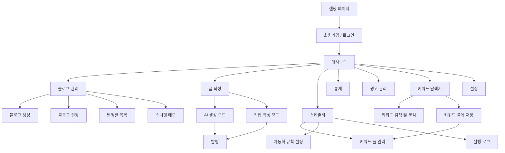

# Multi Blog Hub 사용자 플로우

> 버전: 1.0 | 날짜: 2026-03-04

---

## 1. 메인 플로우



---

## 2. 핵심 사용자 여정

### 여정 1: 신규 사용자 온보딩
```
랜딩 페이지
    ↓
회원가입 (이메일 or 소셜)
    ↓
대시보드 (빈 상태)
    ↓
[가이드] 첫 블로그 만들기
    ↓
블로그 생성 (이름, 도메인 연결, AI 캐릭터 설정)
    ↓
첫 글 작성 (AI 생성 모드 권장)
    ↓
발행 완료 → 대시보드로 복귀
```

### 여정 2: AI 생성 모드 글 작성
```
에디터 진입 → [AI 생성 모드] 선택
    ↓
키워드 입력 (예: "강남 맛집 추천")
    ↓
연관 키워드 + 형태소 자동 생성 (SEO 제안)
    ↓
발행할 블로그 복수 선택 (예: 블로그A, 블로그B)
    ↓
블로그별 AI 캐릭터 확인 (각 블로그의 설정 자동 적용)
    ↓
삽입 이미지 수 선택 (0~5개)
    ↓
[AI 생성 시작] → 로딩 (10~30초)
    ↓
블로그별 생성된 글 확인 (탭으로 전환)
    ↓
각 글 편집 (스니펫 삽입, 이미지 위치 조정)
    ↓
[발행] → 선택한 블로그 동시 업로드
    ↓
발행 완료 알림 → 대시보드 or 계속 작성
```

### 여정 3: 자동화 스케줄 설정
```
[선택] 키워드 탐색기 진입 → 키워드 검색/분석 → 유망 키워드 선택 → "키워드 풀에 추가"
    ↓
스케줄러 진입
    ↓
키워드 풀 관리:
  - 탐색기에서 저장한 키워드 자동 불러오기
  - 직접 키워드 추가/편집/삭제
    ↓
자동화 규칙 생성:
  - 대상 블로그 선택
  - 발행 시간 설정 (예: 매일 09:00)
  - 회차당 발행 개수 (예: 3개)
  - 이미지 수 (예: 2개)
  - 반복 설정 (1회 / 매일 / 매주 / 매월)
    ↓
[규칙 저장] → 타임라인에 등록
    ↓
설정된 시간에 자동 실행
    ↓
실행 로그 확인 (성공/실패, 발행된 글 링크)
```

### 여정 4: 직접 작성 모드
```
에디터 진입 → [직접 작성 모드] 선택
    ↓
리치 텍스트 에디터 or HTML 에디터 선택
    ↓
글 작성 중 스니펫 메모에서 코드 삽입
    ↓
이미지 업로드/삽입
    ↓
발행할 블로그 선택 (복수 가능)
    ↓
[발행] → 완료
```

---

## 3. 화면별 플로우

### 대시보드 (/)
- **진입**: 로그인 후 자동
- **행동**: 통계 확인, 최신글 클릭(에디터로), 수익 현황 확인
- **이탈**: 각 섹션 클릭 → 해당 화면으로

### 블로그 관리 (/blogs)
- **진입**: 메뉴 클릭 또는 대시보드에서
- **행동**: 블로그 목록 확인, 신규 생성, 블로그 클릭(상세로)
- **이탈**: /blogs/:id (블로그 상세), /editor (글 작성)

### 글 작성 에디터 (/editor)
- **진입**: 메뉴, 대시보드의 "글 작성" 버튼, 블로그 상세의 "새 글"
- **행동**: AI 모드 or 직접 작성 → 편집 → 발행
- **이탈**: 발행 후 대시보드 or 블로그 상세

### 키워드 탐색기 (/keywords)
- **진입**: 메뉴 클릭 또는 글 작성 중 키워드 탐색 필요 시
- **행동**:
  - 키워드 검색 → 검색량·경쟁도·연관 키워드 분석
  - 유망 키워드 체크 → "키워드 풀에 추가" 클릭
  - 풀에 저장된 키워드는 스케줄러의 키워드 풀에 자동 반영
- **이탈**: 스케줄러 (/scheduler) 또는 대시보드

### 스케줄러 (/scheduler)
- **진입**: 메뉴 클릭 또는 키워드 탐색기에서 풀 추가 후 이동
- **행동**: 키워드 풀 확인/편집, 자동화 규칙 설정, 실행 로그 확인
  - 키워드 풀 → 자동화 규칙에 적용 → 설정된 시간에 AI가 글 자동 생성 후 발행
- **이탈**: 대시보드

---

## 4. 예외 플로우

| 상황 | 처리 |
|------|------|
| AI 생성 실패 | 에러 메시지 + 재시도 버튼 |
| 도메인 연결 실패 | 설정 페이지로 이동 안내 |
| API 키 없음 | 설정 → AI 설정 페이지로 안내 |
| 스케줄러 실행 실패 | 실행 로그에 에러 기록 + 이메일 알림 (선택) |
| 자동화 실행 중 | 중복 실행 방지 (락 처리) |
