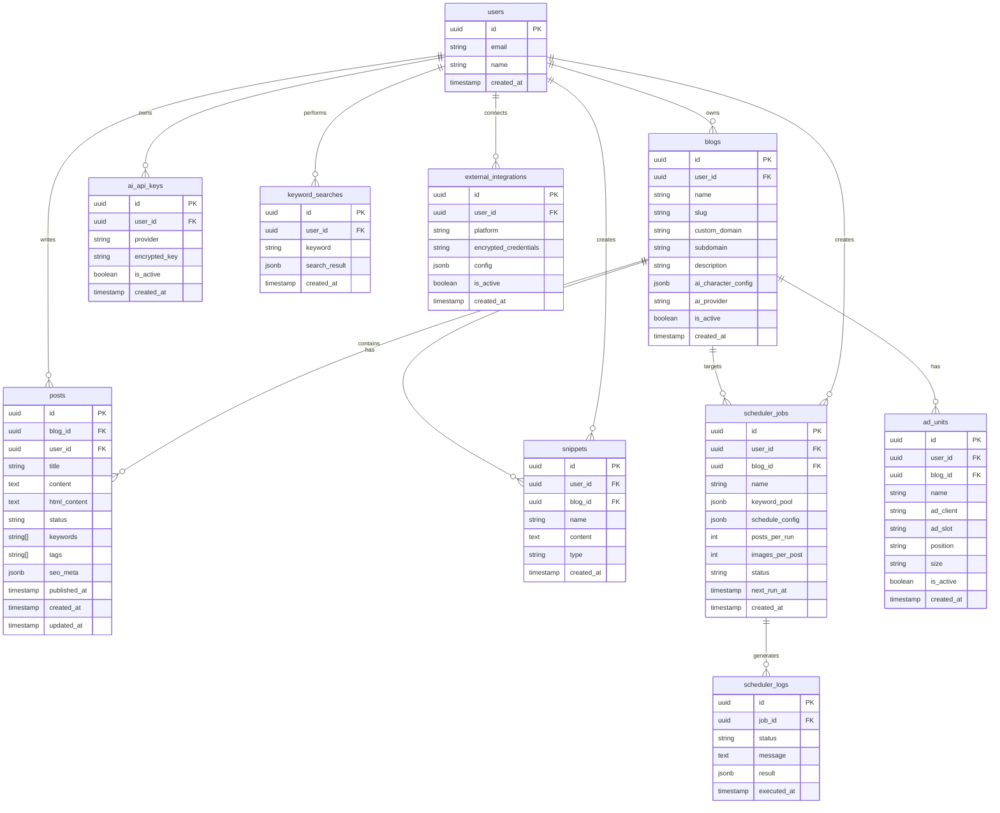

# Multi Blog Hub 데이터베이스 설계

> 버전: 1.0 | 날짜: 2026-03-04

---

## 1. ERD



---

## 2. 테이블 정의

### users (Supabase Auth 연동)
| 컬럼 | 타입 | 제약 | 설명 |
|------|------|------|------|
| id | uuid | PK | Supabase Auth UID |
| email | varchar(255) | UNIQUE, NOT NULL | 이메일 |
| name | varchar(100) | | 표시 이름 |
| created_at | timestamptz | DEFAULT now() | 생성 시각 |

### blogs
| 컬럼 | 타입 | 제약 | 설명 |
|------|------|------|------|
| id | uuid | PK | 블로그 ID |
| user_id | uuid | FK(users) | 소유자 |
| name | varchar(100) | NOT NULL | 블로그 이름 |
| slug | varchar(100) | UNIQUE | URL 슬러그 |
| custom_domain | varchar(255) | | 사용자 커스텀 도메인 |
| subdomain | varchar(100) | | Hub 서브도메인 |
| description | text | | 블로그 설명 |
| ai_character_config | jsonb | | AI 캐릭터 설정 {tone, style, persona} |
| ai_provider | varchar(50) | DEFAULT 'claude' | 기본 AI 공급자 |
| is_active | boolean | DEFAULT true | 활성 여부 |
| created_at | timestamptz | DEFAULT now() | |

### posts
| 컬럼 | 타입 | 제약 | 설명 |
|------|------|------|------|
| id | uuid | PK | 글 ID |
| blog_id | uuid | FK(blogs) | 소속 블로그 |
| user_id | uuid | FK(users) | 작성자 |
| title | varchar(500) | NOT NULL | 제목 |
| content | text | | 본문 (마크다운) |
| html_content | text | | 렌더링된 HTML |
| status | varchar(20) | DEFAULT 'draft' | draft / published / scheduled |
| keywords | text[] | | 사용된 키워드 목록 |
| tags | text[] | | 태그 |
| seo_meta | jsonb | | {meta_title, meta_desc, og_image} |
| published_at | timestamptz | | 발행 시각 |
| created_at | timestamptz | DEFAULT now() | |
| updated_at | timestamptz | DEFAULT now() | |

### snippets
| 컬럼 | 타입 | 제약 | 설명 |
|------|------|------|------|
| id | uuid | PK | 스니펫 ID |
| user_id | uuid | FK(users) | 소유자 |
| blog_id | uuid | FK(blogs), NULL | NULL이면 전역 스니펫 |
| name | varchar(100) | NOT NULL | 스니펫 이름 |
| content | text | NOT NULL | 스니펫 내용 (HTML/코드) |
| type | varchar(50) | DEFAULT 'html' | html / ad_code / link / custom |
| created_at | timestamptz | DEFAULT now() | |

### scheduler_jobs
| 컬럼 | 타입 | 제약 | 설명 |
|------|------|------|------|
| id | uuid | PK | 작업 ID |
| user_id | uuid | FK(users) | 소유자 |
| blog_id | uuid | FK(blogs) | 대상 블로그 |
| name | varchar(100) | NOT NULL | 작업 이름 |
| keyword_pool | jsonb | | 키워드 목록 배열 |
| schedule_config | jsonb | | {cron, timezone, repeat_type} |
| posts_per_run | int | DEFAULT 1 | 회차당 발행 수 |
| images_per_post | int | DEFAULT 0 | 글당 이미지 수 |
| status | varchar(20) | DEFAULT 'active' | active / paused / completed |
| next_run_at | timestamptz | | 다음 실행 시각 |
| created_at | timestamptz | DEFAULT now() | |

### ad_units
| 컬럼 | 타입 | 제약 | 설명 |
|------|------|------|------|
| id | uuid | PK | 광고 ID |
| user_id | uuid | FK(users) | 소유자 |
| blog_id | uuid | FK(blogs) | 소속 블로그 |
| name | varchar(100) | NOT NULL | 광고 단위 이름 |
| ad_client | varchar(100) | | AdSense client ID |
| ad_slot | varchar(100) | | AdSense slot ID |
| position | varchar(50) | | top / bottom / sidebar / in-content |
| size | varchar(50) | | responsive / 728x90 / 300x250 등 |
| is_active | boolean | DEFAULT true | |
| created_at | timestamptz | DEFAULT now() | |

---

## 3. 인덱스

```sql
-- 블로그 조회 최적화
CREATE INDEX idx_blogs_user_id ON blogs(user_id);
CREATE INDEX idx_blogs_slug ON blogs(slug);
CREATE UNIQUE INDEX idx_blogs_custom_domain ON blogs(custom_domain) WHERE custom_domain IS NOT NULL;

-- 글 조회 최적화
CREATE INDEX idx_posts_blog_id ON posts(blog_id);
CREATE INDEX idx_posts_status ON posts(status);
CREATE INDEX idx_posts_published_at ON posts(published_at DESC);

-- 스케줄러 최적화
CREATE INDEX idx_scheduler_jobs_next_run ON scheduler_jobs(next_run_at) WHERE status = 'active';
CREATE INDEX idx_scheduler_logs_job_id ON scheduler_logs(job_id);

-- 스니펫 조회
CREATE INDEX idx_snippets_user_blog ON snippets(user_id, blog_id);
```

---

## 4. RLS (Row Level Security) 정책

```sql
-- 모든 테이블에 RLS 활성화
ALTER TABLE blogs ENABLE ROW LEVEL SECURITY;
ALTER TABLE posts ENABLE ROW LEVEL SECURITY;
ALTER TABLE snippets ENABLE ROW LEVEL SECURITY;

-- 블로그: 본인 데이터만 접근
CREATE POLICY "Users can only access their own blogs"
ON blogs FOR ALL
USING (auth.uid() = user_id);

-- 글: 본인 데이터만 접근
CREATE POLICY "Users can only access their own posts"
ON posts FOR ALL
USING (auth.uid() = user_id);
```
