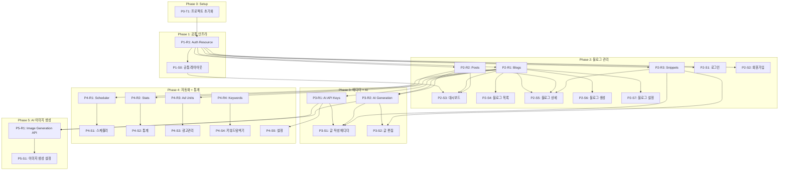

# Multi Blog Hub TASKS.md

> 생성 방식: Domain-Guarded (screen-spec v2.0 기반)
> 버전: 1.0 | 날짜: 2026-03-04
> Interface Contract Validation: ✅ PASSED

---

## 📊 전체 현황

| Phase | 설명 | 태스크 수 | 상태 |
|-------|------|----------|------|
| P0 | 프로젝트 셋업 | 1 | ✅ |
| P1 | 공통 인프라 (Auth + Layout) | 4 | ✅ |
| P2 | 블로그 관리 핵심 | 14 | ⬜ |
| P3 | 에디터 + AI 통합 | 8 | ⬜ |
| P4 | 자동화 + 통계 + 광고 + 키워드 | 18 | ⬜ |
| P5 | AI 이미지 생성 (Google Imagen) | 4 | ⬜ |
| **합계** | | **49** | |

---

## 의존성 다이어그램



---

## Phase 0: 프로젝트 셋업

### [x] P0-T1: Next.js 14 프로젝트 초기화
- **담당**: backend-specialist
- **설명**: Next.js 14 App Router + TypeScript + Supabase + Tailwind + shadcn/ui 초기 설정
- **작업 목록**:
  - [x] `npx create-next-app@latest` with TypeScript + Tailwind + App Router
  - [x] shadcn/ui 설치 및 초기화 (`npx shadcn@latest init`)
  - [x] Supabase 클라이언트 설치 (`@supabase/supabase-js`, `@supabase/ssr`)
  - [x] TipTap 에디터 설치 (`@tiptap/react`, `@tiptap/starter-kit`)
  - [x] Zustand + TanStack Query 설치
  - [x] `.env.local` 환경변수 템플릿 생성
  - [x] `lib/supabase/client.ts`, `lib/supabase/server.ts` 생성
  - [x] 폴더 구조 생성 (07-coding-convention.md 기준)
  - [x] ESLint + Prettier 설정
- **파일**:
  - `package.json`
  - `lib/supabase/client.ts`
  - `lib/supabase/server.ts`
  - `.env.local.example`
  - `.eslintrc.json`
  - `.prettierrc`
- **완료 기준**: `npm run dev` 실행 시 기본 페이지 표시

---

## Phase 1: 공통 인프라

### P1-R1: Auth Resource

#### [x] P1-R1-T1: Supabase Auth 스키마 + 미들웨어 구현
- **담당**: backend-specialist
- **리소스**: users
- **작업 목록**:
  - [x] Supabase `users` 테이블 마이그레이션 (database.ts 타입 포함)
  - [x] RLS 정책: 사용자 본인 데이터만 접근
  - [x] `middleware.ts` 인증 체크 구현 (보호 경로 설정)
  - [x] `lib/supabase/server.ts` SSR 쿠키 처리
- **파일**:
  - `supabase/migrations/001_users.sql`
  - `middleware.ts`
  - `types/database.ts`
- **TDD**: RED → GREEN → REFACTOR

#### [x] P1-R1-T2: Auth API Route 구현
- **담당**: backend-specialist
- **엔드포인트**:
  - `POST /api/auth/login` (이메일 로그인)
  - `POST /api/auth/signup` (회원가입)
  - `POST /api/auth/logout`
  - `GET /api/auth/me`
- **파일**:
  - `app/api/auth/login/route.ts`
  - `app/api/auth/signup/route.ts`
  - `app/api/auth/logout/route.ts`
  - `app/api/auth/me/route.ts`
- **TDD**: `tests/api/auth.test.ts` → 구현

### P1-S0: 공통 레이아웃

#### [x] P1-S0-T1: AppSidebar + AppHeader 구현
- **담당**: frontend-specialist
- **컴포넌트**:
  - `AppSidebar`: 240px 좌측 사이드바 (8개 메뉴)
  - `AppHeader`: 상단 헤더 (로고, 프로필)
  - `(dashboard)/layout.tsx`: 사이드바 + 헤더 조합 레이아웃
- **디자인**: 05-design-system.md 기준 색상/간격 적용
- **반응형**: Mobile(<768px) 하단 탭바, Tablet 아이콘만, Desktop 전체
- **파일**:
  - `components/layout/AppSidebar.tsx`
  - `components/layout/AppHeader.tsx`
  - `app/(dashboard)/layout.tsx`
- **TDD**: `tests/components/AppSidebar.test.tsx` → 구현

#### [x] P1-S0-V: 공통 레이아웃 검증
- **담당**: test-specialist
- **검증 항목**:
  - [x] 8개 네비게이션 링크 정상 렌더링
  - [ ] 미인증 접근 시 /login으로 리디렉션
  - [ ] 반응형 레이아웃 동작 (768px, 1024px 브레이크포인트)

---

## Phase 2: 블로그 관리 핵심

### P2-R1: Blogs Resource

#### [x] P2-R1-T1: Blogs API 구현
- **담당**: backend-specialist
- **리소스**: blogs
- **엔드포인트**:
  - `GET /api/blogs` (목록, 사용자별)
  - `POST /api/blogs` (생성)
  - `GET /api/blogs/:id` (상세)
  - `PATCH /api/blogs/:id` (수정)
  - `DELETE /api/blogs/:id` (삭제)
- **필드**: id, user_id, name, slug, custom_domain, subdomain, description, ai_character_config, ai_provider, is_active, color
- **파일**:
  - `supabase/migrations/002_blogs.sql` (RLS 포함)
  - `app/api/blogs/route.ts`
  - `app/api/blogs/[id]/route.ts`
  - `types/blog.ts`
- **TDD**: `tests/api/blogs.test.ts` → 구현

### P2-R2: Posts Resource

#### [x] P2-R2-T1: Posts API 구현
- **담당**: backend-specialist
- **리소스**: posts
- **엔드포인트**:
  - `GET /api/posts` (목록, blog_id 필터)
  - `POST /api/posts` (생성/발행)
  - `GET /api/posts/:id` (상세)
  - `PATCH /api/posts/:id` (수정)
  - `DELETE /api/posts/:id` (삭제)
- **필드**: id, blog_id, user_id, title, content, html_content, status, keywords, tags, seo_meta, view_count, published_at
- **파일**:
  - `supabase/migrations/003_posts.sql` (RLS 포함)
  - `app/api/posts/route.ts`
  - `app/api/posts/[id]/route.ts`
  - `types/post.ts`
- **TDD**: `tests/api/posts.test.ts` → 구현

### P2-R3: Snippets Resource

#### [x] P2-R3-T1: Snippets API 구현
- **담당**: backend-specialist
- **리소스**: snippets
- **엔드포인트**:
  - `GET /api/snippets` (목록, blog_id 또는 전역)
  - `POST /api/snippets` (생성)
  - `PATCH /api/snippets/:id` (수정)
  - `DELETE /api/snippets/:id` (삭제)
- **필드**: id, user_id, blog_id, name, content, type
- **파일**:
  - `supabase/migrations/004_snippets.sql` (RLS 포함)
  - `app/api/snippets/route.ts`
  - `app/api/snippets/[id]/route.ts`
- **TDD**: `tests/api/snippets.test.ts` → 구현

### P2-S1: 로그인 화면

#### [x] P2-S1-T1: 로그인 UI 구현
- **담당**: frontend-specialist
- **화면**: /login (screen-01)
- **컴포넌트**:
  - `LoginForm`: 이메일/비밀번호 폼 + 에러 표시
  - `SocialLoginButtons`: Google/GitHub OAuth 버튼
- **이벤트**:
  - submit → Supabase signInWithPassword → /dashboard 이동
  - click:forgot-password → 비밀번호 재설정 모달
- **파일**:
  - `app/(auth)/login/page.tsx`
  - `components/auth/LoginForm.tsx`
- **TDD**: `tests/pages/login.test.tsx` → 구현

#### [x] P2-S1-V: 로그인 화면 검증
- **담당**: test-specialist
- **검증 항목**:
  - [x] 유효한 자격증명 → /dashboard 이동
  - [x] 잘못된 비밀번호 → 에러 메시지 표시, 폼 유지
  - [ ] Google OAuth 버튼 클릭 → OAuth 흐름 시작

### P2-S2: 회원가입 화면

#### [x] P2-S2-T1: 회원가입 UI 구현
- **담당**: frontend-specialist
- **화면**: /signup (screen-02)
- **컴포넌트**:
  - `SignupForm`: 이메일/이름/비밀번호 + 약관 동의
  - `SocialSignupButtons`: Google/GitHub OAuth
- **파일**:
  - `app/(auth)/signup/page.tsx`
  - `components/auth/SignupForm.tsx`
- **TDD**: `tests/pages/signup.test.tsx` → 구현

#### [x] P2-S2-V: 회원가입 화면 검증
- **검증 항목**:
  - [x] 유효한 정보 → 계정 생성 → /dashboard 이동
  - [x] 중복 이메일 → 에러 메시지
  - [ ] 약관 미동의 → 제출 차단

### P2-S3: 대시보드

#### [x] P2-S3-T1: 대시보드 UI 구현
- **담당**: frontend-specialist
- **화면**: /dashboard (screen-03)
- **컴포넌트**:
  - `StatSummaryBar`: 총 방문자/조회수/글 수/예상 수익
  - `BlogStatGrid`: 블로그별 통계 카드 (고유 색상)
  - `RecentPostsList`: 최근 발행글 10개
  - `RevenueOverview`: 광고별 수익 기여 현황
  - `QuickActionButtons`: 글 작성 / 스케줄 추가
- **데이터 요구**: stats_summary, blogs, posts, ad_units
- **파일**:
  - `app/(dashboard)/dashboard/page.tsx`
  - `components/dashboard/StatSummaryBar.tsx`
  - `components/dashboard/BlogStatGrid.tsx`
  - `components/dashboard/RecentPostsList.tsx`
  - `components/dashboard/RevenueOverview.tsx`
- **TDD**: `tests/pages/dashboard.test.tsx` → 구현

#### [x] P2-S3-V: 대시보드 검증
- **검증 항목**:
  - [x] 모든 통계 카드 정상 렌더링
  - [x] 블로그별 색상 구분 표시
  - [x] 블로그 카드 클릭 → /blogs/:id 이동

### P2-S4: 블로그 목록

#### [x] P2-S4-T1: 블로그 목록 UI 구현
- **담당**: frontend-specialist
- **화면**: /blogs (screen-04)
- **컴포넌트**:
  - `BlogListHeader`: 총 수 + 신규 생성 버튼
  - `BlogCardGrid`: 블로그 카드 그리드
  - `BlogCard`: 이름, 도메인, 방문자, 글 수, 빠른 작성
- **파일**:
  - `app/(dashboard)/blogs/page.tsx`
  - `components/blogs/BlogCard.tsx`
  - `hooks/useBlogs.ts`
- **TDD**: `tests/pages/blogs.test.tsx` → 구현

#### [ ] P2-S4-V: 블로그 목록 검증
- **검증 항목**:
  - [ ] 사용자 소유 블로그만 표시 (RLS)
  - [ ] 신규 생성 버튼 → /blogs/new 이동
  - [ ] 빠른 작성 버튼 → /editor/new?blogId=:id 이동

### P2-S5: 블로그 상세

#### [x] P2-S5-T1: 블로그 상세 UI 구현
- **담당**: frontend-specialist
- **화면**: /blogs/:id (screen-05)
- **컴포넌트**:
  - `BlogHeader`: 블로그 정보 + 설정 버튼
  - `TabNav`: 발행글 / 통계 / 메모 탭
  - `PostsTab`: 글 목록 테이블 (편집/삭제)
  - `StatsTab`: 방문자/조회수 차트
  - `MemoTab`: 스니펫 목록 + 추가/편집
- **파일**:
  - `app/(dashboard)/blogs/[id]/page.tsx`
  - `components/blogs/PostsTab.tsx`
  - `components/blogs/StatsTab.tsx`
  - `components/blogs/MemoTab.tsx`
- **TDD**: `tests/pages/blog-detail.test.tsx` → 구현

#### [x] P2-S5-V: 블로그 상세 검증
- **검증 항목**:
  - [x] 탭 전환 정상 동작
  - [x] 글 편집 클릭 → /editor/:id 이동
  - [x] 스니펫 추가 모달 → 저장 후 목록 갱신

### P2-S6: 블로그 생성

#### [x] P2-S6-T1: 블로그 생성 UI 구현
- **담당**: frontend-specialist
- **화면**: /blogs/new (screen-06)
- **컴포넌트**:
  - `BlogCreateForm`: 이름, 도메인 방식, AI 설정
  - `DomainConnectionGuide`: DNS 설정 안내 패널
- **파일**:
  - `app/(dashboard)/blogs/new/page.tsx`
  - `components/blogs/BlogCreateForm.tsx`
- **TDD**: `tests/pages/blog-new.test.tsx` → 구현

#### [x] P2-S6-V: 블로그 생성 검증
- **검증 항목**:
  - [x] 생성 성공 → /blogs/:id 이동
  - [x] 중복 슬러그 → 에러 메시지
  - [x] 도메인 타입 토글 → 서브도메인/커스텀도메인 필드 전환

### P2-S7: 블로그 설정

#### [x] P2-S7-T1: 블로그 설정 UI 구현
- **담당**: frontend-specialist
- **화면**: /blogs/:id/settings (screen-07)
- **컴포넌트**:
  - `SettingsTabNav`: 기본정보 / AI 캐릭터 / 광고 / 크로스링킹
  - `BasicInfoTab`: 이름, 도메인, 설명
  - `AICharacterTab`: 캐릭터 이름, 톤, 스타일, 페르소나
  - `AdsTab`: AdSense 코드 + 위치별 광고 단위
  - `CrossLinkTab`: 연결 블로그 선택
- **파일**:
  - `app/(dashboard)/blogs/[id]/settings/page.tsx`
  - `components/blogs/settings/`
- **TDD**: `tests/pages/blog-settings.test.tsx` → 구현

#### [x] P2-S7-V: 블로그 설정 검증
- **검증 항목**:
  - [x] AI 캐릭터 설정 저장 → 성공 토스트
  - [ ] 광고 단위 추가 → 목록 갱신 (P4-S3에서 구현)
  - [x] 크로스링킹 설정 저장

---

## Phase 3: 에디터 + AI 통합

### P3-R1: AI API Keys Resource

#### [x] P3-R1-T1: AI API Keys 암호화 저장 구현
- **담당**: backend-specialist
- **리소스**: ai_api_keys
- **엔드포인트**:
  - `GET /api/ai-keys` (목록, 공급자별 is_active)
  - `POST /api/ai-keys` (생성, 암호화 저장)
  - `DELETE /api/ai-keys/:id` (삭제)
  - `POST /api/ai-keys/:id/test` (유효성 테스트)
- **보안**: `ENCRYPTION_KEY` 환경변수로 AES-256 암호화
- **파일**:
  - `supabase/migrations/005_ai_api_keys.sql` (RLS 포함)
  - `app/api/ai-keys/route.ts`
  - `lib/utils/encryption.ts`
- **TDD**: `tests/api/ai-keys.test.ts` → 구현

### P3-R2: AI Generation API

#### [x] P3-R2-T1: AI 어댑터 패턴 구현
- **담당**: backend-specialist
- **아키텍처**: `AIAdapter` 인터페이스 → Claude/OpenAI/Gemini 어댑터
- **파일**:
  - `lib/ai/adapter.ts` (AIAdapter 인터페이스)
  - `lib/ai/claude.ts` (ClaudeAdapter)
  - `lib/ai/openai.ts` (OpenAIAdapter)
  - `lib/ai/gemini.ts` (GeminiAdapter)
  - `types/ai.ts`
- **TDD**: `tests/lib/ai-adapter.test.ts` → 구현

#### [x] P3-R2-T2: AI 글 생성 API Route 구현
- **담당**: backend-specialist
- **엔드포인트**: `POST /api/ai/generate`
- **입력**: `{ keyword, relatedKeywords, blogIds, imageCount }`
- **출력**: `{ posts: { blogId, title, content, htmlContent }[] }`
- **파일**:
  - `app/api/ai/generate/route.ts`
- **TDD**: `tests/api/ai-generate.test.ts` → 구현

### P3-S1: 글 작성 에디터

#### [x] P3-S1-T1: 에디터 UI 구현 (AI 생성 모드)
- **담당**: frontend-specialist
- **화면**: /editor/new (screen-08) - AI 생성 모드
- **컴포넌트**:
  - `EditorModeTab`: AI 생성 / 직접 작성 전환
  - `KeywordInput`: 키워드 입력 + 연관 키워드 탐색
  - `RelatedKeywordPanel`: 연관 키워드 칩 목록
  - `BlogMultiSelect`: 체크박스 멀티 선택
  - `ImageCountSelect`: 이미지 수 슬라이더
  - `AIGenerateButton`: 생성 버튼 + 로딩 상태
  - `GeneratedPostTabs`: 블로그별 생성된 글 탭
- **파일**:
  - `app/(dashboard)/editor/new/page.tsx`
  - `components/editor/AIGeneratePanel.tsx`
  - `components/editor/BlogMultiSelect.tsx`
  - `store/editorStore.ts`
- **TDD**: `tests/pages/editor-new.test.tsx` → 구현

#### [x] P3-S1-T2: 에디터 UI 구현 (직접 작성 모드 + 공통)
- **담당**: frontend-specialist
- **컴포넌트**:
  - `PostEditor`: TipTap 리치텍스트 에디터 (HTML 모드 전환)
  - `ImageUploader`: 이미지 업로드 (Supabase Storage)
  - `SnippetDrawer`: 우측 스니펫 패널 드로어
  - `SEOMetaForm`: 메타 제목, 설명, OG 이미지
  - `PublishButton`: 즉시 발행
  - `ScheduleButton`: 예약 발행 모달
- **파일**:
  - `components/editor/PostEditor.tsx`
  - `components/editor/SnippetDrawer.tsx`
  - `components/editor/SEOMetaForm.tsx`
  - `hooks/usePosts.ts`
- **TDD**: `tests/components/PostEditor.test.tsx` → 구현

#### [x] P3-S1-V: 에디터 검증
- **검증 항목**:
  - [x] AI 글 생성 → 로딩 → 블로그별 탭에 결과 표시
  - [x] 스니펫 클릭 → 에디터에 삽입
  - [x] 발행 버튼 → 선택 블로그 발행 → /dashboard 이동
  - [x] 내용 변경 → 3초 후 draft 자동 저장

### P3-S2: 글 편집

#### [x] P3-S2-T1: 글 편집 UI 구현
- **담당**: frontend-specialist
- **화면**: /editor/:id (screen-09)
- **기존 글 로드**: posts/:id 데이터 에디터에 초기화
- **파일**:
  - `app/(dashboard)/editor/[id]/page.tsx`
- **TDD**: `tests/pages/editor-edit.test.tsx` → 구현

#### [ ] P3-S2-V: 글 편집 검증
- **검증 항목**:
  - [ ] 기존 글 데이터 에디터 로드 확인
  - [ ] 수정 후 저장 → 업데이트 확인
  - [ ] /blogs/:blogId로 이동

---

## Phase 4: 자동화 + 통계 + 광고 + 키워드

### P4-R1: Scheduler Resource

#### [x] P4-R1-T1: Scheduler API 구현
- **담당**: backend-specialist
- **리소스**: scheduler_jobs, scheduler_logs
- **엔드포인트**:
  - `GET /api/scheduler/jobs` (규칙 목록)
  - `POST /api/scheduler/jobs` (규칙 생성)
  - `PATCH /api/scheduler/jobs/:id` (상태 변경 / 수정)
  - `DELETE /api/scheduler/jobs/:id` (삭제)
  - `GET /api/scheduler/logs` (실행 로그)
- **파일**:
  - `supabase/migrations/006_scheduler.sql`
  - `app/api/scheduler/jobs/route.ts`
  - `app/api/scheduler/jobs/[id]/route.ts`
  - `app/api/scheduler/logs/route.ts`
- **TDD**: `tests/api/scheduler.test.ts` → 구현

#### [x] P4-R1-T2: Cron Job 자동 실행 구현
- **담당**: backend-specialist
- **엔드포인트**: `POST /api/cron/run` (Vercel Cron으로 호출)
- **로직**:
  - next_run_at <= now인 활성 작업 조회
  - keyword_pool에서 키워드 선택
  - AI 글 생성 → 블로그 발행
  - scheduler_logs 기록 + next_run_at 업데이트
- **파일**:
  - `app/api/cron/run/route.ts`
  - `vercel.json` (cron 설정)
- **TDD**: `tests/api/cron.test.ts` → 구현

### P4-R2: Stats Resource

#### [x] P4-R2-T1: Stats API 구현
- **담당**: backend-specialist
- **리소스**: stats_summary
- **엔드포인트**:
  - `GET /api/stats` (전체 집계, 기간 필터)
  - `GET /api/stats/:blogId` (블로그별 상세)
- **파일**:
  - `supabase/migrations/007_stats.sql`
  - `app/api/stats/route.ts`
  - `app/api/stats/[blogId]/route.ts`
- **TDD**: `tests/api/stats.test.ts` → 구현

### P4-R3: Ad Units Resource

#### [x] P4-R3-T1: Ad Units API 구현
- **담당**: backend-specialist
- **리소스**: ad_units
- **엔드포인트**:
  - `GET /api/ads` (광고 단위 목록)
  - `POST /api/ads` (생성)
  - `PATCH /api/ads/:id` (수정/활성화 토글)
  - `DELETE /api/ads/:id` (삭제)
- **파일**:
  - `supabase/migrations/008_ad_units.sql`
  - `app/api/ads/route.ts`
  - `app/api/ads/[id]/route.ts`
- **TDD**: `tests/api/ads.test.ts` → 구현

### P4-R4: Keyword Searches Resource

#### [x] P4-R4-T1: Keyword Search API 구현
- **담당**: backend-specialist
- **리소스**: keyword_searches
- **엔드포인트**:
  - `GET /api/keywords/search?q=:keyword` (외부 SEO API 조회 + 저장)
  - `GET /api/keywords/trending` (트렌딩 키워드)
  - `GET /api/keywords/history` (검색 이력)
- **외부 연동**: Google Trends / DataForSEO API
- **파일**:
  - `supabase/migrations/009_keywords.sql`
  - `app/api/keywords/search/route.ts`
  - `app/api/keywords/trending/route.ts`
- **TDD**: `tests/api/keywords.test.ts` → 구현

### P4-S1: 스케줄러

#### [x] P4-S1-T1: 스케줄러 UI 구현
- **담당**: frontend-specialist
- **화면**: /scheduler (screen-10)
- **컴포넌트**:
  - `SchedulerTabNav`: 4개 탭 전환
  - `JobList` + `JobCard`: 자동화 규칙 목록
  - `JobCreateModal`: 규칙 생성 폼
  - `KeywordPoolTable`: 키워드 풀 관리
  - `ScheduleCalendar`: 예약 타임라인 (월/주 뷰)
  - `LogTable`: 실행 로그
- **파일**:
  - `app/(dashboard)/scheduler/page.tsx`
  - `components/scheduler/`
  - `hooks/useScheduler.ts`
- **TDD**: `tests/pages/scheduler.test.tsx` → 구현

#### [ ] P4-S1-V: 스케줄러 검증
- **검증 항목**:
  - [ ] 규칙 생성 → 목록 추가 + next_run_at 계산
  - [ ] 토글 클릭 → 상태 paused/active 전환
  - [ ] CSV 업로드 → 키워드 풀 추가

### P4-S2: 통계

#### [x] P4-S2-T1: 통계 UI 구현
- **담당**: frontend-specialist
- **화면**: /stats (screen-11)
- **컴포넌트**:
  - `DateRangePicker`: 기간 선택 (Recharts 또는 내장)
  - `OverallStatCards`: 총 방문자/조회수/글 수
  - `BlogCompareChart`: 블로그별 방문자 바 차트
  - `PostPerformanceTable`: 글별 조회수 성과
  - `TrendChart`: 일별/주별 추이 라인 차트
- **파일**:
  - `app/(dashboard)/stats/page.tsx`
  - `components/shared/DateRangePicker.tsx`
  - `components/stats/`
- **TDD**: `tests/pages/stats.test.tsx` → 구현

#### [ ] P4-S2-V: 통계 검증
- **검증 항목**:
  - [ ] 기간 변경 → 통계 재조회
  - [ ] 블로그 비교 차트 고유 색상 표시
  - [ ] 글 행 클릭 → /editor/:id 이동

### P4-S3: 광고 관리

#### [x] P4-S3-T1: 광고 관리 UI 구현
- **담당**: frontend-specialist
- **화면**: /ads (screen-12)
- **컴포넌트**:
  - `AdUnitList`: 광고 단위 목록 + 토글
  - `AdUnitCreateModal`: 광고 단위 생성 폼
  - `RevenueChart`: 수익 추이 차트
  - `AdPerformanceTable`: 광고별 수익 기여
- **파일**:
  - `app/(dashboard)/ads/page.tsx`
  - `components/ads/`
- **TDD**: `tests/pages/ads.test.tsx` → 구현

#### [ ] P4-S3-V: 광고 관리 검증
- **검증 항목**:
  - [ ] 광고 단위 생성 → 목록 추가
  - [ ] 토글 클릭 → 활성/비활성 전환
  - [ ] 수익 차트 최근 30일 표시

### P4-S4: SEO 키워드 탐색기

#### [x] P4-S4-T1: 키워드 탐색기 UI 구현
- **담당**: frontend-specialist
- **화면**: /keywords (screen-13)
- **컴포넌트**:
  - `KeywordSearchInput`: 검색 입력
  - `TrendingKeywordList`: 트렌딩 키워드 목록
  - `SeasonalKeywordCalendar`: 시즌성 캘린더
  - `KeywordDetailCard`: 검색량, 경쟁도, 관련 키워드
  - `AddToSchedulerButton` / `AddToEditorButton`
- **파일**:
  - `app/(dashboard)/keywords/page.tsx`
  - `components/keywords/`
- **TDD**: `tests/pages/keywords.test.tsx` → 구현

#### [ ] P4-S4-V: 키워드 탐색기 검증
- **검증 항목**:
  - [ ] 검색 → keyword_searches 저장 + 결과 표시
  - [ ] 에디터로 버튼 → /editor/new?keyword=:keyword 이동
  - [ ] 스케줄러 추가 → keyword_pool 업데이트

### P4-S5: 설정

#### [x] P4-S5-T1: 설정 UI 구현
- **담당**: frontend-specialist
- **화면**: /settings (screen-14)
- **컴포넌트**:
  - `SettingsNav`: 계정 / AI API / 외부 연동 / 알림 탭
  - `AccountTab`: 프로필 편집 + 비밀번호 변경
  - `AIAPITab`: API 키 추가/삭제/테스트 (마스킹 표시)
  - `ExternalIntegrationTab`: Notion / Google Sheets (선택)
  - `NotificationTab`: 알림 설정
- **파일**:
  - `app/(dashboard)/settings/page.tsx`
  - `components/settings/`
- **TDD**: `tests/pages/settings.test.tsx` → 구현

#### [ ] P4-S5-V: 설정 검증
- **검증 항목**:
  - [ ] API 키 저장 → 암호화 저장 + 마스킹 표시
  - [ ] API 키 테스트 → 성공/실패 결과 표시
  - [ ] 프로필 수정 → 성공 토스트

---

## Phase 5: AI 이미지 생성

> **목적**: 에디터/스케줄러에서 글 작성 시 Google Imagen을 통해 대표 이미지·본문 이미지를 자동 생성

### P5-R1: Image Generation API

#### [ ] P5-R1-T1: Google Imagen 어댑터 구현
- **담당**: backend-specialist
- **리소스**: `ai_api_keys` (provider='imagen' 추가)
- **아키텍처**: `ImagenAdapter` 클래스 — `AIAdapter`와 별도 `ImageAdapter` 인터페이스
- **API**: Google Imagen 3 (`imagen-3.0-generate-001`)
  - 엔드포인트: `https://generativelanguage.googleapis.com/v1beta/models/imagen-3.0-generate-001:predict`
  - 인증: Google AI Studio API Key (Gemini 키와 동일 형식)
- **작업 목록**:
  - [x] `lib/ai/imagen.ts`: `ImagenAdapter` 구현 (`generateImage`, `testConnection`)
  - [x] `lib/ai/adapter.ts`: `ImageProvider`, `AnyAIProvider` 타입, `createImageAdapter()` 팩토리 추가
  - [x] `supabase/migrations/010_imagen_provider.sql`: CHECK 제약 조건에 `imagen` 추가
  - [ ] `app/api/ai/generate-image/route.ts`: `POST /api/ai/generate-image`
    - 입력: `{ prompt, count, aspectRatio, blogId }`
    - 출력: `{ images: [{ base64, mimeType }] }`
    - Supabase Storage에 업로드 후 공개 URL 반환
- **파일**:
  - `lib/ai/imagen.ts`
  - `lib/ai/adapter.ts` (수정)
  - `supabase/migrations/010_imagen_provider.sql`
  - `app/api/ai/generate-image/route.ts`
- **TDD**: `tests/lib/imagen.test.ts` → 구현

#### [ ] P5-R1-T2: 이미지 생성 → Supabase Storage 업로드
- **담당**: backend-specialist
- **로직**:
  1. Imagen API에서 base64 이미지 수신
  2. Buffer 변환 후 `supabase.storage.from('post-images').upload()` 저장
  3. `getPublicUrl()` 반환 → post.html_content에 `` 삽입
- **Storage 버킷**: `post-images` (공개 버킷)
- **파일**:
  - `lib/storage/uploadImage.ts`
  - `supabase/migrations/011_storage_policy.sql`
- **TDD**: `tests/lib/uploadImage.test.ts` → 구현

### P5-S1: 이미지 생성 설정 UI

#### [x] P5-S1-T1: 설정 페이지 Imagen 키 등록 UI
- **담당**: frontend-specialist
- **화면**: /settings (기존 P4-S5 확장)
- **변경 내용**:
  - [x] `settings/page.tsx`: AI 공급자 선택 UI를 "텍스트 생성 AI" / "이미지 생성 AI" 두 그룹으로 분리
  - [x] Imagen 선택 시 설명 노트 표시 (Google AI Studio 키 안내)
  - [x] 등록된 키 목록에 `이미지 생성` / `텍스트 생성` 배지 표시

#### [ ] P5-S1-T2: 에디터 이미지 생성 패널
- **담당**: frontend-specialist
- **화면**: /editor/new (기존 P3-S1 확장)
- **컴포넌트 변경**:
  - `AIGeneratePanel`: `imageCount > 0` 시 이미지 생성 옵션 활성화
  - `ImagePromptInput`: 이미지 프롬프트 입력 (선택, 기본값: 글 제목 기반 자동 생성)
  - `AspectRatioSelect`: 1:1 / 16:9 / 9:16 선택
  - `GeneratedImagePreview`: 생성된 이미지 미리보기 + 에디터 삽입 버튼
- **파일**:
  - `components/editor/AIGeneratePanel.tsx` (수정)
  - `components/editor/ImageGeneratePanel.tsx` (신규)

#### [ ] P5-S1-V: 이미지 생성 검증
- **검증 항목**:
  - [ ] Imagen API 키 등록 → 테스트 성공
  - [ ] 에디터에서 이미지 생성 → Supabase Storage 업로드 → 에디터 삽입
  - [ ] 스케줄러 cron 실행 시 imageCount > 0이면 이미지 자동 생성 + 글에 포함

---

## 병렬 실행 가이드

### 병렬 가능 그룹

```
P2-R1 || P2-R2 || P2-R3          # Backend Resource 동시 작업 가능
P2-S1 || P2-S2                    # Auth 화면 동시 가능 (P1-R1 완료 후)
P4-R1 || P4-R2 || P4-R3 || P4-R4 # P4 Resource 동시 가능
P4-S1 || P4-S2 || P4-S3 || P4-S4 || P4-S5  # P4 Screen 동시 (Resource 완료 후)
P5-R1-T1 || P5-R1-T2              # Imagen 어댑터 + Storage 업로드 동시 가능
```

### 순차 필수 그룹

```
P0-T1 → P1-R1 → P2-R1 → P3-R2 → P3-S1
P1-R1 → P2-S1
P2-R1 → P2-S3 (대시보드)
P3-R1 → P5-R1 (AI 키 인프라 → 이미지 생성)
P5-R1-T1 → P5-R1-T2 (어댑터 → Storage 업로드)
P5-R1-T2 → P5-S1-T2 (API 완료 → 에디터 UI)
```

---

## 기술 스택 참조

| 영역 | 기술 |
|------|------|
| Frontend | Next.js 14 App Router + TypeScript |
| UI | Tailwind CSS + shadcn/ui |
| Editor | TipTap |
| State | Zustand + TanStack Query |
| Backend | Next.js API Routes (Route Handlers) |
| Database | Supabase PostgreSQL |
| Auth | Supabase Auth (소셜 + 이메일) |
| Storage | Supabase Storage (이미지) |
| AI (텍스트) | Claude API + OpenAI API + Gemini API |
| AI (이미지) | Google Imagen 3 (generativelanguage API) |
| Deploy | Vercel (Cron 포함) |

---

## 완료 기준 (Definition of Done)

- [ ] TypeScript strict 에러 없음
- [ ] ESLint 경고 없음 (`no-explicit-any: error`)
- [ ] 각 태스크의 테스트 통과
- [ ] Supabase RLS 정책 적용 (다른 사용자 데이터 접근 차단)
- [ ] 반응형 레이아웃 (Mobile/Tablet/Desktop)
- [ ] 에러 상태 및 로딩 상태 처리
